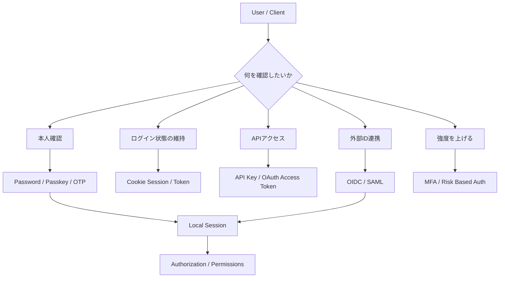

## 概要

認証機能を設計するとき、次のような言葉が一気に出てきます。

- パスワード認証
- メール認証
- SMS認証
- セッション
- JWT
- API Key
- OAuth 2.0
- OpenID Connect
- SAML
- SSO
- MFA
- Passkey

これらをすべて「ログインの種類」として並べると、理解しにくくなります。

理由は、同じ認証まわりの言葉でも、担当しているレイヤーが違うからです。

この記事では、認証機能を「本人確認」「ログイン状態の保持」「APIアクセス」「外部ID連携」「追加要素による強化」に分けて整理します。

> [!IMPORTANT]
> この記事は設計の地図を作るための記事です。実装時は、利用するフレームワーク、認証基盤、規制要件、脅威モデルに合わせてOWASPやNISTなどの最新ガイドラインを確認してください。

## この記事で学べること

- 認証、認可、セッション管理の違い
- パスワード、OTP、MFA、Passkeyの位置づけ
- Cookie Session、JWT、API Keyの違い
- OAuth 2.0とOpenID Connectを混同してはいけない理由
- 自分のアプリでどの方式を選ぶべきかの考え方

## 前提知識

- Webアプリでログイン機能を使ったことがある
- Cookie、HTTP Header、APIという言葉を聞いたことがある
- GitHub、Google、Appleなどの外部ログインを使ったことがある
- この記事では「完全な実装手順」ではなく、方式選定のための整理を扱う

## 本編

### まず認証・認可・セッション管理を分ける

最初に、次の3つを分けます。

| 用語 | 問い | 例 |
|---|---|---|
| 認証 | あなたは誰か | password、passkey、OIDC login |
| 認可 | 何をしてよいか | role、permission、scope、policy |
| セッション管理 | 認証済み状態をどう維持するか | session cookie、access token、refresh token |

「ログインできる」は認証です。

「管理画面を開ける」は認可です。

「次のリクエストでもログイン済みとして扱う」はセッション管理です。

この3つが混ざると、たとえば「JWT認証」「OAuth認証」「API Key認証」という言い方の中で、何を検証しているのかが曖昧になります。

### 認証方式の大きな分類

認証方式は、ざっくり次のように分けられます。

| 分類 | 代表例 | 主な用途 |
|---|---|---|
| 知識要素 | password、PIN | ユーザーが知っている情報で本人確認する |
| 所持要素 | TOTP、hardware key、SMS、email OTP | ユーザーが持っているものを確認する |
| 生体要素 | fingerprint、face recognition | 端末上で本人性を確認する |
| 暗号鍵ベース | passkey、WebAuthn、client certificate | 秘密鍵の所持を署名で証明する |
| 外部IdP | OIDC、SAML | Googleや社内IdPなどに本人確認を委ねる |
| 機械向け資格情報 | API Key、client credential、mTLS | ユーザーではなくclientやserviceを識別する |

ここで重要なのは、MFAやPasskeyは「ログイン画面の見た目」ではなく、本人確認の強度や攻撃耐性に関わる仕組みだということです。

### パスワード認証

最も基本的な方式です。

ユーザーはIDとpasswordを入力し、サーバーは保存済みのpassword hashと照合します。

```text
user input password
↓
server
↓
password hash verification
↓
session issue
```

passwordをそのまま保存してはいけません。実装では、Argon2、bcrypt、scrypt、PBKDF2など、password hashingに適した方式を使います。

パスワード認証のメリットは、ユーザーが理解しやすく、ほぼすべてのサービスで導入できることです。

一方で、credential stuffing、password reuse、phishing、漏えい時の被害が問題になります。そのため、MFA、漏えい済みpasswordのブロック、login throttling、risk based authenticationなどと組み合わせて設計します。

### メールリンク・メールOTP

メールリンクやメールOTPは、メールアドレスを制御できることを使って本人確認します。

```text
login request
↓
server creates one-time token
↓
email link / OTP
↓
user clicks or inputs code
↓
session issue
```

メリットは、passwordを覚えなくてよいことです。

デメリットは、メールアカウントの安全性に依存することです。メールが乗っ取られている場合、ログインも乗っ取られます。また、メール到達遅延やメールクライアントのリンク展開によってUXやセキュリティ上の考慮が必要になります。

メールリンクは便利ですが、強い認証というより「メールアドレスへの到達性確認」に近い側面があります。

### SMS OTP

SMS OTPは、電話番号へワンタイムコードを送る方式です。

MFAの一要素として使われることがありますが、SIM swap、電話番号再利用、SMSの配送経路、端末ロック状態などのリスクがあります。

そのため、SMS OTPは「何もしないよりは強いが、phishing resistantな方式ではない」と考えるのが現実的です。

高リスクな操作や管理者アカウントでは、TOTP、hardware security key、passkeyなど、より強い方式を検討します。

### TOTP

TOTPは、Google Authenticatorや1Passwordなどの認証アプリで見る6桁コードの方式です。

```text
shared secret
↓
current time window
↓
one-time code
↓
server verifies code
```

メリットは、SMSより通信経路への依存が少なく、導入しやすいことです。

デメリットは、phishingに弱いことです。ユーザーが偽サイトにTOTPを入力すると、そのコードを攻撃者が短時間で使える可能性があります。

TOTPはMFAとして実用的ですが、phishing resistantという観点ではpasskeyやsecurity keyに劣ります。

### Passkey / WebAuthn

Passkeyは、WebAuthnを使った公開鍵ベースの認証方式です。

登録時に、ユーザーの端末や認証器が鍵ペアを作ります。サーバーは公開鍵を保存し、秘密鍵は認証器側に残ります。

ログイン時は、サーバーがchallengeを出し、認証器が秘密鍵で署名します。サーバーは保存済み公開鍵で署名を検証します。

```text
server challenge
↓
authenticator signs challenge
↓
browser returns assertion
↓
server verifies signature with public key
```

Passkeyの強みは、passwordをサーバーへ送らないこと、originに紐づくこと、phishing耐性を持ちやすいことです。

一方で、アカウント復旧、複数端末、同期型passkey、端末紛失時のUX、組織ポリシーなどは設計対象になります。

### Cookie Session

Cookie Sessionは、サーバー側にsession状態を持ち、ブラウザにはsession IDをCookieとして渡す方式です。

```text
login success
↓
server creates session record
↓
Set-Cookie: session_id=...
↓
browser sends cookie on next requests
↓
server loads session
```

Webアプリでは非常に扱いやすい方式です。sessionをサーバー側で無効化でき、権限変更やログアウトを反映しやすいからです。

重要なのは、session ID自体が一時的な認証済み状態を表す強い資格情報になることです。漏えい、推測、固定化、盗難に注意し、`HttpOnly`、`Secure`、`SameSite`、rotation、expirationを設計します。

### JWT

JWTは認証方式そのものではなく、claimsをJSONとして表現し、署名または暗号化できるtoken formatです。

```json
{
  "sub": "user_123",
  "iss": "https://idp.example.com",
  "aud": "api.example.com",
  "exp": 1790000000
}
```

JWTは、access tokenやID tokenの形式として使われることがあります。

ただし、「JWTを使っているから安全」「JWTだからログアウト不要」ではありません。署名検証、issuer、audience、expiration、key rotation、algorithm固定、revocation戦略が必要です。

小規模な通常Webアプリでは、Cookie Sessionの方が扱いやすいことも多いです。JWTは、複数service間でtokenを検証したい、外部IdPのtokenを受け取る、API Gatewayを挟む、といった場面で検討します。

### API Key

API Keyは、主に機械や外部clientを識別するための文字列です。

```http
GET /v1/events
Authorization: Bearer api_key_xxx
```

API Keyは「この呼び出し元は登録済みのclientか」を見るのに向いています。

ただし、API Keyだけでは「どのエンドユーザーが操作したか」を表せないことがあります。ユーザー単位の監査、権限、取り消しを扱うなら、API Keyに紐づくownerやscope、rotation、rate limitを設計します。

API Keyは漏れる前提で、権限を絞り、表示は一度だけ、hash保存、期限、rotation、監査ログを考えます。

### OAuth 2.0

OAuth 2.0は、認証そのものではなく認可委譲のframeworkです。

典型例は、「あるアプリにGoogle Driveの一部権限を許可する」というケースです。

```text
resource owner
↓ approves scope
authorization server
↓ issues access token
client
↓ calls resource server
protected resource
```

OAuth 2.0で重要なのは、access tokenは「誰かがログインした証明」ではなく、「あるclientが、あるscopeでresourceへアクセスできる資格情報」だという点です。

そのため、ログイン目的でOAuth 2.0だけを使うと、ユーザー識別やID情報の取り扱いが曖昧になります。

### OpenID Connect

OpenID Connectは、OAuth 2.0の上に作られたidentity layerです。

ログイン用途では、OAuth 2.0だけではなくOpenID Connectを使うと整理しやすくなります。

OIDCでは、ID Tokenによって「どのEnd-Userが認証されたか」をclientが検証できます。

```text
client requests openid scope
↓
authorization server authenticates user
↓
client receives ID Token
↓
client verifies issuer, audience, signature, exp
↓
local session issue
```

実務では、「Googleログイン」「GitHubログイン」「社内SSOログイン」のように見えても、内部ではOIDCやSAMLなどのprotocolに基づいてIdPと連携しています。

### SAML

SAMLは、特に企業SSOで長く使われているXMLベースの認証・認可情報連携protocolです。

OIDCが現代的なWeb/APIとの相性が高い一方、SAMLは既存のenterprise IdPやSaaS連携で今でも使われます。

SAMLでは、IdPがユーザーを認証し、Service Providerへassertionを渡します。

```text
user
↓
service provider
↓ redirects to IdP
identity provider authenticates user
↓
SAML assertion
↓
service provider creates local session
```

SAMLを扱う場合は、署名検証、audience、recipient、ACS URL、clock skew、metadata管理を慎重に扱います。

### MFA

MFAは、認証方式の名前というより、複数のfactorを組み合わせる考え方です。

代表的なfactorは次です。

| Factor | 例 |
|---|---|
| 知っているもの | password、PIN |
| 持っているもの | TOTP app、security key、phone |
| 本人の特徴 | fingerprint、face |
| 場所 | network、geolocation |
| 行動 | typing pattern、behavior |

実務では、最初の3つがよく使われます。

MFAで大事なのは、単にステップを増やすことではありません。攻撃者が同じ経路で両方を盗めるなら、効果は弱くなります。

たとえばpasswordとTOTPはpassword単体より強いですが、偽サイトに両方入力すると突破される可能性があります。passkeyやhardware security keyは、originに紐づく公開鍵認証によりphishing耐性を持ちやすくなります。

### 方式選定の考え方

個人開発や小規模SaaSなら、まずは次の構成が現実的です。

| 用途 | 選択肢 |
|---|---|
| 通常のWebログイン | Cookie Session + password / OIDC |
| 外部ログイン | OIDC |
| 企業SSO | OIDCまたはSAML |
| API公開 | API KeyまたはOAuth 2.0 access token |
| 管理者ログイン | password + MFA、またはpasskey |
| 高リスク操作 | re-authentication + MFA |
| passwordless | email linkよりpasskeyを優先検討 |

最初からすべてを自前実装する必要はありません。認証は攻撃面が広く、実装ミスの影響も大きいため、Auth0、Clerk、Firebase Authentication、Cognito、Supabase Auth、NextAuth/Auth.js、Rails Deviseなど、利用技術に合う実績ある基盤を使う判断も重要です。

### よくある誤解

| 誤解 | 整理 |
|---|---|
| OAuth 2.0はログイン方式 | OAuth 2.0は認可委譲。ログインにはOIDCを使うと整理しやすい |
| JWTならセッション管理はいらない | JWTも盗まれれば資格情報。失効、期限、保管場所の設計が必要 |
| API Keyはユーザー認証 | 多くの場合はclientやproject識別。end-user認証とは別 |
| MFAを入れれば安全 | phishing耐性、復旧導線、factor変更手順まで必要 |
| Passkeyなら復旧設計はいらない | 端末紛失、同期、組織ポリシー、予備手段が必要 |

## 図解



この図では、ログイン画面で見えるものと、サーバー内部で扱うものを分けています。ユーザー認証に成功した後、アプリは多くの場合、独自のlocal sessionを発行し、そのsessionを使って認可判定を行います。

## 内部動作

一般的なWebアプリのログイン処理は、次のように分けられます。

```text
1. credential input
   password / passkey / OIDC redirect / SAML assertion

2. verification
   password hash
   WebAuthn signature
   ID token signature
   SAML assertion signature

3. account mapping
   local user
   external subject
   provider account

4. session issue
   server-side session
   secure cookie
   access token

5. authorization
   role
   permission
   policy
   scope

6. audit and lifecycle
   login log
   token rotation
   session expiration
   account recovery
```

たとえばOIDCでログインした場合でも、アプリはOIDC providerから受け取ったID Tokenを検証したあと、自分のアプリ用sessionを発行することが多いです。

```text
Google / GitHub / IdP
↓
ID Token
↓
application verifies token
↓
map external subject to local user
↓
issue application session
```

ここを分けておくと、「外部ログインを使っているのに、なぜ自分のアプリにもsession tableがあるのか」が理解しやすくなります。

## まとめ

- 認証は「あなたは誰か」、認可は「何をしてよいか」、セッション管理は「認証済み状態をどう維持するか」。
- Password、OTP、Passkey、OIDC、SAML、API Key、JWTは同じレイヤーの言葉ではない。
- OAuth 2.0は認可委譲のframeworkであり、ログインにはOpenID Connectを使うと整理しやすい。
- JWTはtoken formatであり、それ自体が認証方式ではない。
- MFAはステップ追加ではなく、異なるfactorを組み合わせて攻撃耐性を上げる設計。
- 実装では、方式名だけで選ばず、脅威モデル、UX、復旧、監査、失効、権限管理まで含めて選ぶ。

## 参考文献

- [OWASP Authentication Cheat Sheet](https://cheatsheetseries.owasp.org/cheatsheets/Authentication_Cheat_Sheet.html)
- [OWASP Session Management Cheat Sheet](https://cheatsheetseries.owasp.org/cheatsheets/Session_Management_Cheat_Sheet.html)
- [OWASP Multifactor Authentication Cheat Sheet](https://cheatsheetseries.owasp.org/cheatsheets/Multifactor_Authentication_Cheat_Sheet.html)
- [NIST SP 800-63B: Authentication and Authenticator Management](https://pages.nist.gov/800-63-4/sp800-63b.html)
- [RFC 6749: The OAuth 2.0 Authorization Framework](https://www.rfc-editor.org/rfc/rfc6749)
- [OpenID Connect Core 1.0](https://openid.net/specs/openid-connect-core-1_0.html)
- [RFC 7519: JSON Web Token](https://www.rfc-editor.org/rfc/rfc7519)
- [W3C Web Authentication: Level 3](https://www.w3.org/TR/webauthn-3/)
- [OASIS SAML V2.0 Core](https://docs.oasis-open.org/security/saml/v2.0/saml-core-2.0-os.pdf)
