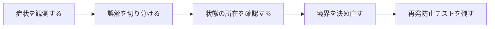

## 概要

Rails、Flutter、Swiftで詰まった問題は構文ミスより、状態がどこにあり、いつ消え、誰が所有し、どの境界で確定するかを誤解したものが多かった。

フレームワークを横断して再利用できる学習軸は、構文ではなく実行モデルである。状態、identity、lifecycle、transaction、async/concurrency、side effectの6軸でコードを読む。

## この記事で学べること

- `Future`型と`await`の混同
- Dirty TrackingとDB履歴の混同
- `with_lock`とreload
- Secure StorageとDIの役割混同
- Equatableと値等価性
- Safe Area modifier

## 前提知識

- Rails、Dart、Swiftのいずれかで、状態や副作用の扱いに触れたこと
- フレームワークのAPIを使った経験があり、状態・トランザクション・非同期処理の境界で詰まり始めていること
- この記事のコード例は匿名化した最小例であり、利用中のバージョンでは公式ドキュメントと実装を確認すること

## 図解




## 実装コード例

```text
構文
  -> 状態がどこにあるか
  -> いつ評価されるか
  -> どの境界を越えるか
  -> どこで副作用が起きるか
```

## 本編

### 発生した状況

Rails、Flutter、Swiftで詰まった問題は構文ミスより、状態がどこにあり、いつ消え、誰が所有し、どの境界で確定するかを誤解したものが多かった。

### 当初の理解・誤解

当初は、API名やメソッド名から直感的に挙動を推測していました。しかし実際には、フレームワークを横断して再利用できる学習軸は、構文ではなく実行モデルである。状態、identity、lifecycle、transaction、async/co... という観点で見る必要がありました。

### 観測したこと

- 1つの処理を状態/境界/時系列で分解するMermaid図
- デバッグ時に出すログの例
- API調査テンプレート

### 修正案の比較

| 方針 | 見るべき点 |
| --- | --- |
| 構文先行 | 始めやすい／複雑な障害で止まる |
| 実行モデル先行 | 応用可能／学習初期は抽象的 |

## 内部動作

複数の言語やフレームワークを横断すると、同じ名前の概念でも意味が変わります。構文を暗記するより、実行時に何が保持され、いつ評価され、どこで副作用が出るかを追う方が、保守時の判断に効きます。

- 構文知識を軽視する記事にしない
- すべてのフレームワークへ完全に同じモデルを当てはめない

```text
syntax
  -> state
  -> lifecycle
  -> boundary
  -> execution model
```

## 調査手順

1. まず、入力値・保存前状態・保存後状態・コールバックや非同期処理の発火地点をログに残します。
2. 次に、DBやHTTP通信など外部境界をまたぐ処理を分けて、どこまでが同じトランザクションや同じライフサイクルに属するかを確認します。
3. 最後に、修正後の設計を最小テストへ落とし込み、同じ誤解が再発しないようにします。

- 構文知識を軽視する記事にしない
- すべてのフレームワークへ完全に同じモデルを当てはめない

## 再発防止テスト

```text
given: 状態と境界を明示する
when: 実行モデルに沿って処理を進める
then: 期待した副作用だけが発生する
```

## 一般化できる設計原則

- API名が短いほど、裏側の実行モデルを確認する
- 状態を「値」「オブジェクト」「DB row」「外部サービス」のどこに置いているかを分けて考える
- トランザクションや非同期処理の境界をまたぐ副作用は、明示的な設計として扱う
- テストは成功確認だけでなく、誤解しやすい境界条件を固定する

## まとめ

新しい技術を学ぶときは「何を書くか」だけでなく「実行時に何が、どこで、いつ起きるか」を説明できることを目標にする。


この記事では、次のような短絡的な一般化は避けます。

- 精神論で終わらせない
- 具体例なしに「本質を理解する」とだけ書かない

## 参考文献

- この記事は、提供された執筆仕様とサムネイルをもとに、公開用の匿名化された技術ノートとして再構成しています。
- Rails、Flutter、Dart、Swiftのバージョン差が関係する箇所は、利用中リポジトリの設定と公式ドキュメントで確認してください。
