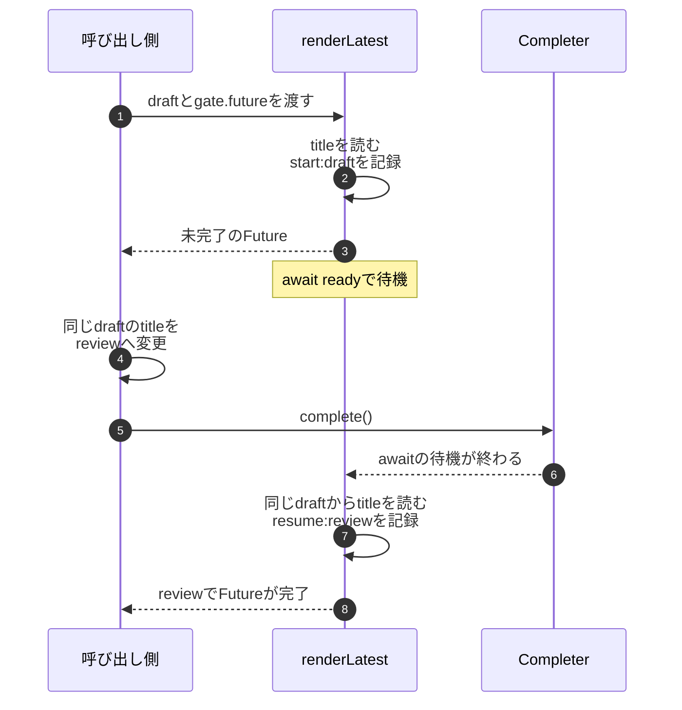

非同期関数を呼んだ後に、渡したオブジェクトを書き換えました。関数が待機から戻ったとき、読むのは呼び出した時点の値でしょうか、それとも変更後の値でしょうか。

この問いには、`Future<String>` という戻り値の型だけでは答えられません。どのオブジェクトを保持し、いつ属性を読むかを見る必要があります。Dart 3.11.5向けの説明用コードで、その時系列を分けます。Dart 3.11.5で実行し、待機前の記録、再開後の値、失敗時の記録を期待値と照合しました。

## awaitすれば、呼び出した時点の状態が固定されますか？

次の2つの関数は、同じ `ExportDraft` と、完了を待つFutureを受け取ります。`renderLatest` は待機の後にtitleを読み、`renderRequested` は待機の前に取り出したStringを使います。

`Completer` は例を進めるための合図です。ネットワークやsleepを使わず、どの時点で待機を終わらせるかを呼び出し側で決めます。[Dart: Completer](https://api.dart.dev/dart-async/Completer-class.html)

```dart file="execution_model.dart"
import 'dart:async';
import 'dart:convert';

final class ExportDraft {
  String title;
  ExportDraft(this.title);
}

Future<String> renderLatest(
  ExportDraft draft, Future<void> ready, List<String> events,
) async {
  events.add('start:${draft.title}');
  await ready;
  events.add('resume:${draft.title}');
  return draft.title;
}

Future<String> renderRequested(
  ExportDraft draft, Future<void> ready, List<String> events,
) async {
  final requestedTitle = draft.title;
  events.add('start:$requestedTitle');
  await ready;
  events.add('resume:$requestedTitle');
  return requestedTitle;
}

typedef Renderer = Future<String> Function(
  ExportDraft draft, Future<void> ready, List<String> events,
);

Future<Map<String, Object?>> changedWhileWaiting(Renderer render) async {
  final draft = ExportDraft('draft');
  final gate = Completer<void>();
  final events = <String>[];
  final pending = render(draft, gate.future, events);
  final beforeComplete = List<String>.of(events);
  draft.title = 'review';
  events.add('edit:review');
  gate.complete();
  final rendered = await pending;
  return {
    'before_complete': beforeComplete,
    'events': events,
    'rendered': rendered,
    'current_title': draft.title,
  };
}

Future<Map<String, Object?>> failedWhileWaiting() async {
  final gate = Completer<void>();
  final events = <String>[];
  final pending = renderRequested(ExportDraft('draft'), gate.future, events);
  try {
    gate.completeError(StateError('blocked'));
    await pending;
    return {'outcome': 'unexpected_success', 'events': events};
  } on StateError {
    return {'outcome': 'StateError', 'events': events};
  }
}

Future<void> main() async {
  print(jsonEncode({
    'latest': await changedWhileWaiting(renderLatest),
    'requested': await changedWhileWaiting(renderRequested),
    'failed': await failedWhileWaiting(),
  }));
}
```

`changedWhileWaiting` の順序は、関数の呼び出し、同じdraftの変更、合図の完了、結果の取得です。`await pending` は関数の完了を待ちますが、渡したdraftの過去の状態を保存する操作ではありません。

| 出力内の値 | latestの期待値 | requestedの期待値 |
| --- | --- | --- |
| `before_complete` | `['start:draft']` | `['start:draft']` |
| `rendered` | `review` | `draft` |
| `current_title` | `review` | `review` |

どちらが適切かは要件によります。「完了時点の最新のタイトル」を使うなら前者、「依頼時点のタイトル」を使うなら後者です。`renderRequested` も元のdraftへの変更を止めてはいません。この例ではStringを先に取り出すことで、使う値を固定しています。可変リストやオブジェクトを代入するだけで、その内部まで複製されると考えないでください。

## 関数は呼んだ瞬間に、どこまで進みますか？

Dartの `async` 関数は最初の `await` までは同期的に進みます。そのため、この例では `pending` を受け取る時点で `start:draft` がeventsへ追加されています。[Dart: Execution flow with async and await](https://dart.dev/libraries/async/async-await#execution-flow-with-async-and-await)



上から順に読みます。実線は呼出しや状態を読む処理、破線はFutureを返す処理や完了の通知です。待機の前後で、titleを読む位置が2か所あります。

この例は同じisolate内の処理です。非同期で待機することから、別スレッドで同時にCPU処理を実行すると推測する必要はありません。Dartのisolate、イベントループ、並列実行は区別して読みます。[Dart: Concurrency](https://dart.dev/language/concurrency)

また、戻り値がFutureであることだけで「呼び出してもまだ何も始まらない」とは判断できません。何を返し、どの処理がいつ始まるかは関数の契約を見ます。型と待機の基礎は[Future型とasync/awaitの役割](/tech-note/articles/flutter/dart/dart-future-async-await/)で扱います。

## 成功時の順序が分かれば、調査は終わりですか？

失敗の境界も確認します。`failedWhileWaiting` は待機中のFutureを `StateError` で完了させています。期待値は `outcome: StateError`、eventsは `['start:draft']` だけです。`await` の後にある `resume` の記録には進みません。

`await` したFutureがエラーで完了すると、その位置でエラーを受け取れます。この例では呼び出し側で捕捉しています。エラーを捕捉したからといって、待機前の処理や別の場所で行った変更まで取り消されるわけではありません。[Dart: Futureのエラー処理](https://dart.dev/libraries/async/async-await#handling-errors)

実際の調査で役立つのは、期待する順序と比べられる記録です。上の `events` は説明用タイトルと処理の段階だけを残します。`latest` の期待順序は `start:draft → edit:review → resume:review`、`requested` は最後が `resume:draft` になります。実行して得たeventsも、この順序と一致しました。

## 別のフレームワークでも、何を共通の問いにできますか？

共通化できるのは調べる問いです。Dartのawait、DBのtransaction、Swiftのactor隔離が同じ仕組みという意味ではありません。

| 観点 | 今回の例で確認すること | 別の処理へ進むときの確認先 |
| --- | --- | --- |
| 状態 | titleはdraftにあり、取り出したStringと分けて読む | [Dirty Trackingはどこに残るか](/tech-note/articles/rails/active_record/active-record-dirty-tracking-lifecycle/) |
| 同一性 | 呼び出し側と関数が同じdraftを参照している | [値・参照・識別の比較](/tech-note/articles/architecture/execution-model/identity-equality-ruby-dart-swift/) |
| 寿命 | Futureの完了まで、必要な値とeventsを保持する | [CancelTokenの所有と終了](/tech-note/articles/flutter/architecture/dio-cancel-token-lifecycle/) |
| transaction | この例にDB transactionはなく、awaitはrollbackを提供しない | [with_lockとreloadの影響](/tech-note/articles/rails/active_record/with-lock-dirty-tracking-after-commit/) |
| 非同期・並行性 | 待機前後の読み取りを分ける | [Swiftのactor隔離とnonisolated](/tech-note/articles/swift/concurrency/swift-nonisolated-actor-isolation/) |
| 副作用 | draftの変更とeventsへの記録が別の場所で起きる | [保存領域とDIの役割](/tech-note/articles/flutter/auth/di-dio-secure-storage-roles/) |

UIでも、変更が届く対象を追う問いは使えます。ただしSwiftUIのSafe Areaはレイアウトの規則なので、今回のawaitの順序から挙動を推測することはできません。[ignoresSafeAreaの適用先](/tech-note/articles/swiftui/layout/swiftui-ignores-safe-area/)のように、対象の仕様と実行環境で確認します。

## 新しいAPIを調べるとき、何を最小例に残しますか？

まず入力と期待結果を1つ決め、次に期待が崩れる境界を1つ動かします。今回なら「待機中にtitleを変える」がその境界です。成功と失敗を同じ例へ入れ、どの行まで進んだかを確認します。

記録するのは、利用版、入力、状態の保持先、読み取る時点、成功時と失敗時の結果、根拠となる公開契約です。時間やスレッド名を推測で補う必要はありません。依存先を代わりの実装へ差し替えた場合は、その例で確かめられる範囲も書きます。

その後、外部境界で必要な検証を追加します。今回のCLI例は共有状態の読み取り時点を確かめるもので、実際の保存や通信の成功は確認しません。どの層に何を残すかは[テストの重複を機能境界で整理する](/tech-note/articles/rails/rspec/test-duplication-across-layers/)、APIの契約を狭める方法は[copyWithやwith_lockの名前と動作](/tech-note/articles/architecture/execution-model/framework-api-abstraction-leaks/)へつながります。

構文の意味を押さえた上で、誰が保持する値を、どの時点で読むかまで説明すると、確認すべき実行結果が具体的になります。
