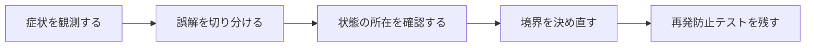

## 概要

Railsの同じDB行、Dartの`identical`、Swiftの`===`など、言語を跨ぐと「同じ」の意味が変わる。同じ値、同じ参照、同じ永続化IDを混同するとバグになる。

各言語で参照同一性、値等価性、ハッシュ契約、永続化同一性を分け、ドメイン上どの「同じ」を必要としているか明示する。

## この記事で学べること

- Ruby: `equal?`, `==`, `eql?`, `hash`
- Active Record: 同じprimary keyでも別Rubyインスタンス
- Dart: `identical`, `==`, `hashCode`
- Swift: classの`===`, `Equatable`の`==`, value type
- Hash/Set/Dictionary keyの契約
- immutable Value Object

## 前提知識

- Rails、Dart、Swiftのいずれかで、状態や副作用の扱いに触れたこと
- フレームワークのAPIを使った経験があり、状態・トランザクション・非同期処理の境界で詰まり始めていること
- この記事のコード例は匿名化した最小例であり、利用中のバージョンでは公式ドキュメントと実装を確認すること

## 図解




## 実装コード例

```text
Ruby:  equal? は同一オブジェクト、== は値の比較として再定義されることがある
Dart:  identical は同一性、== と hashCode は等価性
Swift: === はクラス参照の同一性、== は Equatable の等価性
```

## 本編

### 発生した状況

Railsの同じDB行、Dartの`identical`、Swiftの`===`など、言語を跨ぐと「同じ」の意味が変わる。同じ値、同じ参照、同じ永続化IDを混同するとバグになる。

### 当初の理解・誤解

当初は、API名やメソッド名から直感的に挙動を推測していました。しかし実際には、各言語で参照同一性、値等価性、ハッシュ契約、永続化同一性を分け、ドメイン上どの「同じ」を必要としているか明示する。 という観点で見る必要がありました。

### 観測したこと

- 3言語で同値別インスタンスを比較
- Ruby Hash、Dart HashSet、Swift Setの小例
- DB同一行を2回loadするRails例

### 修正案の比較

| 方針 | 見るべき点 |
| --- | --- |
| 値等価性 | ドメイン表現に有効／mutable値で危険 |
| 参照同一性 | 所有/共有確認／永続化同一性とは別 |

## 内部動作

複数の言語やフレームワークを横断すると、同じ名前の概念でも意味が変わります。構文を暗記するより、実行時に何が保持され、いつ評価され、どこで副作用が出るかを追う方が、保守時の判断に効きます。

- Swiftの`===`はclass instance identityでありvalue typeには使わない
- Rubyの`eql?`/`hash`関係を正確に説明
- 言語版により細部を確認

```text
syntax
  -> state
  -> lifecycle
  -> boundary
  -> execution model
```

## 調査手順

1. まず、入力値・保存前状態・保存後状態・コールバックや非同期処理の発火地点をログに残します。
2. 次に、DBやHTTP通信など外部境界をまたぐ処理を分けて、どこまでが同じトランザクションや同じライフサイクルに属するかを確認します。
3. 最後に、修正後の設計を最小テストへ落とし込み、同じ誤解が再発しないようにします。

- Swiftの`===`はclass instance identityでありvalue typeには使わない
- Rubyの`eql?`/`hash`関係を正確に説明
- 言語版により細部を確認

## 再発防止テスト

```text
given: 状態と境界を明示する
when: 実行モデルに沿って処理を進める
then: 期待した副作用だけが発生する
```

## 一般化できる設計原則

- API名が短いほど、裏側の実行モデルを確認する
- 状態を「値」「オブジェクト」「DB row」「外部サービス」のどこに置いているかを分けて考える
- トランザクションや非同期処理の境界をまたぐ副作用は、明示的な設計として扱う
- テストは成功確認だけでなく、誤解しやすい境界条件を固定する

## まとめ

「同じか？」という質問には、値・参照・DB identity・UI identityのどれかを必ず付ける。


この記事では、次のような短絡的な一般化は避けます。

- 演算子を単純対応表にしない
- primary key一致だけで全ドメイン等価としない

## 参考文献

- この記事は、提供された執筆仕様とサムネイルをもとに、公開用の匿名化された技術ノートとして再構成しています。
- Rails、Flutter、Dart、Swiftのバージョン差が関係する箇所は、利用中リポジトリの設定と公式ドキュメントで確認してください。
