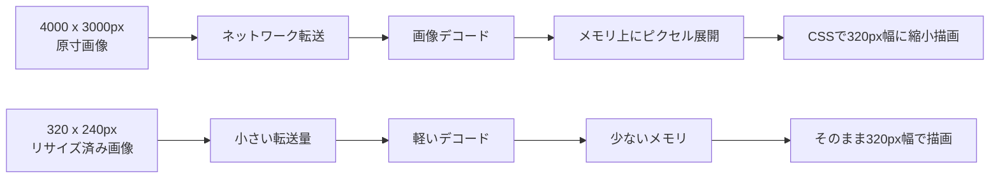
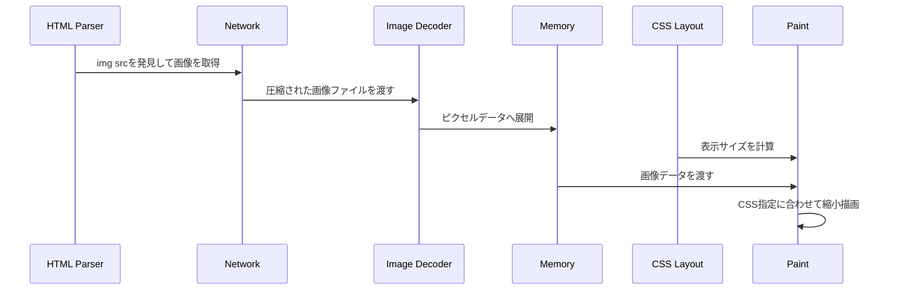

## 概要

Webアプリで画像一覧や詳細画面を実装していると、画像の表示が重くなることがあります。

特に、商品画像、プロフィール画像、投稿画像、車両画像、ギャラリー画像など、1画面に複数の画像を表示する場合は、画像サイズの扱いがパフォーマンスに大きく影響します。

ここで混同しやすいのが、次の違いです。

```text
px
width / height
画素数
ファイルサイズ
ブラウザ上のメモリ使用量
CSSでの表示サイズ
```

たとえば、CSSで画像を `width: 320px` にして表示していると、「画面上では小さいから軽いはず」と思いやすいです。

しかし実際には、CSSで小さく表示しても、ブラウザが読み込んでいる画像が原寸サイズのままなら、ネットワーク転送、画像デコード、メモリ使用量は原寸画像に近い負荷になります。

この記事では、画像最適化を考えるうえで重要な `px`、`width`、`height`、画素数の意味を整理し、なぜサムネイル用途ではリサイズ済み画像を配信する必要があるのかを説明します。

## この記事で学べること

- `px`、`width`、`height`、画素数の違い
- CSSで小さく表示しても画像ファイルが軽くならない理由
- 画像の負荷を横幅ではなく面積で考える理由
- ファイルサイズとデコード後メモリ使用量の違い
- `srcset` や画像変換URLを使って表示サイズに合った画像を配信する考え方
- 一覧、詳細、モーダル拡大で画像サイズを分ける設計

## 前提知識

- HTMLの `img` タグを使ったことがある
- CSSで `width` や `height` を指定したことがある
- Webアプリの一覧画面や詳細画面で画像を表示したことがある
- この記事では、画像CDNやフレームワーク固有の細かい設定よりも、ブラウザ内部で何が起きるかを優先して整理する

## 図解




同じ `width: 320px` 表示でも、ブラウザへ渡す画像が `4000px × 3000px` なのか、`320px × 240px` なのかで内部処理の重さは大きく変わります。

## 本編

### pxとは何か

`px` は pixel の略です。

画像における pixel は、画像を構成する最小単位です。

たとえば、次のような画像があるとします。

```text
4000px x 3000px
```

これは、横に4000個、縦に3000個のピクセルが並んでいる画像という意味です。

このとき、画像全体の画素数は次のようになります。

```text
4000 x 3000 = 12,000,000
```

つまり、この画像は1200万画素の画像です。

ここで重要なのは、`4000px` や `3000px` はそれぞれ「辺の長さ」を表しているということです。画像全体の大きさ、つまり画素数は、横幅と高さを掛け算して求めます。

```text
width x height = 画素数
```

画像の負荷を考えるときは、「横幅が何pxか」だけではなく、「横幅と高さを掛けた面積がどれくらいか」を見ます。

### widthとheightは画像の辺の長さ

`width` は横幅、`height` は高さを表します。

たとえば、次の画像があります。

```text
4000px x 3000px
```

この場合は、次のように整理できます。

```text
width  = 4000px
height = 3000px
```

一方で、Web画面上で画像を次のように表示することもあります。

```html

```

またはCSSで次のように指定することもあります。

```css
.image {
  width: 320px;
}
```

この場合、画面上では画像が横幅320pxで表示されます。

しかし、この `width: 320px` は、あくまで「画面上で320px幅に表示する」という指定です。ブラウザに読み込ませる画像そのものが320px幅になるわけではありません。

### CSSで小さく表示しても画像自体は軽くならない

たとえば、次のようなHTMLがあるとします。

```html

```

```css
.thumbnail {
  width: 320px;
}
```

このとき、`original.jpg` が `4000px × 3000px` の画像だった場合、ブラウザはまずその原寸画像を読み込みます。

処理の流れは、おおよそ次のようになります。

```text
1. 4000px x 3000px の画像ファイルをネットワークから取得する
2. ブラウザが画像をデコードする
3. メモリ上に画像データを展開する
4. CSSに従って、画面上では320px幅に縮小して描画する
```

つまり、見た目は320px幅でも、ブラウザ内部では大きな画像を扱っています。

CSSで小さく表示することと、画像ファイル自体を小さくすることは別です。

ここを混同すると、一覧画面で大量の原寸画像を読み込んでしまい、ページが重くなります。

### w=320は横幅320pxの画像を返すという意味

画像配信APIや画像変換サービスでは、URLに `w=320` のようなパラメータを付けることがあります。

```text
/images/sample.jpg?w=320
```

これは多くの場合、「横幅320pxにリサイズした画像を返す」という意味です。

ここで注意したいのは、`w=320` は「画像全体が320画素になる」という意味ではないことです。

たとえば、4:3の画像を横幅320pxに縮小すると、画像サイズはおおよそ次のようになります。

```text
320px x 240px
```

この画像の画素数は次の通りです。

```text
320 x 240 = 76,800
```

つまり、約7.7万画素です。

元画像が `4000px × 3000px` だった場合は、次のように大きく削減されます。

```text
元画像:   4000 x 3000 = 12,000,000画素
縮小後:    320 x  240 =     76,800画素
```

画素数は100分の1以下になります。

この差が、ネットワーク転送量、デコード処理、メモリ使用量、描画負荷に効きます。

### 画像の重さは横幅だけでなく面積で効く

画像の負荷を考えるときは、横幅だけを見るのではなく、横幅と高さを掛けた面積で考える必要があります。

たとえば、4:3の画像を段階的に小さくすると、画素数は次のようになります。

```text
4000 x 3000 = 12,000,000画素
2000 x 1500 =  3,000,000画素
1000 x  750 =    750,000画素
 500 x  375 =    187,500画素
 320 x  240 =     76,800画素
```

横幅を半分にすると、高さも半分になります。

つまり、画素数は次のように減ります。

```text
1/2 x 1/2 = 1/4
```

横幅を半分にすると、画素数は約4分の1になります。

画像サイズの最適化では、この「面積で効く」という感覚が重要です。

### ファイルサイズとメモリ使用量は別物

画像の重さを考えるとき、ファイルサイズだけを見るのも不十分です。

JPEG、PNG、WebP、AVIFなどの画像ファイルは、圧縮された状態で保存されています。そのため、`4000px × 3000px` の画像でも、ファイルサイズは数MB程度のことがあります。

しかし、ブラウザが画像を表示するには、圧縮された画像をデコードして、ピクセルデータとしてメモリ上に展開する必要があります。

一般的な目安として、デコード後の画像は1ピクセルあたりRGBAの4バイト相当として考えると理解しやすいです。

たとえば、`4000px × 3000px` の画像なら次のようになります。

```text
4000 x 3000 x 4 byte = 48,000,000 byte
```

つまり、デコード後は約48MB相当のメモリを使う可能性があります。

JPEGファイルとしては数MBでも、ブラウザ上では数十MB規模の画像データとして扱われることがあります。

これが一覧画面で何十枚も並ぶと、メモリ使用量は大きくなります。

```text
48MB x 20枚 = 960MB
```

もちろん、実際にはブラウザの最適化、キャッシュ、表示領域外の扱いなどがあります。それでも、原寸画像を大量に読み込む設計が危険であることは変わりません。

特にスマートフォンでは、PCよりメモリ制約が厳しいため、画像の扱いが原因でページが重くなったり、ブラウザがクラッシュしたりすることがあります。

### 表示サイズと配信サイズを分けて考える

画像を扱うときは、次の2つを分けて考える必要があります。

```text
表示サイズ:
画面上で何pxの大きさで表示するか

配信サイズ:
ブラウザに何pxの画像を渡すか
```

たとえば、カード型の一覧画面で画像を横幅320pxで表示するなら、配信する画像も横幅320px前後で十分なケースが多いです。

```html

```

この場合、ブラウザには最初から小さい画像が届きます。

一方で、次のような指定では不十分です。

```html

```

この場合、表示は320pxでも、読み込む画像は原寸のままです。

見た目は同じでも、ブラウザの負荷は大きく異なります。

### 用途ごとに画像サイズを変える

画像は、用途ごとに必要なサイズが違います。

一覧画面のサムネイル、詳細画面のメイン画像、モーダル拡大表示では、必要な解像度が違います。

一例として、次のように使い分けることができます。

```text
一覧画面のサムネイル:
w=320

管理画面の小さなプレビュー:
w=160〜320

スマホ詳細画面のメイン画像:
w=800〜1200

PC詳細画面のギャラリー:
w=1200〜1600

モーダル拡大表示:
w=2000以上、または原寸画像
```

大事なのは、どの画面で、どの大きさで見せるのかに合わせて、配信する画像サイズを変えることです。

一覧画面では軽く表示し、拡大表示が必要なときだけ高解像度画像を読み込む構成にすると、パフォーマンスと画質を両立できます。

```text
一覧では軽く
詳細では十分きれいに
拡大時だけ高解像度に
```

## 実装コード例

### 悪い例：CSSだけで小さくする

次のコードは、画面上では320px幅に見えます。

```html

```

```css
.card-image {
  width: 320px;
  height: auto;
}
```

しかし、`photo-original.jpg` が原寸画像なら、ブラウザは原寸画像を取得してから縮小描画します。

### 改善例：サムネイル用のURLを使う

一覧カードでは、表示サイズに近い配信サイズを使います。

```html

```

このように、最初から小さく変換された画像を返すURLを使うと、転送量、デコード量、メモリ使用量を減らせます。

### レスポンシブ画像ではsrcsetを使う

画面幅やDPRに応じて画像を出し分ける場合は、`srcset` と `sizes` を使います。

```html

```

このようにすると、ブラウザは画面サイズやデバイスの解像度に応じて、適切な画像候補を選択できます。

ただし、`srcset` を使うには、実際に `w=320` や `w=640` の画像を返せる仕組みが必要です。URLだけ分けても、サーバー側やCDN側でリサイズ画像を返せなければ意味がありません。

### Next.jsで考える場合

Next.jsの `next/image` は、`width` と `height` を画像のintrinsic sizeとして扱い、ブラウザがアスペクト比を推測してレイアウトシフトを避けるためにも使います。

```tsx
import Image from "next/image";

export function ProductCardImage() {
  return (
    <Image
      src="/uploads/photo.jpg"
      width={640}
      height={480}
      sizes="(max-width: 768px) 100vw, 320px"
      alt="商品画像"
    />
  );
}
```

ここでも大事なのは、「CSSで小さく見せる」だけではなく、「どのサイズの画像をブラウザに渡すか」を設計することです。

GitHub Pagesのような静的ホスティングでNext.jsの画像最適化を使わない構成では、ビルド時やアップロード時にリサイズ済み画像を用意する、画像CDNを使う、などの設計が必要になります。

## 内部動作

ブラウザが画像を表示するとき、ざっくり次の処理が行われます。



ポイントは、CSSの `width: 320px` は最後の描画段階に効く指定だということです。

画像取得、デコード、メモリ展開の段階では、基本的に実際に取得した画像サイズが効きます。

```text
CSS表示サイズが小さい
↓
描画される見た目は小さい
↓
しかし取得・デコード・メモリ展開は原寸画像の負荷になり得る
```

そのため、画像のパフォーマンス改善では、CSSだけではなく、配信する画像そのものを適切なサイズにする必要があります。

## 原寸画像を一覧で大量に読み込むと何が起きるか

一覧画面で原寸画像を大量に読み込むと、次のような問題が起きやすくなります。

```text
ページの初期表示が遅くなる
スクロールが重くなる
画像の読み込み完了まで時間がかかる
モバイル回線で通信量が増える
ブラウザのメモリ使用量が増える
スマートフォンでクラッシュしやすくなる
```

たとえば、1枚あたり数MBの画像を20枚、30枚と読み込むと、ネットワーク転送だけでも重くなります。

さらに、ブラウザはそれらを表示するためにデコードし、メモリ上に展開します。

そのため、画像一覧では原寸画像ではなく、サムネイル用の画像を配信するのが基本です。

## リサイズ画像を使うメリット

リサイズ画像を使うメリットは次の通りです。

```text
ネットワーク転送量を減らせる
画像デコード処理を軽くできる
ブラウザのメモリ使用量を減らせる
一覧画面の表示が速くなる
スクロールが安定しやすくなる
スマートフォンでクラッシュしにくくなる
```

画像が多いアプリケーションでは、リサイズ画像の効果はかなり大きいです。

特に、一覧画面、検索結果画面、ギャラリー画面、管理画面などでは、リサイズ画像を使うかどうかで体感速度が変わります。

## リサイズ画像を使うときの注意点

一方で、リサイズ画像を使う場合には注意点もあります。

```text
サーバー側で画像変換処理が必要になる
画像URLの設計が必要になる
キャッシュ戦略を考える必要がある
初回生成時に処理時間がかかる場合がある
原寸画像とリサイズ画像の使い分けが必要になる
```

アクセスのたびに毎回画像をリサイズすると、サーバー負荷が高くなります。

そのため、実運用では次のような仕組みを組み合わせることが多いです。

```text
アップロード時に複数サイズを生成する
初回アクセス時にリサイズしてキャッシュする
CDNの画像変換機能を使う
オブジェクトストレージにリサイズ済み画像を保存する
```

どの方式を選ぶかは、アプリケーションの規模、画像枚数、更新頻度、インフラ構成によって変わります。

## 実装時の考え方

実装では、まず画像を表示する場所を分類すると整理しやすいです。

```text
一覧カード
詳細画面
ギャラリー
モーダル拡大表示
管理画面のプレビュー
コメントや投稿のサムネイル
```

そのうえで、それぞれに必要な画像サイズを決めます。

```text
一覧カード:
小さいサムネイル画像を使う

詳細画面:
中サイズ画像を使う

モーダル拡大:
高解像度画像を使う

管理画面:
用途に応じて小〜中サイズ画像を使う
```

このように、表示場所ごとに画像サイズを決めておくと、無駄に大きな画像を読み込まずに済みます。

実務では、次のような表を先に作っておくと実装判断がぶれにくくなります。

| 画面 | 表示サイズ | 配信サイズ | 備考 |
|---|---:|---:|---|
| 一覧カード | 160〜320px | 320〜640px | DPRを考慮して少し大きめでもよい |
| 詳細メイン画像 | 800〜1200px | 1200〜1600px | 画質を優先する |
| モーダル拡大 | 画面幅いっぱい | 2000px以上 | 必要になったときだけ読む |
| 管理画面プレビュー | 120〜320px | 240〜640px | 一覧性を優先する |

最初から「全部原寸で出す」ではなく、「どの画面でどの解像度が必要か」を決めることが、画像が多いWebアプリでは重要です。

## まとめ

画像最適化では、見た目の表示サイズだけを見るのではなく、ブラウザに渡している画像の実際のサイズを見る必要があります。

`width: 320px` で表示していても、読み込んでいる画像が `4000px × 3000px` の原寸画像なら、ブラウザは大きな画像を取得し、デコードし、メモリ上に展開しています。

`px` は画像や画面の辺の長さを表す単位です。一方で、画像の負荷に大きく効くのは、横幅と高さを掛けた画素数です。

```text
width x height = 画素数
```

そして、ブラウザ上ではデコード後の画像が1ピクセルあたりおおよそ4バイト相当のメモリを使うため、原寸画像を大量に読み込むと負荷が大きくなります。

画像一覧やサムネイル表示では、原寸画像ではなく、用途に合ったリサイズ画像を配信することが重要です。

```text
CSSで小さく表示するだけでは不十分
ブラウザに渡す画像そのものを小さくする
用途ごとに適切な画像サイズを使い分ける
```

この考え方を持っておくと、画像が多いWebアプリでも、画質とパフォーマンスを両立しやすくなります。

## 参考文献

- [MDN Web Docs: Responsive images](https://developer.mozilla.org/en-US/docs/Learn_web_development/Core/Structuring_content/Responsive_images)
- [MDN Web Docs: img element](https://developer.mozilla.org/en-US/docs/Web/HTML/Reference/Elements/img)
- [web.dev: Learn Images](https://web.dev/learn/images)
- [Next.js Docs: Image Component](https://nextjs.org/docs/app/api-reference/components/image)
