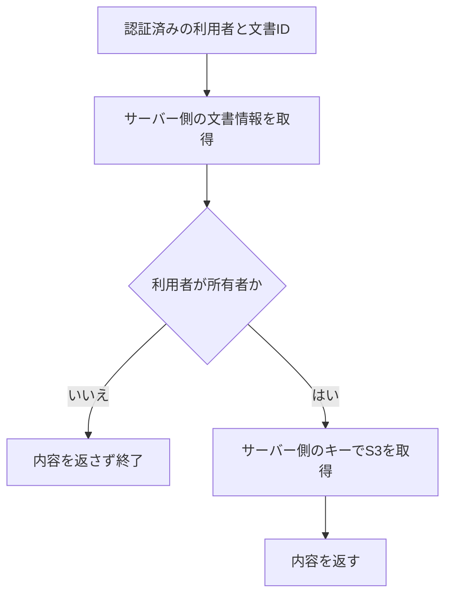

Lambdaは、実行ロールなどで許可された範囲のS3オブジェクトを読み取ります。その関数を呼んだ利用者へ何を返してよいかは、別に判断する必要があります。

たとえば、同じ関数が複数の利用者の文書を取得する構成では、関数のIAM権限は共通でも、利用者ごとに閲覧可能な文書は違います。AWS資源へのアクセス権限と、アプリケーションの認可を分けて考えます。

## 実行ロールは、誰の権限を表すか

Lambdaの実行ロールは、関数がAWSサービスや資源へアクセスするためのIAMロールです。Lambdaサービスが設定済みの実行ロールを引き受けます。関数自身が実行ロールを使うために、毎回`AssumeRole`を呼ぶ必要はありません。[AWSのLambda実行ロール](https://docs.aws.amazon.com/lambda/latest/dg/lambda-intro-execution-role.html)

AWS SDK for JavaScript v3は、認証情報を明示しなければ既定のcredential provider chainから探します。通常のLambdaでは実行ロール由来の認証情報を利用できるため、ソースコードへアクセスキーを埋め込む必要はありません。独自に別の認証情報を渡すと、使用する主体が変わる点には注意します。[AWS SDKの認証情報の解決](https://docs.aws.amazon.com/sdk-for-javascript/v3/developer-guide/setting-credentials-node.html)

| 判定 | 確認する主体と対象 |
| --- | --- |
| 関数の呼出しを許すか | API入口やLambdaの呼出し元 |
| 関数がS3を読めるか | 実行ロールと対象のS3オブジェクト |
| 利用者に文書を返してよいか | 認証済み利用者と文書の所有・参加関係 |

入口で認証が成功しても、最後の行は残ります。IAMへアプリ固有の利用者・文書の関係を自動的に伝える構成でなければ、共有の実行ロールからその関係は判定できません。

## ロールを使えることと、S3を読めることを分ける

ロールの信頼ポリシーは、誰がそのロールを引き受けられるかを定義します。権限ポリシーは、引き受けた主体が何を操作できるかを定義します。[AWSのサービス向けロール](https://docs.aws.amazon.com/IAM/latest/UserGuide/id_roles_create_for-service.html)

以下は構造を説明するための設定例です。AWSへ適用していません。バケット名も架空の例で、既存バケットや利用者の情報を表していません。

Lambdaを信頼する部分は次の形です。

```json
{
  "Version": "2012-10-17",
  "Statement": [{
    "Effect": "Allow",
    "Principal": { "Service": "lambda.amazonaws.com" },
    "Action": "sts:AssumeRole"
  }]
}
```

一方、通常のS3バケットの`documents/`配下で現在のオブジェクトを読む許可は、別のポリシーです。

```json
{
  "Version": "2012-10-17",
  "Statement": [{
    "Effect": "Allow",
    "Action": "s3:GetObject",
    "Resource": "arn:aws:s3:::example-documents/documents/*"
  }]
}
```

この許可には、バケット一覧の取得や書込みは含めていません。特定バージョンの取得、暗号化されたオブジェクト、他アカウントとのアクセスなどでは追加条件が関係します。[S3 GetObjectの権限](https://docs.aws.amazon.com/AmazonS3/latest/API/API_GetObject.html)

また、このJSONがあるだけでアクセス成功を保証することはできません。資源側のポリシーや組織の制限なども評価され、明示的なDenyはAllowより優先されます。[IAMのポリシー評価](https://docs.aws.amazon.com/IAM/latest/UserGuide/reference_policies_evaluation-logic.html)

CDKなどでこれらを定義しても、アプリの閲覧ルールが自動生成されるわけではありません。インフラコードが設定する権限と、実行時に業務データを使って判断する認可は分担します。

## 文書を取得する前に、利用者との関係を確認する

説明用の文書APIを考えます。文書IDを受け取り、サーバーが持つ文書情報から所有者とS3キーを取得する構成です。利用者IDは、認証処理が確認した結果を使います。リクエスト本文やクエリで指定された利用者IDを、そのまま信用しません。



以下はこの順序を確かめるTypeScriptの例です。`loadDocument`と`readObject`は外から渡す処理で、後の確認ではどちらも合成データを使います。認証・AWS SDK・DBは実装していません。

```typescript
type Principal = { userId: string };
type Document = { ownerId: string; objectKey: string };
type Dependencies = {
  loadDocument: (id: string) => Promise<Document | undefined>;
  readObject: (key: string) => Promise<string>;
};

export async function readDocument(
  principal: Principal,
  documentId: string,
  dependencies: Dependencies,
) {
  const document = await dependencies.loadDocument(documentId);
  if (!document || document.ownerId !== principal.userId) {
    return { status: 404, body: "not found" };
  }

  const body = await dependencies.readObject(document.objectKey);
  return { status: 200, body };
}
```

他人の文書と存在しない文書は、どちらも404にしています。この例で、文書の有無を応答から区別させないための方針です。すべてのAPIで404にすべきという意味ではありません。読取り自体が失敗した場合は例外が上がるので、HTTP層では業務上の拒否と基盤障害を分けて扱います。

`objectKey`は利用者から直接受け取らず、サーバー側の文書情報から決めています。実アプリでは取得するデータの範囲も利用者で絞れます。どの方式でも、対象の文書について権限を確認する必要があります。[OWASPのオブジェクト単位の認可](https://cheatsheetseries.owasp.org/cheatsheets/Authorization_Cheat_Sheet.html#ensure-lookup-ids-are-not-accessible-even-when-guessed-or-cannot-be-tampered-with)

## 拒否した要求で、読取り処理が走っていないことを確かめる

上のコードを`documents.ts`へ保存し、Node.js 22とTypeScriptでCommonJSとしてビルドします。`"type": "module"`を指定していない作業用ディレクトリを使います。

```bash
tsc documents.ts --strict --target ES2022 --module commonjs --outDir dist --skipLibCheck
```

次を`check.cjs`へ保存します。ユーザー・文書・キー・本文は、すべて説明用の合成データです。

```javascript
const assert = require("node:assert/strict");
const { readDocument } = require("./dist/documents.js");

async function check() {
  const keysRead = [];
  const dependencies = {
    loadDocument: async (id) => id === "document-a"
      ? { ownerId: "user-a", objectKey: "documents/a.txt" }
      : undefined,
    readObject: async (key) => {
      keysRead.push(key);
      return "sample document";
    },
  };

  const denied = await readDocument(
    { userId: "user-b" }, "document-a", dependencies,
  );
  assert.equal(denied.status, 404);
  assert.deepEqual(keysRead, []);

  const allowed = await readDocument(
    { userId: "user-a" }, "document-a", dependencies,
  );
  assert.deepEqual(allowed, { status: 200, body: "sample document" });
  assert.deepEqual(keysRead, ["documents/a.txt"]);
}

check().catch((error) => {
  console.error(error);
  process.exitCode = 1;
});
```

`node check.cjs`で、他人の要求では読取りが0回、所有者の要求ではサーバー側のキーを1回読むことを確認できます。Node.js 22.13.0、TypeScript 5.9.3でこのコードを実行しました。実IAM、S3、認証機構の試験ではありません。

## IAMを絞っても残る、業務側の判断

この例の所有者比較は、認可を置く位置を示す最小のルールです。共同閲覧、利用停止、退会、文書の移管があるアプリでは、その条件も認可へ含めます。権限の変更が読取りと同時に起きる場合、どの時点の状態で判断するかも設計します。

利用者の認可と関数のIAM権限を両方絞ると、どの範囲の操作を誰が許可するかを確認しやすくなります。認可を画面表示だけで済ませず、内容を返すAPI側でも要求ごとに確認します。[OWASPの要求ごとの権限検査](https://cheatsheetseries.owasp.org/cheatsheets/Authorization_Cheat_Sheet.html#validate-the-permissions-on-every-request)

ログイン・Cookie・JWT・OIDCの役割は、[認証方式を整理する記事](/tech-note/articles/architecture/auth/authentication-types/)で扱っています。そこで得た認証済み主体を、この文書APIの判定へどう渡すかをつなげて考えます。
