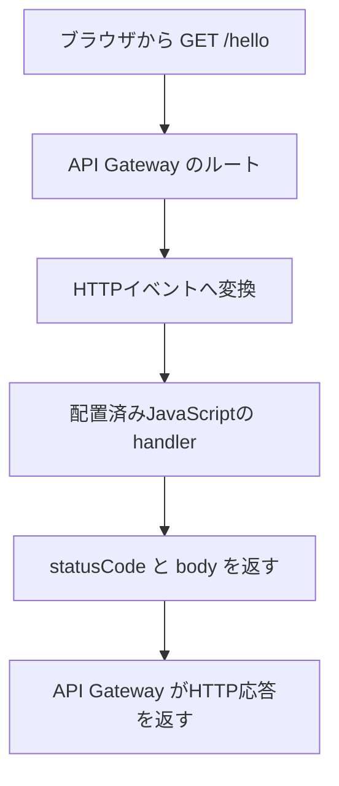

TypeScriptでバックエンドを書いてLambdaへ置く場合、ブラウザからそのファイルをimportすればAWS側で実行されるわけではありません。ブラウザはAPIへリクエストを送り、AWS側では配置済みのコードが入力を受け取って実行されます。

混ざりやすいのは、処理を書く言語、コードを動かす実行環境、外部から呼ぶ入口の3つです。ここでは、API GatewayのHTTP APIからLambdaを呼ぶ構成に絞ります。

## TypeScriptのファイルとLambdaの設定は何が違うか

AWSのTypeScript向け手順では、コードをJavaScriptへ変換してからLambdaへ配置します。TypeScriptの型検査と、配置したJavaScriptの実行は別の工程です。[AWSのTypeScript Lambdaガイド](https://docs.aws.amazon.com/lambda/latest/dg/lambda-typescript.html)

| 決めること | この例での役割 |
| --- | --- |
| TypeScriptのソース | `index.ts`に入力の確認と応答を書く |
| ビルドしたJavaScript | `dist/index.js`を実行する |
| Lambdaのhandler設定 | 配置したファイル名と公開関数名を指定する |
| API Gatewayのルート | `GET /hello`を対象のLambdaへ結び付ける |

関数の入口を`handler`としてexportし、`index.js`を配置パッケージのルートへ置いた場合、handler設定は`index.handler`です。ローカルの`dist/`という名前を、そのままhandler設定へ付けるわけではありません。設定は**配置先のファイル構成**に合わせます。[AWSのhandler命名規則](https://docs.aws.amazon.com/lambda/latest/dg/typescript-handler.html#typescript-handler-naming)

CDKなどのインフラコードは、関数・権限・APIルートなどの資源を定義して配置を管理します。入力を受けて何を返すかは、関数のコードに書く処理です。同じTypeScriptでも、インフラを定義するコードとリクエストを処理するコードでは実行する場面が違います。[AWS CDKの権限とデプロイの説明](https://docs.aws.amazon.com/cdk/v2/guide/permissions.html)

## HTTPリクエストは、どんな入力に変わるか

HTTP APIのLambda proxy integrationでは、API Gatewayがリクエストをイベントへ変換し、Lambdaへ渡します。関数の戻り値はAPI Gatewayが解釈してHTTPレスポンスになります。[HTTP APIとLambdaの統合](https://docs.aws.amazon.com/apigateway/latest/developerguide/http-api-develop-integrations-lambda.html)



受け取るのは、パス、クエリ、本文などのデータです。クライアントから送ったソースコードを自由に実行する仕組みではありません。

HTTP APIのpayload formatには`1.0`と`2.0`があります。以下は`2.0`を使います。HTTPメソッドは`requestContext.http.method`、パスは`rawPath`から読みます。REST APIや別形式のイベントへ、そのまま流用しないようにします。カスタムドメインのAPI mappingを使う場合、`rawPath`にはmappingの値が含まれない点も確認が必要です。[payload formatの違い](https://docs.aws.amazon.com/apigateway/latest/developerguide/http-api-develop-integrations-lambda.html#http-api-develop-integrations-lambda.proxy-format)

## AWSへ接続せず、handlerの入力と応答を確かめる

以下は説明用の例です。認証のない挨拶処理で、DBや外部APIは使いません。イベント全体のschemaを検証するコードではなく、処理で読む項目の形を確認します。名前は説明を小さくするため、英字1〜20文字に限定しています。

`index.ts`へ保存します。

```typescript
function isRecord(value: unknown): value is Record<string, unknown> {
  return typeof value === "object" && value !== null && !Array.isArray(value);
}

function response(statusCode: number, body: Record<string, string>) {
  return {
    statusCode,
    headers: { "content-type": "application/json" },
    body: JSON.stringify(body),
    isBase64Encoded: false,
  };
}

export async function handler(event: unknown) {
  if (!isRecord(event) || event.version !== "2.0") {
    return response(400, { error: "unsupported event" });
  }

  const context = event.requestContext;
  if (!isRecord(context) || !isRecord(context.http)) {
    return response(400, { error: "invalid HTTP context" });
  }
  if (context.http.method !== "GET" || event.rawPath !== "/hello") {
    return response(404, { error: "not found" });
  }

  const query = event.queryStringParameters ?? {};
  if (!isRecord(query)) {
    return response(400, { error: "invalid query" });
  }
  const name = query.name === undefined ? "Reader" : query.name;
  if (typeof name !== "string" || !/^[A-Za-z]{1,20}$/.test(name)) {
    return response(400, { error: "invalid name" });
  }

  return response(200, { message: `Hello, ${name}!` });
}
```

`unknown`で受け取り、読む前に値を確認しています。TypeScriptの型を付けるだけで、外から届く値の内容まで検証されるわけではありません。また、`body`はオブジェクトをJSON文字列へ変換しています。HTTP APIの`2.0`には応答形式を推定する機能もありますが、この例ではstatusと本文の境界を明示します。[Lambda応答の形式](https://docs.aws.amazon.com/apigateway/latest/developerguide/http-api-develop-integrations-lambda.html#http-api-develop-integrations-lambda.response)

Node.js 22とTypeScriptを使える作業用ディレクトリで、CommonJSとしてビルドします。この例は`package.json`に`"type": "module"`を指定していない構成です。

```bash
tsc index.ts --strict --target ES2022 --module commonjs --outDir dist --skipLibCheck
```

次のコードは`check.cjs`へ保存します。イベントは、handlerが使う項目だけを持つ合成データです。AWSが生成するイベント全体の複製ではありません。

```javascript
const assert = require("node:assert/strict");
const { handler } = require("./dist/index.js");

async function check() {
  const event = {
    version: "2.0",
    rawPath: "/hello",
    requestContext: { http: { method: "GET" } },
    queryStringParameters: { name: "Mina" },
  };

  const ok = await handler(event);
  assert.equal(ok.statusCode, 200);
  assert.deepEqual(JSON.parse(ok.body), { message: "Hello, Mina!" });

  const invalid = await handler({
    ...event,
    queryStringParameters: { name: "" },
  });
  assert.equal(invalid.statusCode, 400);
  assert.deepEqual(JSON.parse(invalid.body), { error: "invalid name" });
}

check().catch((error) => {
  console.error(error);
  process.exitCode = 1;
});
```

`node check.cjs`がエラーなしで終了すれば、この2つの入力と期待値は一致しています。このコードをNode.js 22.13.0、TypeScript 5.9.3で実行して確認しました。AWSへの配置、ルート設定、認証、ネットワークの疎通は検証していません。

## API Gateway以外の入口を選ぶときは何が変わるか

Function URLはLambdaにHTTPSの入口を付ける方式です。API Gatewayを省いても、外部からリクエストを受ける入口と認証方針は残ります。必要な認証やAPI管理機能から方式を選びます。[AWSのHTTP呼出し方式の比較](https://docs.aws.amazon.com/lambda/latest/dg/furls-http-invoke-decision.html)

AWS SDKの`Invoke`を使う場合は、LambdaのInvoke APIを呼びます。呼出し側に`lambda:InvokeFunction`の権限が必要です。API Gatewayへ送るログイントークンと、AWS APIを呼ぶ権限を同一視しないようにします。[Lambda Invoke API](https://docs.aws.amazon.com/lambda/latest/api/API_Invoke.html)

入口が変われば、イベントの形、認証、失敗の返し方も確認し直します。まず呼出し方式とpayload形式を決め、その入力を扱うhandlerを書き、最後に配置先のコードと設定を一致させます。
