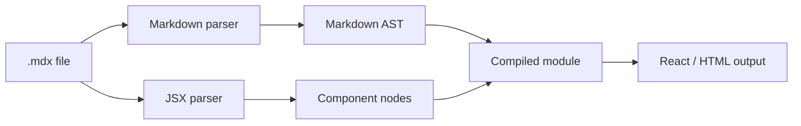

## 概要

`.mdx` は、MarkdownにJSXやコンポーネントを埋め込めるファイル形式です。

普通のMarkdownは、見出し、本文、リスト、コードブロック、リンク、画像などを書くための軽量な記法です。一方でMDXは、Markdownの読みやすさを残しながら、ReactコンポーネントのようなUI部品を本文内で使えるようにします。

たとえば、技術記事の中で次のような要素を扱いたい場合に便利です。

```text
Callout
Accordion
Mermaid
YouTube embed
Interactive component
Custom code block
```

このTech Noteでも、記事は `.mdx` として管理しています。文章だけなら `.md` でも足りますが、記事内で独自コンポーネントや拡張表示を使いたい場合、`.mdx` はかなり相性が良い形式です。

ただし、`.mdx` は単なる文章ファイルではありません。ビルド時にMarkdownとして解析され、JSXとして変換され、最終的にはWebページの一部として描画されます。そのため、Markdownより表現力が高い分、構文エラーやビルドエラーも起きやすくなります。

## この記事で学べること

- `.mdx` が何のための拡張子なのか
- `.md` と `.mdx` の違い
- MDXがビルド時にどのようにHTMLやReact要素へ変換されるのか
- 技術記事サイトでMDXを使うメリット
- MDXで壊れやすいポイント
- `.mdx` ファイルを扱うときの実務上の注意点

## 前提知識

- Markdownで見出しやコードブロックを書いたことがある
- HTMLタグを見たことがある
- Reactコンポーネントという言葉を聞いたことがある
- この記事ではMDXコンパイラの完全な実装ではなく、拡張子としての役割と実務上の扱いを整理する

## 図解




`.mdx` は、Markdown本文とJSXコンポーネントを同じファイルの中に置ける形式です。ビルド時には、Markdownとしての構文と、JSXとしての構文の両方が解釈されます。

## 本編

### .mdxは何の拡張子か

`.mdx` は、MDXファイルを表す拡張子です。

MDXは、MarkdownにJSXを組み合わせた形式です。

```text
Markdown + JSX = MDX
```

Markdownだけなら次のように書きます。

```md
## 注意点

この設定を変更すると、ビルド結果が変わります。
```

MDXでは、同じ文章の中にコンポーネントを置けます。

```mdx
## 注意点

<Callout type="warning">
  この設定を変更すると、ビルド結果が変わります。
</Callout>
```

このように、文章を中心にしながら、必要なところだけUI部品を差し込めるのが `.mdx` の特徴です。

### .mdとの違い

`.md` と `.mdx` は似ていますが、責務が違います。

| 拡張子 | 主な用途 | コンポーネント | 向いているもの |
|---|---|---|---|
| `.md` | Markdown文書 | 基本的には不可 | README、メモ、シンプルな記事 |
| `.mdx` | Markdown + JSX文書 | 可能 | 技術記事、Docs、コンポーネント付き記事 |

`.md` はプレーンなMarkdown文書として扱いやすいです。GitHub上でも読みやすく、エディタでも扱いやすいです。

一方、`.mdx` は表現力が高い代わりに、実行環境やビルド環境に依存します。MDXを理解できるツールチェーンがなければ、ただのテキストとしては読めても、最終的な表示結果は再現できません。

そのため、次のように使い分けると分かりやすいです。

```text
READMEや単純なメモ:
.md

Webページとして表現を作り込みたい記事:
.mdx
```

### .mdxの中身はテキストファイル

`.mdx` はバイナリファイルではなく、基本的にはテキストファイルです。

そのため、エディタで開いて編集できます。Gitでも差分を追いやすく、レビューもしやすいです。

ただし、テキストファイルだからといって、何を書いてもよいわけではありません。

MDXはMarkdownとJSXの両方のルールを受けます。

たとえば、JSXタグの閉じ忘れがあると、Markdown記事としては自然に見えても、ビルド時にエラーになることがあります。

```mdx
<Callout type="info">
  これは閉じタグがありません。
```

このような場合、Markdownとしては文章に見えても、MDXとしては不正です。

### MDXが使われる場所

`.mdx` は、次のような場所で使われます。

```text
技術ブログ
ドキュメントサイト
コンポーネントカタログ
プロダクトのヘルプページ
社内ナレッジベース
チュートリアル
```

特に、文章だけでなく「動くサンプル」や「独自UI」を見せたいドキュメントと相性が良いです。

たとえば、UIライブラリのドキュメントで、説明文の直後に実際のボタンコンポーネントを表示できます。

```mdx
## Button

フォーム送信などの主要アクションに使います。

<Button variant="primary">保存する</Button>
```

Markdownの読みやすさを保ちながら、Webページとしての表現力を足せるのがMDXです。

### .mdxは記事の正本に向いているか

技術記事サイトでは、`.mdx` は記事の正本として使いやすい形式です。

理由は、次の3つです。

```text
Gitで管理しやすい
Markdownとして本文を書きやすい
必要に応じてコンポーネントを差し込める
```

このTech Noteのように、記事をGitHub Repositoryで管理し、pushすると自動で静的サイトとして公開する構成では、`.mdx` は相性が良いです。

一方で、コンポーネントを使いすぎると、記事が特定のサイト実装に強く依存します。

たとえば、`<Callout>` や `<Mermaid>` のような独自コンポーネントを本文に多用すると、そのコンポーネントが存在しない別サイトへ移植しにくくなります。

そのため、記事の本文はMarkdown中心にし、必要なところだけMDXコンポーネントを使うのが扱いやすいです。

## 内部動作

`.mdx` は、保存された瞬間に特別な動きをするわけではありません。

重要なのは、ビルド時や実行時にMDX対応ツールがどう処理するかです。

一般的には、次のような流れになります。

```text
.mdx file
↓
frontmatterを読む
↓
Markdown構文を解析する
↓
JSX構文を解析する
↓
見出し、段落、コードブロック、コンポーネントをASTとして扱う
↓
ReactコンポーネントまたはHTMLへ変換する
↓
Webページとして描画する
```

ここで大事なのは、`.mdx` は「そのままブラウザが理解するファイル」ではないということです。

ブラウザは `.mdx` を直接記事ページとして表示しているわけではありません。Next.jsやMDX compilerのようなツールが、ビルド時に `.mdx` をページとして使える形へ変換します。

つまり、`.mdx` は次のような位置づけです。

```text
人間が書く入力ファイル:
.mdx

ビルドツールが変換する中間表現:
AST / module

ブラウザが受け取る出力:
HTML / CSS / JavaScript
```

### FrontMatterとの組み合わせ

技術記事サイトでは、`.mdx` の先頭にFrontMatterを書くことが多いです。

```mdx
---
title: ".mdxとは何か"
description: MDXの用途を整理する
date: 2026-06-30
tags:
  - MDX
  - Markdown
---

## 概要

本文を書きます。
```

FrontMatterは、記事タイトル、説明文、投稿日、タグ、カテゴリ、サムネイルなどのメタデータを管理するために使います。

本文とは別にメタデータを持てるため、一覧ページ、検索、SEO、関連記事、シリーズページを生成しやすくなります。

### MDXで壊れやすいポイント

`.mdx` は便利ですが、Markdownより壊れやすいところがあります。

代表的には次のようなものです。

```text
JSXタグの閉じ忘れ
コンポーネント名のtypo
importできないコンポーネントを使う
Markdown内の < や { } がJSXとして解釈される
空行の位置で意図しない構文になる
```

特に、`<` や `{}` を本文中にそのまま書くと、MDXがJSXとして解釈しようとすることがあります。

たとえば、説明文として次のように書きたい場合があります。

```text
Array<T> のような型を書く
```

MDXでは、文脈によっては `<T>` がタグのように見える場合があります。

そのため、コードとして表したいものはインラインコードやコードブロックに入れるのが安全です。

```mdx
`Array<T>` のような型を書く
```

### 編集してよいファイルか、生成物か

`.mdx` は多くの場合、開発者や執筆者が直接編集するソースファイルです。

一方、`.html`、`.js`、`.json` などに変換されたビルド結果は、通常は直接編集しません。

```text
編集する:
articles/example.mdx

直接編集しない:
out/articles/example/index.html
```

この区別は重要です。

静的サイト生成では、`.mdx` を編集し、ビルドして、出力されたHTMLを公開します。公開後にHTMLを直接修正しても、次回ビルドで上書きされます。

### .mdxを見つけたときの確認ポイント

プロジェクト内で `.mdx` を見つけたら、まず次の順番で確認すると整理しやすいです。

```text
1. どのディレクトリに置かれているか
2. FrontMatterに何が書かれているか
3. 本文に独自コンポーネントが使われているか
4. importが必要なMDXか
5. どのページ生成処理から読み込まれているか
6. 公開URLや検索インデックスに含まれるか
```

たとえば、`articles/` 配下にある `.mdx` は記事本文である可能性が高いです。`docs/` 配下ならドキュメント、`pages/` や `app/` 配下ならルーティングと結びついたページかもしれません。

また、FrontMatterがある場合は、本文だけでなくメタデータも重要です。

```mdx
---
title: "Example"
description: "Example description"
draft: false
---
```

`draft: true` なら公開対象から外れるかもしれません。`category` や `tags` があれば一覧ページや検索に影響します。`thumbnail` があれば記事カードやOGPの見え方に関わります。

つまり、`.mdx` を読むときは「文章ファイル」としてだけではなく、「Webページを生成するための入力ファイル」として見る必要があります。

### .mdxを使わない方がよいケース

`.mdx` は便利ですが、すべての文書に向いているわけではありません。

たとえば、次のような用途では `.md` の方が扱いやすいことがあります。

```text
GitHub上でそのまま読みたいREADME
外部ツールでも確実に表示したいメモ
コンポーネントを使わない単純な仕様書
ビルド環境に依存させたくない文書
```

`.mdx` は、MDXを処理できる環境がある前提で力を発揮します。逆に言えば、その環境がない場所では、`<Callout>` や `<Button>` のような記述がそのまま文字列として見えたり、表示できなかったりします。

そのため、プロジェクト外へ持ち出す可能性が高い文書や、GitHub上で完結して読ませたい文書は、あえて `.md` にする判断もあります。

判断軸は次のように考えると分かりやすいです。

| 判断 | 向いている拡張子 |
|---|---|
| 文章だけで完結する | `.md` |
| GitHub上で読みやすくしたい | `.md` |
| Webページとして表現を作りたい | `.mdx` |
| コンポーネントや埋め込みを使いたい | `.mdx` |

`.mdx` はMarkdownの上位互換というより、Webページ生成に寄せた拡張形式だと考えると扱いやすいです。

## まとめ

`.mdx` は、MarkdownにJSXやコンポーネントを埋め込める拡張子です。

普通のMarkdownより表現力が高く、技術ブログ、ドキュメントサイト、ナレッジベース、コンポーネントカタログと相性が良いです。

一方で、Markdownだけのファイルよりもビルド環境に依存します。JSXタグの閉じ忘れ、コンポーネント名の間違い、`<` や `{}` の扱いなどでビルドエラーになることもあります。

覚えるポイントは次の通りです。

```text
.md:
文章中心のMarkdownファイル

.mdx:
Markdown本文にコンポーネントを埋め込めるファイル

使いどころ:
技術記事、Docs、UI付きナレッジベース

注意点:
Markdownではなく、Markdown + JSXとして解析される
```

`.mdx` は、単なるメモというより「Webページとして育てる記事」に向いた拡張子です。

## 参考文献

- [MDX Documentation](https://mdxjs.com/)
- [Next.js Docs: MDX](https://nextjs.org/docs/pages/guides/mdx)
- [Markdown Guide: Basic Syntax](https://www.markdownguide.org/basic-syntax/)
- [MDN Web Docs: MIME types](https://developer.mozilla.org/en-US/docs/Web/HTTP/Guides/MIME_types)
