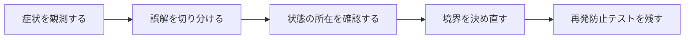

## 概要

画面遷移やdispose後もFutureは完了し、不要なレスポンス処理やエラー表示が走る。Widgetが消えたこととHTTP要求のキャンセルは自動連動しない。

CancelTokenをリクエスト所有者のライフサイクルへ結び付け、dispose時にクライアント側の待機・通信を中止する。ただしサーバーで開始済みの処理まで必ず止まるわけではない。

## この記事で学べること

- Futureには一般的な自動キャンセルがない
- DioのCancelTokenをrequestへ渡す
- 画面/Provider/Notifierのdisposeでcancel
- キャンセル例外を通常エラーと区別
- 複数リクエストに同じtokenを使う範囲
- 二重送信防止とボタン状態

## 前提知識

- Dart、Flutter、Future、ProviderやHTTP通信の基本を読めること
- フレームワークのAPIを使った経験があり、状態・トランザクション・非同期処理の境界で詰まり始めていること
- この記事のコード例は匿名化した最小例であり、利用中のバージョンでは公式ドキュメントと実装を確認すること

## 図解




## 実装コード例

```dart
class UserPageController {
  CancelToken? _cancelToken;

  Future<void> load() async {
    _cancelToken = CancelToken();
    await dio.get('/users/me', cancelToken: _cancelToken);
  }

  void dispose() {
    _cancelToken?.cancel('page disposed');
  }
}
```

## 本編

### 発生した状況

画面遷移やdispose後もFutureは完了し、不要なレスポンス処理やエラー表示が走る。Widgetが消えたこととHTTP要求のキャンセルは自動連動しない。

### 当初の理解・誤解

当初は、API名やメソッド名から直感的に挙動を推測していました。しかし実際には、CancelTokenをリクエスト所有者のライフサイクルへ結び付け、dispose時にクライアント側の待機・通信を中止する。ただしサーバーで開始済みの処理まで必... という観点で見る必要がありました。

### 観測したこと

- StatefulWidgetのdispose例
- Riverpod `ref.onDispose`例
- `DioExceptionType.cancel`等は利用バージョン確認
- キャンセル時にerror reporterへ送らないtest

### 修正案の比較

| 方針 | 見るべき点 |
| --- | --- |
| 積極キャンセル | リソース節約／所有関係の管理が必要 |
| 結果無視 | 実装簡単／通信は継続 |

## 内部動作

FlutterやDartでは、UIのライフサイクル、非同期処理、HTTP通信、状態管理が同時に動きます。画面が閉じたこと、Futureが完了したこと、Providerが更新されたこと、通信がキャンセルされたことは、それぞれ別のイベントです。

- TCP/HTTPキャンセルとサーバーside effect停止は別
- Dio API名はバージョンに合わせる

```text
Widget lifecycle
  -> state owner
  -> async operation
  -> network/storage boundary
  -> UI update
```

## 調査手順

1. まず、入力値・保存前状態・保存後状態・コールバックや非同期処理の発火地点をログに残します。
2. 次に、DBやHTTP通信など外部境界をまたぐ処理を分けて、どこまでが同じトランザクションや同じライフサイクルに属するかを確認します。
3. 最後に、修正後の設計を最小テストへ落とし込み、同じ誤解が再発しないようにします。

- TCP/HTTPキャンセルとサーバーside effect停止は別
- Dio API名はバージョンに合わせる

## 再発防止テスト

```dart
void main() {
  test('dio-cancel-token-lifecycle', () async {
    final subject = TestSubject();

    expect(await subject.call(), isNotNull);
  });
}

class TestSubject {
  Future<Object> call() async => Object();
}
```

## 一般化できる設計原則

- API名が短いほど、裏側の実行モデルを確認する
- 状態を「値」「オブジェクト」「DB row」「外部サービス」のどこに置いているかを分けて考える
- トランザクションや非同期処理の境界をまたぐ副作用は、明示的な設計として扱う
- テストは成功確認だけでなく、誤解しやすい境界条件を固定する

## まとめ

非同期処理は「誰が開始したか」だけでなく「誰が終了責任を持つか」を設計する。


この記事では、次のような短絡的な一般化は避けます。

- `mounted`チェックだけで通信が止まると書かない
- CancelTokenでサーバートランザクションもrollbackすると書かない

## 参考文献

- この記事は、提供された執筆仕様とサムネイルをもとに、公開用の匿名化された技術ノートとして再構成しています。
- Rails、Flutter、Dart、Swiftのバージョン差が関係する箇所は、利用中リポジトリの設定と公式ドキュメントで確認してください。
