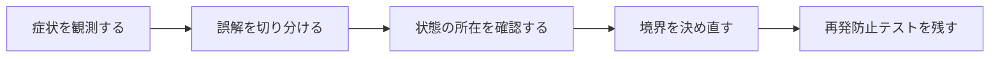

## 概要

`@riverpod`を書いたファイルと、自動生成された`.g.dart`の関係が分からず、どちらが実行されるコードなのか混乱した。

手書き関数/Notifierがproviderの定義元で、generatorは型安全なProviderオブジェクト、hash、ref型などの接着コードを生成する。生成物は直接編集せず、annotationとbuild設定を管理する。

## この記事で学べること

- `part 'providers.g.dart';`
- `@riverpod`が対象を示す
- 生成されるProviderオブジェクト
- 関数名とprovider名の対応
- autoDisposeとkeepAlive
- family引数

## 前提知識

- Dart、Flutter、Future、ProviderやHTTP通信の基本を読めること
- フレームワークのAPIを使った経験があり、状態・トランザクション・非同期処理の境界で詰まり始めていること
- この記事のコード例は匿名化した最小例であり、利用中のバージョンでは公式ドキュメントと実装を確認すること

## 図解




## 実装コード例

```dart
// providers.dart
@riverpod
Future<User> user(UserRef ref) async {
  return ref.watch(userRepositoryProvider).fetchMe();
}

// providers.g.dart は build_runner によって生成される
final userProvider = AutoDisposeFutureProvider<User>.internal(
  user,
  name: r'userProvider',
);
```

## 本編

### 発生した状況

`@riverpod`を書いたファイルと、自動生成された`.g.dart`の関係が分からず、どちらが実行されるコードなのか混乱した。

### 当初の理解・誤解

当初は、API名やメソッド名から直感的に挙動を推測していました。しかし実際には、手書き関数/Notifierがproviderの定義元で、generatorは型安全なProviderオブジェクト、hash、ref型などの接着コードを生成する... という観点で見る必要がありました。

### 観測したこと

- 関数providerとclass Notifierの2例
- 生成前後の概念図
- `ProviderScope(overrides: ...)` test
- 生成ファイルを編集して再生成で消える例は説明のみ

### 修正案の比較

| 方針 | 見るべき点 |
| --- | --- |
| codegen | 型安全・boilerplate削減／build時間・生成規約への依存 |
| 手書きProvider | 明示的／定型コード |

## 内部動作

FlutterやDartでは、UIのライフサイクル、非同期処理、HTTP通信、状態管理が同時に動きます。画面が閉じたこと、Futureが完了したこと、Providerが更新されたこと、通信がキャンセルされたことは、それぞれ別のイベントです。

- Riverpod generator APIはメジャーバージョンで変わるためpubspecを確認
- 生成物の全行を解説せず責務に集中する

```text
Widget lifecycle
  -> state owner
  -> async operation
  -> network/storage boundary
  -> UI update
```

## 調査手順

1. まず、入力値・保存前状態・保存後状態・コールバックや非同期処理の発火地点をログに残します。
2. 次に、DBやHTTP通信など外部境界をまたぐ処理を分けて、どこまでが同じトランザクションや同じライフサイクルに属するかを確認します。
3. 最後に、修正後の設計を最小テストへ落とし込み、同じ誤解が再発しないようにします。

- Riverpod generator APIはメジャーバージョンで変わるためpubspecを確認
- 生成物の全行を解説せず責務に集中する

## 再発防止テスト

```dart
void main() {
  test('riverpod-generated-provider-code', () async {
    final subject = TestSubject();

    expect(await subject.call(), isNotNull);
  });
}

class TestSubject {
  Future<Object> call() async => Object();
}
```

## 一般化できる設計原則

- API名が短いほど、裏側の実行モデルを確認する
- 状態を「値」「オブジェクト」「DB row」「外部サービス」のどこに置いているかを分けて考える
- トランザクションや非同期処理の境界をまたぐ副作用は、明示的な設計として扱う
- テストは成功確認だけでなく、誤解しやすい境界条件を固定する

## まとめ

コード生成はロジックを生成するというより、宣言とランタイムAPIの接着層を自動化していると理解する。


この記事では、次のような短絡的な一般化は避けます。

- 生成コードを魔法とだけ表現しない
- 古いannotation/Ref型を現行版へ混ぜない

## 参考文献

- この記事は、提供された執筆仕様とサムネイルをもとに、公開用の匿名化された技術ノートとして再構成しています。
- Rails、Flutter、Dart、Swiftのバージョン差が関係する箇所は、利用中リポジトリの設定と公式ドキュメントで確認してください。
