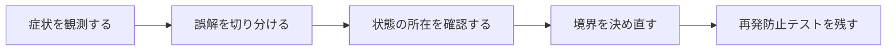

## 概要

画面表示時に複数APIを並行実行すると、期限切れAccess Tokenに対して複数の401が同時に返る。それぞれがRefresh APIを呼ぶと、token rotationや再試行が競合する。

Refresh処理をsingle-flight化し、同時401のうち1つだけが更新を担当し、他は同じFutureを待つ。generation/versionを記録し、既に別リクエストが更新済みなら再refreshせず再試行する。

## この記事で学べること

- Thundering Herdとしての同時401
- 共有中のrefresh Future/Mutex/queue
- リクエスト送信時のtoken generation
- 401時に現在generationと比較
- Refresh endpoint自体をinterceptor対象から除外
- 元リクエストは最大1回だけretry

## 前提知識

- Dart、Flutter、Future、ProviderやHTTP通信の基本を読めること
- フレームワークのAPIを使った経験があり、状態・トランザクション・非同期処理の境界で詰まり始めていること
- この記事のコード例は匿名化した最小例であり、利用中のバージョンでは公式ドキュメントと実装を確認すること

## 図解




## 実装コード例

```dart
class TokenRefreshCoordinator {
  Future<TokenPair>? _refreshing;

  Future<TokenPair> refreshOnce() {
    return _refreshing ??= _refresh().whenComplete(() {
      _refreshing = null;
    });
  }

  Future<TokenPair> _refresh() async {
    return TokenPair(accessToken: 'new-access', refreshToken: 'new-refresh');
  }
}
```

## 本編

### 発生した状況

画面表示時に複数APIを並行実行すると、期限切れAccess Tokenに対して複数の401が同時に返る。それぞれがRefresh APIを呼ぶと、token rotationや再試行が競合する。

### 当初の理解・誤解

当初は、API名やメソッド名から直感的に挙動を推測していました。しかし実際には、Refresh処理をsingle-flight化し、同時401のうち1つだけが更新を担当し、他は同じFutureを待つ。generation/versionを記... という観点で見る必要がありました。

### 観測したこと

- `TokenRefreshCoordinator`
- `Future&lt;String&gt;? _inFlightRefresh`方式
- generation counter方式
- Dio interceptorの擬似コード
- 10件同時401でrefresh呼び出しが1回のtest

### 修正案の比較

| 方針 | 見るべき点 |
| --- | --- |
| 単一Future共有 | 単純／失敗・キャンセル伝播を設計 |
| queue | 順序制御／待機リクエスト管理が複雑 |

## 内部動作

FlutterやDartでは、UIのライフサイクル、非同期処理、HTTP通信、状態管理が同時に動きます。画面が閉じたこと、Futureが完了したこと、Providerが更新されたこと、通信がキャンセルされたことは、それぞれ別のイベントです。

- 並行制御は同一Isolate内だけか、プロセスを跨ぐかを明記
- Refresh Token rotation仕様を認証サーバーに合わせる
- 401すべてが期限切れとは限らない

```text
Widget lifecycle
  -> state owner
  -> async operation
  -> network/storage boundary
  -> UI update
```

## 調査手順

1. まず、入力値・保存前状態・保存後状態・コールバックや非同期処理の発火地点をログに残します。
2. 次に、DBやHTTP通信など外部境界をまたぐ処理を分けて、どこまでが同じトランザクションや同じライフサイクルに属するかを確認します。
3. 最後に、修正後の設計を最小テストへ落とし込み、同じ誤解が再発しないようにします。

- 並行制御は同一Isolate内だけか、プロセスを跨ぐかを明記
- Refresh Token rotation仕様を認証サーバーに合わせる
- 401すべてが期限切れとは限らない

## 再発防止テスト

```dart
void main() {
  test('single-flight-token-refresh-concurrent-401', () async {
    final subject = TestSubject();

    expect(await subject.call(), isNotNull);
  });
}

class TestSubject {
  Future<Object> call() async => Object();
}
```

## 一般化できる設計原則

- API名が短いほど、裏側の実行モデルを確認する
- 状態を「値」「オブジェクト」「DB row」「外部サービス」のどこに置いているかを分けて考える
- トランザクションや非同期処理の境界をまたぐ副作用は、明示的な設計として扱う
- テストは成功確認だけでなく、誤解しやすい境界条件を固定する

## まとめ

認証更新はInterceptorの小技ではなく、並行状態機械として設計する。


この記事では、次のような短絡的な一般化は避けます。

- 401なら無条件refreshし続ける実装を出さない
- 無限retryを許さない

## 参考文献

- この記事は、提供された執筆仕様とサムネイルをもとに、公開用の匿名化された技術ノートとして再構成しています。
- Rails、Flutter、Dart、Swiftのバージョン差が関係する箇所は、利用中リポジトリの設定と公式ドキュメントで確認してください。
