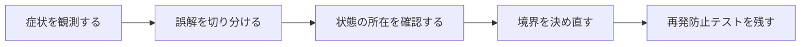

## 概要

同じフィールド値を持つ2インスタンスが`==`でfalseになり、Equatableを入れれば解決すると思った。ところがmutableな値やListを含むと、Set/Mapの挙動まで影響する。

`identical`は同一オブジェクト参照、`==`は型が定義する値等価性、`hashCode`はハッシュコレクションとの契約である。Equatableは値等価性の実装補助であり、不変性や深いコレクション比較を自動的に万能化するものではない。

## この記事で学べること

- デフォルトObjectの`==`
- `identical`との違い
- `operator ==`と`hashCode`の契約
- 等価ならhashCodeも同じにする必要
- HashSet/Map keyでmutable objectを使う危険
- Equatableの`props`

## 前提知識

- Dart、Flutter、Future、ProviderやHTTP通信の基本を読めること
- フレームワークのAPIを使った経験があり、状態・トランザクション・非同期処理の境界で詰まり始めていること
- この記事のコード例は匿名化した最小例であり、利用中のバージョンでは公式ドキュメントと実装を確認すること

## 図解




## 実装コード例

```dart
class Money {
  const Money(this.amount, this.currency);

  final int amount;
  final String currency;

  @override
  bool operator ==(Object other) =>
      identical(this, other) ||
      other is Money && amount == other.amount && currency == other.currency;

  @override
  int get hashCode => Object.hash(amount, currency);
}
```

## 本編

### 発生した状況

同じフィールド値を持つ2インスタンスが`==`でfalseになり、Equatableを入れれば解決すると思った。ところがmutableな値やListを含むと、Set/Mapの挙動まで影響する。

### 当初の理解・誤解

当初は、API名やメソッド名から直感的に挙動を推測していました。しかし実際には、`identical`は同一オブジェクト参照、`==`は型が定義する値等価性、`hashCode`はハッシュコレクションとの契約である。Equatableは値等... という観点で見る必要がありました。

### 観測したこと

- 同値2インスタンスの例
- hashCode不整合でSet検索が壊れる悪い例
- Equatable Value Object
- mutable fieldを変更した後のHashSet test

### 修正案の比較

| 方針 | 見るべき点 |
| --- | --- |
| Equatable | boilerplate削減／props漏れ、mutable値の危険 |
| 手書き | 明示的／実装量とミス |

## 内部動作

FlutterやDartでは、UIのライフサイクル、非同期処理、HTTP通信、状態管理が同時に動きます。画面が閉じたこと、Futureが完了したこと、Providerが更新されたこと、通信がキャンセルされたことは、それぞれ別のイベントです。

- `identical`と`==`の結果はconst canonicalization等で変わり得る
- 等価性はドメイン定義で決める

```text
Widget lifecycle
  -> state owner
  -> async operation
  -> network/storage boundary
  -> UI update
```

## 調査手順

1. まず、入力値・保存前状態・保存後状態・コールバックや非同期処理の発火地点をログに残します。
2. 次に、DBやHTTP通信など外部境界をまたぐ処理を分けて、どこまでが同じトランザクションや同じライフサイクルに属するかを確認します。
3. 最後に、修正後の設計を最小テストへ落とし込み、同じ誤解が再発しないようにします。

- `identical`と`==`の結果はconst canonicalization等で変わり得る
- 等価性はドメイン定義で決める

## 再発防止テスト

```dart
void main() {
  test('dart-identity-equality-hashcode-equatable', () async {
    final subject = TestSubject();

    expect(await subject.call(), isNotNull);
  });
}

class TestSubject {
  Future<Object> call() async => Object();
}
```

## 一般化できる設計原則

- API名が短いほど、裏側の実行モデルを確認する
- 状態を「値」「オブジェクト」「DB row」「外部サービス」のどこに置いているかを分けて考える
- トランザクションや非同期処理の境界をまたぐ副作用は、明示的な設計として扱う
- テストは成功確認だけでなく、誤解しやすい境界条件を固定する

## まとめ

等価性は便利メソッドではなく、コレクション・状態比較・UI更新へ影響するドメイン契約である。


この記事では、次のような短絡的な一般化は避けます。

- Equatableを付ければimmutableになると書かない
- hashCodeの具体値が実行間で固定と仮定しない

## 参考文献

- この記事は、提供された執筆仕様とサムネイルをもとに、公開用の匿名化された技術ノートとして再構成しています。
- Rails、Flutter、Dart、Swiftのバージョン差が関係する箇所は、利用中リポジトリの設定と公式ドキュメントで確認してください。
