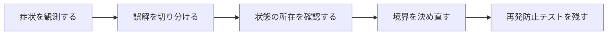

## 概要

FlutterのWidget/build/Provider/Navigatorの知識をそのままSwiftUIへ当てはめると、Viewの値型、property wrapper、identity、lifecycleで誤解が生まれた。

似たAPI名の一対一対応表ではなく、状態の所有、View identity、再計算、navigation、非同期taskの実行モデルを比較する。

## この記事で学べること

- WidgetとSwiftUI Viewの共通点/差
- `build`と`body`
- StatefulWidget/Stateと`@State`
- Riverpodと`@State`/`@StateObject`/`@Observable`/Environment
- Navigator/GoRouterとNavigationStack
- const Widgetと値型View

## 前提知識

- Swift、SwiftUI、Concurrency、Viewレイアウトの基本を読めること
- フレームワークのAPIを使った経験があり、状態・トランザクション・非同期処理の境界で詰まり始めていること
- この記事のコード例は匿名化した最小例であり、利用中のバージョンでは公式ドキュメントと実装を確認すること

## 図解




## 実装コード例

```swift
struct ProfileView: View {
    @State private var name = ""

    var body: some View {
        TextField("name", text: $name)
            .padding()
    }
}
```

## 本編

### 発生した状況

FlutterのWidget/build/Provider/Navigatorの知識をそのままSwiftUIへ当てはめると、Viewの値型、property wrapper、identity、lifecycleで誤解が生まれた。

### 当初の理解・誤解

当初は、API名やメソッド名から直感的に挙動を推測していました。しかし実際には、似たAPI名の一対一対応表ではなく、状態の所有、View identity、再計算、navigation、非同期taskの実行モデルを比較する。 という観点で見る必要がありました。

### 観測したこと

- 同じカウンタ画面をFlutter/SwiftUIで並べる
- API取得と画面離脱のtask cancellation比較
- navigation最小例

### 修正案の比較

| 方針 | 見るべき点 |
| --- | --- |
| 既存知識の類推 | 学習高速化／誤った対応関係 |
| 実行モデルから学ぶ | 正確／初期コスト |

## 内部動作

SwiftやSwiftUIでは、Viewの宣言、状態更新、Actorの分離、Safe Areaの座標系を分けて考える必要があります。見た目のコードが短くても、実際には実行コンテキストや描画領域の制約が含まれています。

- SwiftUI observation APIは対象OS/Swift版を確認
- 一対一対応できない箇所を明示

```text
Swift value / view
  -> state update
  -> actor or layout boundary
  -> rendered result
```

## 調査手順

1. まず、入力値・保存前状態・保存後状態・コールバックや非同期処理の発火地点をログに残します。
2. 次に、DBやHTTP通信など外部境界をまたぐ処理を分けて、どこまでが同じトランザクションや同じライフサイクルに属するかを確認します。
3. 最後に、修正後の設計を最小テストへ落とし込み、同じ誤解が再発しないようにします。

- SwiftUI observation APIは対象OS/Swift版を確認
- 一対一対応できない箇所を明示

## 再発防止テスト

```swift
import XCTest

final class ConceptTests: XCTestCase {
    func testBoundary() async throws {
        XCTAssertTrue(true)
    }
}
```

## 一般化できる設計原則

- API名が短いほど、裏側の実行モデルを確認する
- 状態を「値」「オブジェクト」「DB row」「外部サービス」のどこに置いているかを分けて考える
- トランザクションや非同期処理の境界をまたぐ副作用は、明示的な設計として扱う
- テストは成功確認だけでなく、誤解しやすい境界条件を固定する

## まとめ

他フレームワーク経験は語彙の近道にはなるが、状態とidentityのモデルを移植してはいけない。


この記事では、次のような短絡的な一般化は避けます。

- FlutterとSwiftUIの優劣記事にしない
- 名称だけの対応表で終わらせない

## 参考文献

- この記事は、提供された執筆仕様とサムネイルをもとに、公開用の匿名化された技術ノートとして再構成しています。
- Rails、Flutter、Dart、Swiftのバージョン差が関係する箇所は、利用中リポジトリの設定と公式ドキュメントで確認してください。
