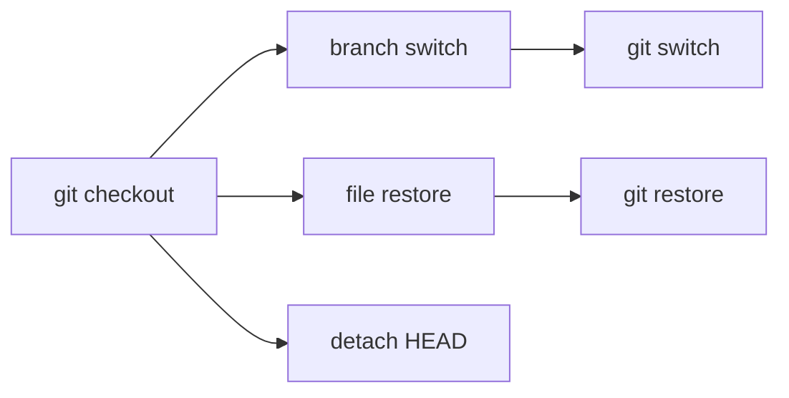

## 概要

`git switch` と `git checkout` はどちらもブランチ切り替えで見かけるコマンドですが、責務の広さが違います。

この記事では、単なる使い分けだけでなく、HEAD、index、working treeがどう切り替わるのかまで整理します。

## この記事で学べること

- `git switch` と `git checkout` の違い
- `git restore` が分離された理由
- ブランチ切り替え時にHEAD、index、working treeで何が起きるか
- 普段の作業でどのコマンドを選ぶべきか

## 前提知識

- Gitのブランチを使ったことがある
- `main`、`feature` のようなブランチ名を見たことがある
- 未コミットの変更がworking treeに残ることを知っている

## 図解



## Gitコマンド例

```bash
git switch develop
git switch -c feature/login
git restore app/models/user.rb
git checkout main -- app/models/user.rb
```

## 内部動作

```text
git switch develop
↓
HEADの参照先をdevelopへ変更
↓
indexをdevelopのtreeに合わせる
↓
working treeをdevelopの内容に更新
```

## 本編

## git switch と git checkout は何が違うのか

## 結論

普通にブランチを切り替えるだけなら、基本的には `git switch` を使えば問題ありません。

`git checkout` は、もともとブランチの切り替えだけでなく、特定コミットへの移動やファイルの復元など、複数の役割を持っているコマンドです。

一方で、`git switch` はブランチ操作に特化したコマンドです。

そのため、現在は以下のように使い分けると分かりやすいです。

```bash title="git commands"
# ブランチを切り替える
git switch <branch>

# ファイルを復元する
git restore <file>

# 古い書き方・多機能コマンド
git checkout <branch>
```

つまり、`git switch` は `git checkout` のブランチ切り替え機能を、より分かりやすく切り出したコマンドだと考えると理解しやすいです。

## なぜ git switch が作られたのか

`git checkout` は Git の初期から存在している古いコマンドです。

一般的にはブランチを切り替えるコマンドとして知られていますが、実際にはそれ以外の用途にも使えます。

例えば、以下のようにブランチを切り替えることができます。

```bash
git checkout feature/login
```

一方で、以下のようにファイルを過去の状態に戻すこともできます。

```bash
git checkout main -- app/models/user.rb
```

同じ `checkout` というコマンドなのに、以下のような複数の責務を持っています。

- ブランチを切り替える
- ファイルを復元する
- 特定のコミットに移動する

そのため、初心者にとっては「この checkout は何をしているのか」が分かりにくくなりやすいです。

そこで Git 2.23 で、`git switch` と `git restore` が導入されました。

役割をざっくり分けると、以下のようになります。

| コマンド | 主な役割 |
| --- | --- |
| `git switch` | ブランチを切り替える |
| `git restore` | ファイルを復元する |
| `git checkout` | ブランチ切り替え・ファイル復元などを行う従来の多機能コマンド |

## checkout と switch の比較

| 機能 | checkout | switch |
| --- | --- | --- |
| 既存ブランチに切り替える | `git checkout <branch>` | `git switch <branch>` |
| 新しいブランチを作成して切り替える | `git checkout -b <new-branch>` | `git switch -c <new-branch>` |
| 特定のコミットからブランチを作成して切り替える | `git checkout -b <new-branch> <commit>` | `git switch -c <new-branch> <commit>` |
| 直前のブランチに戻る | `git checkout -` | `git switch -` |
| detached HEAD 状態で特定コミットに移動する | `git checkout <commit>` | `git switch --detach <commit>` |
| ファイルを特定のバージョンに戻す | `git checkout <commit> -- <file>` | できない |
| ファイルの変更を取り消す | `git checkout -- <file>` | できない |
| リモートブランチを元にローカルブランチを作る | `git checkout -b <branch> --track origin/<branch>` | `git switch -c <branch> --track origin/<branch>` |

この表を見ると分かるように、ブランチ操作に関しては `checkout` と `switch` の多くは対応しています。

ただし、`switch` はファイル復元には使えません。

ファイルを戻したい場合は、`git restore` を使います。

## git checkout とは

`git checkout` は、Git の初期から存在している多機能なコマンドです。

主な用途は以下です。

- ブランチを切り替える
- 新しいブランチを作って切り替える
- 特定のコミットに移動する
- ファイルを過去の状態に戻す

例えば、ブランチを切り替える場合は以下のように使います。

```bash
git checkout develop
```

新しいブランチを作成して切り替える場合は、以下です。

```bash
git checkout -b feature/login
```

また、ファイルを特定のブランチやコミットの状態に戻すこともできます。

```bash
git checkout main -- app/models/user.rb
```

このように `checkout` は便利ですが、複数の責務を持っているため、何をしているのかがコマンド名だけでは分かりにくいという問題があります。

## git switch とは

`git switch` は、Git 2.23 で導入されたブランチ操作用のコマンドです。

主な用途は以下です。

- 既存ブランチに切り替える
- 新しいブランチを作成して切り替える
- 特定のコミットからブランチを作成する
- detached HEAD 状態で特定コミットに移動する

例えば、既存ブランチに切り替える場合は以下です。

```bash
git switch develop
```

新しいブランチを作成して切り替える場合は、以下です。

```bash
git switch -c feature/login
```

特定のコミットから新しいブランチを作ることもできます。

```bash
git switch -c fix/login-bug 1234567
```

また、ブランチを作らずに特定のコミットを確認したい場合は、`--detach` を使います。

```bash
git switch --detach 1234567
```

`git switch` はブランチ操作に特化しているため、`checkout` よりも意図が明確です。

ブランチを切り替えるなら `switch`、ファイルを戻すなら `restore`、という形で考えると分かりやすいです。

## 内部的には何が起きているのか

ブランチを切り替えると、Git は大きく以下のような処理を行います。

- `HEAD` の参照先を切り替える
- index を切り替え先ブランチの状態に合わせる
- working tree のファイルを切り替え先ブランチの状態に合わせる

つまり、ブランチを切り替えると、単に「今いるブランチ名」が変わるだけではありません。

作業ディレクトリ上のファイルも、切り替え先ブランチの内容に合わせて更新されます。

ただし、未コミットの変更があり、その変更が切り替え先ブランチの内容と衝突する可能性がある場合、Git はブランチ切り替えを止めることがあります。

これは、作業中の変更を誤って失わないようにするためです。

## どちらを使えばいいのか

基本的には、以下の使い分けでよいと思います。

```bash title="recommended usage"
# ブランチを切り替える
git switch <branch>

# 新しいブランチを作って切り替える
git switch -c <new-branch>

# ファイルを戻す
git restore <file>
```

逆に、以下のような古い記事や既存プロジェクトでは、まだ `checkout` が使われていることも多いです。

```bash
git checkout develop
git checkout -b feature/login
git checkout -- app/models/user.rb
```

そのため、`checkout` を完全に覚えなくてよいわけではありません。

ただ、自分が普段使うコマンドとしては、ブランチ操作には `switch`、ファイル復元には `restore` を使う方が、意図が明確で分かりやすいです。

## まとめ

`git checkout` は、ブランチ切り替えやファイル復元など複数の役割を持った多機能コマンドです。

一方で、`git switch` はブランチ操作に特化したコマンドです。

そのため、現在は以下のように考えると分かりやすいです。

```text
git checkout = 従来の多機能コマンド
git switch   = ブランチ操作用
git restore  = ファイル復元用
```

つまり、`git switch` は `git checkout` のブランチ切り替え機能を、より分かりやすく扱えるようにしたコマンドです。

今後、自分でコマンドを打つときは、ブランチ操作なら `git switch` を使っていこうと思います。

## 参考文献

- [Git Documentation: git-switch](https://git-scm.com/docs/git-switch)
- [Git Documentation: git-checkout](https://git-scm.com/docs/git-checkout)
- [Git Documentation: git-restore](https://git-scm.com/docs/git-restore)
