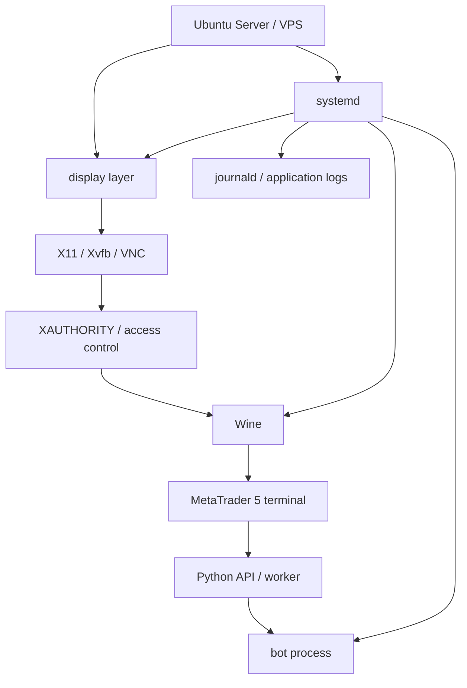

## 概要

MetaTrader 5はWindows前提の色が強いGUIアプリです。Ubuntu系LinuxでMT5を動かす場合、公式ドキュメントでもWineを使う構成が案内されています。

この記事シリーズでは、単にMT5をインストールする手順ではなく、Ubuntu系Linux上でMT5をサーバー運用へ寄せるときに問題になりやすい境界を整理します。

中心になるのは、次の整合性です。

- Wine
- display server
- Wayland / X11 / XAuthority
- MT5 terminal
- Python API
- systemd
- ログと復旧

> [!WARNING]
> このシリーズは投資助言ではありません。売買ロジック、収益性、実口座での運用成績は扱いません。broker名、口座番号、server名、passwordも記載しません。

## この記事で学べること

- Ubuntu系LinuxでMT5を扱うときの全体アーキテクチャ
- GUIあり検証環境とUbuntu Server本番構成を分ける理由
- Wine、display layer、X11認証、Python API、systemdの境界
- シリーズをどの順番で読めばよいか

## 前提知識

- Linuxの基本的なCLI操作を知っている
- systemd serviceと`journalctl`の役割を聞いたことがある
- Pythonで外部APIやプロセスを扱った経験がある
- MT5がGUIアプリであり、terminalが起動している状態を前提にするAPIがあることを理解している

## 本編

### 背景

MT5をVPSで動かすなら、Windows VPSを使うのが最も素直な選択です。MT5本体もPython連携もWindowsを前提にした情報が多く、環境差分も少なくなります。

それでもUbuntu系Linuxで試す理由はあります。

- SSH、systemd、journaldなどLinuxの運用資産を使いたい
- bot本体や周辺処理をLinux側で管理したい
- GUIは必要なときだけ確認し、普段はサーバーとして常駐させたい
- Windows VPSではなく既存のLinux VPS運用に寄せたい

ただし、Linuxで動かす場合は「インストールできたか」だけでは不十分です。MT5はGUIアプリなので、headlessなUbuntu Serverでは表示先が必要になります。また、Python APIはMT5 terminalとの接続を前提にするため、Pythonがどこで動くかも重要です。

### 試したOSの切り方

OSごとに記事を完全分割すると、Wine、MT5、Python API、systemdの説明が重複します。

そのため、このシリーズでは次のように分けます。

| No | テーマ | 役割 |
|---:|---|---|
| 00 | 全体像 | 背景、ゴール、アーキテクチャ |
| 01 | OS選定 | Ubuntu系flavorとServerの比較 |
| 02 | GUI検証 | Lubuntu / Xubuntu / Kubuntu / Ubuntu Desktopで検証する意味 |
| 03 | Wayland / X11 / XAuthority | display serverとX11認証の切り分け |
| 04 | headless設計 | Ubuntu ServerでDISPLAYをどう用意するか |
| 05 | Wine + MT5 | prefix、terminal path、初回ログイン |
| 06 | Python API | MetaTrader5 package、initialize、bridge構成 |
| 07 | systemd | display、MT5、botの起動順序とログ |
| 08 | まとめ | 最終構成、メリット、デメリット、失敗集 |

### シリーズ全体の主張

UbuntuでMT5サーバーを作るときに難しいのは、MT5のインストールそのものではありません。

難しいのは、次の状態を同じ文脈に揃えることです。

- MT5を入れたユーザー
- MT5を入れたWine prefix
- MT5 terminalの実行パス
- MT5が描画するDISPLAY
- X11アプリが接続するときのXAUTHORITY
- Python APIが参照するterminal
- systemdが起動するユーザーと環境変数

手動起動では動いても、systemdでは動かないことがあります。その場合、Pythonコードの問題に見えて、実際には`DISPLAY`、`XAUTHORITY`、`WINEPREFIX`、`HOME`、`PATH`の差分だった、という切り分けが必要になります。

## 図解



この図で重要なのは、MT5だけが独立しているわけではないことです。MT5はWine上で動き、Wineはdisplay layerを必要とし、Python APIはMT5 terminalの状態に依存し、systemdはそれらを正しい順序で起動する必要があります。

## CLI・設定例

このシリーズで確認対象になる値は、最初からメモしておきます。

```bash
$ uname -a
$ lsb_release -a
$ wine --version
$ echo "$DISPLAY"
$ echo "$XDG_SESSION_TYPE"
$ echo "$XAUTHORITY"
$ echo "$WINEPREFIX"
$ ps aux | grep -i terminal64.exe
$ systemctl status mt5.service
$ journalctl -u mt5.service -f
```

実環境の値を記事に出す場合は、broker名、口座番号、server名、passwordが含まれないように必ずマスクします。

## 内部動作

MT5をUbuntu Serverで常駐させると、内部的には次の順に依存します。

```text
systemd
↓
display service
↓
X11 authentication / XAUTHORITY
↓
Wine process
↓
MT5 terminal64.exe
↓
Python API / bridge
↓
bot
↓
logs / health check
```

上流が壊れると下流も壊れます。たとえばdisplay layerが起動していなければ、Wine上のMT5はGUIを表示できません。MT5が起動していなければ、Pythonの`initialize()`は失敗しやすくなります。

## まとめ

- Ubuntu系LinuxでMT5を運用する本質は、インストール手順ではなく実行環境の整合性にある。
- GUIあり環境は初回ログイン、表示、broker接続、terminal path確認に向いている。
- 本番構成ではUbuntu Serverに必要最小限のX11-compatible display layerを足し、MT5とbotをsystemdで管理する設計が現実的。
- このシリーズでは、投資判断ではなくLinuxサーバー運用としての切り分けを扱う。

## 参考文献

- [MetaTrader 5 Help: Installation on Linux](https://www.metatrader5.com/en/terminal/help/start_advanced/install_linux)
- [MQL5 Reference: Python Integration](https://www.mql5.com/en/docs/python_metatrader5)
- [MQL5 Reference: initialize](https://www.mql5.com/en/docs/python_metatrader5/mt5initialize_py)
- [Ubuntu: Ubuntu flavors](https://ubuntu.com/desktop/flavors)
- [Wayland](https://wayland.freedesktop.org/)
- [X.Org: Xsecurity manual page](https://xorg.freedesktop.org/archive/X11R7.5/doc/man/man7/Xsecurity.7.html)
