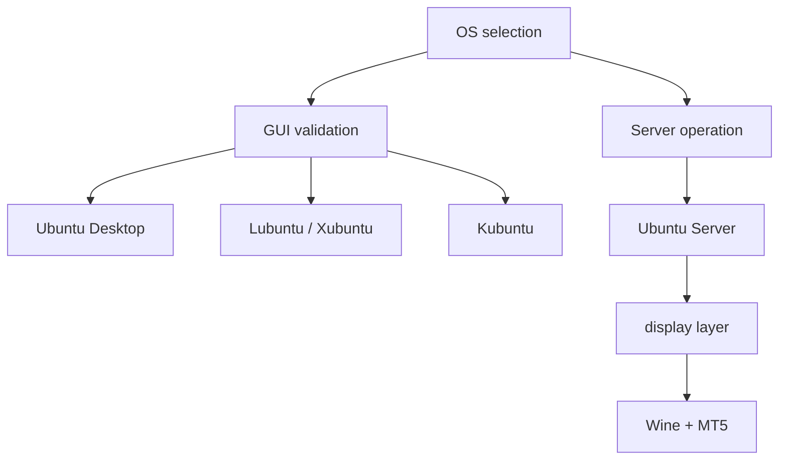

## 概要

MT5をUbuntu系Linuxで動かす場合、OS選定は「普段使いしやすいか」だけでは決められません。

MT5はGUIアプリです。そのため、初回検証ではGUIがある環境の方が楽です。一方、本番運用ではGUIを常時持つことがリソースや復旧性の面で不利になることがあります。

この記事では、Ubuntu Desktop、Lubuntu、Xubuntu、Kubuntu、Ubuntu Serverを、MT5サーバー用途の観点で比較します。

## この記事で学べること

- Ubuntu系flavorの違いをMT5用途で見る観点
- GUIあり検証環境とUbuntu Server本番環境を分ける理由
- Lubuntu、Xubuntu、Kubuntu、Ubuntu Desktop、Ubuntu Serverの向き不向き
- OS選定で見るべきメリット・デメリット

## 前提知識

- MT5はLinuxネイティブアプリではなく、Linux上ではWine経由で動かす前提がある
- LubuntuやKubuntuなどはUbuntuをベースにしたflavorで、主にデスクトップ環境が異なる
- Ubuntu ServerはGUIなし運用が基本で、GUIアプリを動かすには追加設計が必要

## 本編

### 比較の前提

MT5用途でOSを見るときの軸は、一般的なデスクトップ用途とは少し違います。

見るべき軸は次です。

- Wineを扱いやすいか
- MT5の初回ログインや表示確認がしやすいか
- 低リソースVPSで動かしやすいか
- リモート操作がしやすいか
- systemdで常駐運用へ寄せやすいか
- 障害時に切り分けやすいか

### 比較表

| OS | 位置付け | メリット | デメリット | MT5用途での評価 |
|---|---|---|---|---|
| Ubuntu Desktop | 標準GUI検証 | 情報量が多い、GUIが最初からある | VPS用途では重めになりやすい | 初期検証向き |
| Lubuntu | 軽量GUI検証 | LXQtで軽量、低リソース環境に向く | 機能は最小限 | GUI検証向き |
| Xubuntu | バランス型GUI検証 | Xfceで軽量かつ扱いやすい | Serverよりは重い | 検証・軽量運用向き |
| Kubuntu | 高機能GUI検証 | KDE Plasmaで操作性が高い | MT5専用サーバーには過剰になりやすい | 作業環境向き |
| Ubuntu Server | 本番候補 | 軽量、SSH管理、systemd運用向き | GUIがないためdisplay設計が必要 | 本番向き |

### Ubuntu Desktop

Ubuntu Desktopは情報量が多く、WineやMT5のGUI確認を始めやすい環境です。

初回検証で、MT5の画面、broker server選択、ログイン状態、フォント表示、Wineのダイアログを確認するには楽です。

ただし、本番VPSでMT5だけを常駐させる目的なら、デスクトップ環境全体は重くなりがちです。

### Lubuntu

Ubuntu公式のflavor説明では、LubuntuはLXQtデスクトップ環境を提供する軽量なflavorとして説明されています。

MT5用途では、軽量GUIとして初回検証に向いています。低リソースVPSや仮想環境で、MT5の画面確認をしたい場合に扱いやすい候補です。

デメリットは、最低限のGUIであるため、細かい設定作業やデバッグ時の補助機能はUbuntu DesktopやKubuntuほど豊富ではないことです。

### Xubuntu

XubuntuはXfceベースの軽量デスクトップです。軽さと操作性のバランスが良く、ファイル操作や設定変更もしやすい位置付けです。

Lubuntuより少しリッチで、Ubuntu Desktopより軽い検証環境として使いやすいです。

ただし、本番サーバーとして見れば、やはりUbuntu Serverよりは余計なGUI要素を持ちます。

### Kubuntu

KubuntuはKDE Plasmaを使うflavorです。Ubuntu公式でもKubuntuはKDEとPlasma desktopを組み合わせたflavorとして説明されています。

設定UIが豊富で、GUI上の作業はしやすいです。MT5の画面確認、ファイル操作、設定変更をGUI中心で行いたい場合は便利です。

一方、MT5専用サーバーとしては高機能すぎる可能性があります。検証や作業環境としてはよくても、低リソースVPSの常駐先としては優先度が下がります。

### Ubuntu Server

Ubuntu Serverは本番候補です。

SSH、systemd、journald、firewallなど、サーバー運用に必要な部品と相性が良く、余計なGUIを持たない分だけ軽量にできます。

ただし、MT5はGUIアプリです。Ubuntu Server単体では表示先がないため、Xvfb、VNC、軽量desktopなどのdisplay layerをどう用意するかが設計課題になります。

## 図解



## CLI・設定例

OS選定時には、体感だけでなく基本情報を記録します。

```bash
$ lsb_release -a
$ free -h
$ df -h
$ systemctl get-default
$ ps aux | grep -E "Xorg|Xvfb|vnc|wine|terminal64"
```

MT5検証では、OS名だけでなく、どのユーザーでWine prefixを作ったかも記録します。

## 内部動作

OSの違いがMT5に影響するポイントは、MT5本体のロジックではなく周辺レイヤーです。

```text
Ubuntu flavor
↓
desktop environment / display server
↓
Wine
↓
MT5 terminal
↓
Python API / systemd operation
```

GUIありflavorではdisplayが最初から用意されます。Ubuntu Serverではdisplayを自分で用意します。この差が、MT5をheadlessで動かすときの難しさになります。

## まとめ

- OS選定は「軽いOSはどれか」だけで決めない。
- GUIあり環境は初回ログイン、表示、Wineダイアログ、terminal path確認に向く。
- Ubuntu Serverは本番候補だが、MT5用にdisplay layerを設計する必要がある。
- 検証はLubuntu / Xubuntu / Ubuntu Desktop、本番はUbuntu Server + 必要最小限のdisplay layerという切り方が現実的。

## 参考文献

- [MetaTrader 5 Help: Installation on Linux](https://www.metatrader5.com/en/terminal/help/start_advanced/install_linux)
- [Ubuntu: Ubuntu flavors](https://ubuntu.com/desktop/flavors)
- [Xubuntu official site](https://xubuntu.org/)
- [Ubuntu Server download](https://ubuntu.com/download/server)
