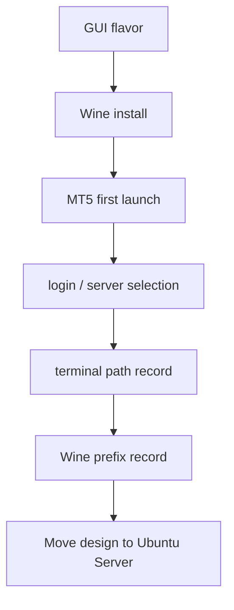

## 概要

Ubuntu ServerでいきなりMT5を動かそうとすると、問題の切り分けが難しくなります。

MT5が起動しない原因が、Wineなのか、DISPLAYなのか、broker loginなのか、Python APIなのか、systemdなのかが見えにくいからです。

そのため、まずGUIあり環境でWine + MT5の基本動作を潰すのが現実的です。

## この記事で学べること

- GUIあり環境でMT5を検証する意味
- Lubuntu / Xubuntu / Kubuntu / Ubuntu Desktopの使い分け
- Ubuntu Serverへ移す前に記録すべき値
- GUI検証と本番運用を混同しない考え方

## 前提知識

- MT5はGUIアプリであり、画面上で初回ログインやbroker server選択が必要になることがある
- WineはWindowsアプリをUnix-like OS上で動かす互換レイヤーだが、GUI表示先そのものを不要にするものではない
- Ubuntu ServerではGUIがないため、GUIあり環境で潰せる問題は先に潰しておく方がよい

## 本編

### なぜGUIあり環境で検証するのか

GUIあり環境で確認したいのは、MT5が「見える状態で」正しく起動するかです。

具体的には、次を確認します。

- `terminal64.exe`がWine上で起動するか
- WineのMono / Gecko / font関連ダイアログが出るか
- broker serverを選べるか
- demo accountでログインできるか
- Market Watchに対象symbolが見えるか
- 自動売買許可やterminal設定を確認できるか
- MT5 terminalのパスを記録できるか
- Wine prefixがどこに作られたか分かるか

これらは、headlessなUbuntu Server上で一度に確認しようとすると手間が増えます。

### Lubuntuで見ること

Lubuntuは軽量GUIとして検証に向きます。LXQtベースで、低リソース環境でも扱いやすいです。

MT5専用の検証用途では、過剰なデスクトップ機能よりも「軽く画面が出る」ことが重要です。VPSや仮想マシンでMT5の初回ログインだけ確認したい場合、Lubuntuは候補になります。

デメリットは、GUIとしての補助機能が最小限になりやすいことです。作業中に設定UIやファイル操作を多用するなら、XubuntuやUbuntu Desktopの方が楽な場面もあります。

### Xubuntuで見ること

XubuntuはXfceベースで、軽さと操作性のバランスが良い環境です。

MT5のインストール、ファイル探索、Wine prefixの確認、terminal pathの記録など、GUI上での確認作業がしやすいです。

Lubuntuより少しリッチで、Ubuntu Desktopより軽い中間候補として使えます。

### Kubuntuで見ること

KubuntuはKDE Plasmaベースで、設定UIやデスクトップ操作が豊富です。

MT5以外にも画面上で調査や作業を行うなら便利です。ただし、MT5専用サーバーの検証環境として見ると、機能が多すぎる場合があります。

本番運用の軽量性よりも、GUI上での調査効率を重視するときの候補です。

### Ubuntu Desktopで見ること

Ubuntu Desktopは標準的な情報量が多く、トラブル時に検索しやすいです。

WineやMT5の初期検証では、最も無難な環境です。ただし、低リソースVPSで長期常駐させる構成としては重くなりやすいため、本番候補とは分けて考えます。

### GUI検証で記録する項目

| 項目 | 確認内容 |
|---|---|
| MT5起動 | `terminal64.exe`がWine上で起動するか |
| login状態 | 再起動後もログイン状態が維持されるか |
| Market Watch | 対象symbolが見えるか |
| terminal path | Pythonから指定するpathを確認 |
| Wine prefix | どのprefixにMT5が入っているか |
| run user | どのLinuxユーザーで入れたか |
| font | 文字化けや表示崩れがないか |
| 再起動 | OS再起動後に状態が復元されるか |

## 図解



GUIあり環境の役割は、本番環境そのものになることではなく、Serverへ移す前にMT5固有の不確定要素を減らすことです。

## CLI・設定例

GUIで確認した値はCLIでも控えます。

```bash
$ echo "$USER"
$ echo "$HOME"
$ echo "$WINEPREFIX"
$ find "$HOME" -iname "terminal64.exe" 2>/dev/null
$ ps aux | grep -i terminal64.exe
```

`find`の結果にはbroker名やインストール先名が含まれることがあります。公開記事に出す場合は必要に応じてマスクします。

## 内部動作

GUIあり環境では、display layerが最初から存在します。

```text
desktop session
↓
DISPLAY
↓
Wine
↓
MT5 terminal
↓
manual verification
```

Ubuntu Serverへ移すと、この`desktop session`がなくなります。つまり、Server移行時に壊れる場合は、MT5そのものよりもDISPLAYや起動ユーザーの問題を疑います。

## まとめ

- GUIあり環境は、MT5の初回ログイン、表示、Wine prefix、terminal path確認に向く。
- Lubuntuは軽量検証、Xubuntuはバランス、KubuntuはGUI作業重視、Ubuntu Desktopは情報量重視。
- GUI検証を本番推奨と混同しない。
- Ubuntu Serverへ移す前に、run user、WINEPREFIX、terminal path、login状態を記録する。

## 参考文献

- [MetaTrader 5 Help: Installation on Linux](https://www.metatrader5.com/en/terminal/help/start_advanced/install_linux)
- [Ubuntu: Ubuntu flavors](https://ubuntu.com/desktop/flavors)
- [Xubuntu official site](https://xubuntu.org/)
