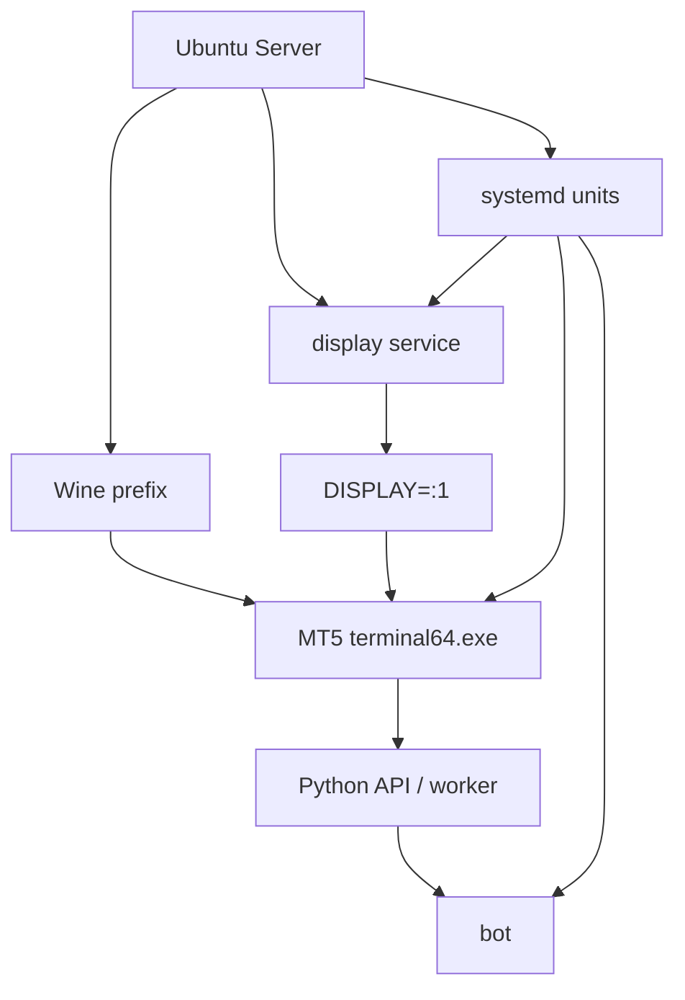

## 概要

Ubuntu ServerはGUIを持たない前提で使うことが多いOSです。

一方、MT5はGUIアプリです。Wineを入れただけでは、MT5が描画する先のdisplayがありません。

この記事では、Ubuntu ServerでMT5を動かすときに必要になるheadless設計を整理します。

## この記事で学べること

- Ubuntu ServerだけではMT5が動きにくい理由
- `DISPLAY`、Xvfb、VNC、軽量desktopの役割
- Wine prefixとrun userを固定する理由
- systemd化する前に決めるべき設計値

## 前提知識

- SSHログインしたshellには、通常GUI displayがない
- WineはWindows API互換層であり、displayの問題を自動で消してくれるわけではない
- Xvfbは物理ディスプレイなしで動くX serverとして使える
- VNCは画面確認には便利だが、公開方法に注意が必要

## 本編

### Ubuntu Serverだけでは何が足りないのか

MT5はGUIアプリです。Ubuntu Server上でWineを使って`terminal64.exe`を起動する場合、MT5は画面を表示しようとします。

しかし、SSHで入っただけのServerには、通常`DISPLAY`がありません。

この状態で起動すると、MT5以前にGUI表示先がないことが問題になります。

### 必要な構成要素

Ubuntu ServerでMT5を動かすには、少なくとも次のレイヤーを考えます。

- Wine
- MT5 terminal
- display layer
- Python runtimeまたはworker
- systemd
- logs

MT5のインストールだけを見ると簡単に見えますが、常駐運用ではこれらを同じユーザー、同じprefix、同じdisplayで揃える必要があります。

### display layerの選択肢

| 方式 | メリット | デメリット | 向く用途 |
|---|---|---|---|
| Xvfb | 軽量、headlessに向く | 画面確認がしづらい | 本番常駐 |
| VNC | MT5の画面を確認しやすい | 公開設定に注意、やや重い | 検証・障害対応 |
| 軽量desktop | GUI操作が楽 | Serverの軽さが落ちる | 常時画面確認が必要な運用 |
| Ubuntu Desktop化 | 初心者には楽 | サーバー運用としては過剰 | 検証用 |

VNCを使う場合でも、VNCポートをそのままpublicに開ける構成は避けます。基本はSSH tunnelやfirewallで閉じる設計にします。

### 固定すべき環境変数

headless運用では、次の値を固定しておくと切り分けしやすくなります。

```text
DISPLAY=:1
WINEPREFIX=/home/<user>/.wine-mt5
HOME=/home/<user>
MT5_PATH=/home/<user>/.wine-mt5/drive_c/Program Files/MetaTrader 5/terminal64.exe
```

重要なのは、手動起動とsystemd起動で同じ値を使うことです。

### よくある失敗

- `DISPLAY`がない
- `WINEPREFIX`が手動起動時とservice起動時で違う
- rootで入れたMT5を一般ユーザーで起動しようとしている
- VNCでは起動するがsystemdでは起動しない
- pathに空白があり、unit fileの`ExecStart`で壊れる
- MT5が多重起動する

### 本番設計の方針

本番では、次のように分けます。

- MT5専用ユーザーを作る
- Wine prefixを固定する
- display serviceを先に起動する
- MT5 serviceとbot serviceを分ける
- bot側は`initialize()`にretryを持たせる
- journaldとapplication logを両方見る

## 図解



## CLI・設定例

Xvfbを使う場合の確認例です。これはテンプレートであり、実環境ではdisplay番号やscreen sizeを調整します。

```bash
$ Xvfb :1 -screen 0 1280x800x24 &
$ export DISPLAY=:1
$ export WINEPREFIX=/home/<user>/.wine-mt5
$ wine "/home/<user>/.wine-mt5/drive_c/Program Files/MetaTrader 5/terminal64.exe"
$ ps aux | grep -E "Xvfb|terminal64"
```

systemd化する前に、まず同じユーザーで手動起動できるか確認します。

## 内部動作

headless構成では、GUIが消えるのではなく、仮想的なdisplayに差し替わります。

```text
physical displayなし
↓
Xvfb or VNC
↓
DISPLAY=:1
↓
Wine GUI application
↓
MT5 terminal
```

MT5はGUIを必要とします。XvfbやVNCは、GUIアプリが描画できる場所を用意するためのレイヤーです。

## まとめ

- Ubuntu ServerでMT5を動かす問題は、MT5のインストールよりdisplay設計にある。
- `DISPLAY`、`WINEPREFIX`、`HOME`、run userを固定しないと、手動起動とservice起動で挙動が変わる。
- Xvfbは軽量な本番常駐向き、VNCは画面確認向き。
- VNCをpublicに直接開ける構成は避ける。

## 参考文献

- [MetaTrader 5 Help: Installation on Linux](https://www.metatrader5.com/en/terminal/help/start_advanced/install_linux)
- [X.Org: Xvfb manual page](https://www.x.org/archive//X11R7.0/doc/html/Xvfb.1.html)
- [systemd.service manual](https://www.freedesktop.org/software/systemd/man/systemd.service.html)
- [systemd.exec manual](https://www.freedesktop.org/software/systemd/man/systemd.exec.html)

