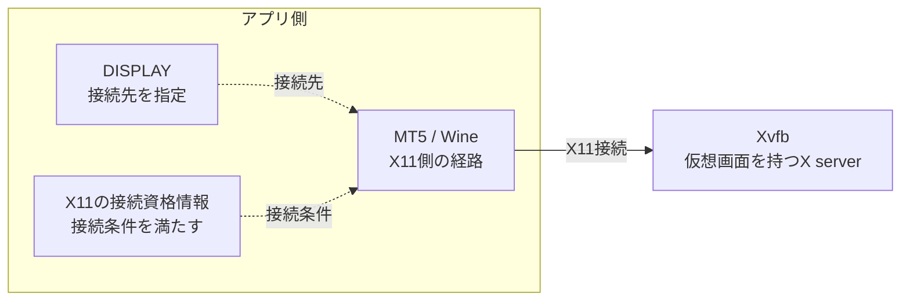

物理モニターを接続しない構成でも、GUIアプリが利用する表示の仕組みまで不要になるわけではありません。MT5をWine経由で動かす構成では、Wineが利用する表示先と、その表示先へ接続できる条件を別に用意します。

ここでは、**WineのX11側の経路を使い、Xvfbを表示先にする設計例**を扱います。Linux上でのWine利用はMT5公式の案内にありますが、このheadless構成の動作や常駐の安定性を確認した記事ではありません。[MetaTrader 5: Installation on Linux](https://www.metatrader5.com/en/terminal/help/start_advanced/install_linux)

## headlessにすると、どの部分が置き換わるのか

Xvfbは物理的な画面や入力装置がなくても動作できるX serverです。アプリからのX11接続を受け、仮想的な画面をメモリ上に持ちます。アプリを画面なしのCLIへ変換するものではありません。[X.Org: Xvfb](https://xorg.freedesktop.org/archive/X11R7.5/doc/man/man1/Xvfb.1.html)

```mermaid
flowchart LR
  accTitle: WineのX11接続に必要な表示先と接続条件
  accDescr: MT5がWineのX11側の経路でXvfbの仮想画面へ接続する。DISPLAYは接続先を示し、X11の接続資格情報は接続条件になる。これらの設定だけではX serverや認証情報を生成しない。
  subgraph client["アプリ側"]
    A["MT5 / Wine<br/>X11側の経路"]
    D["DISPLAY<br/>接続先を指定"]
    E["X11の接続資格情報<br/>接続条件を満たす"]
  end
  A -->|X11接続| C["Xvfb<br/>仮想画面を持つX server"]
  D -.->|接続先| A
  E -.->|接続条件| A
```

実線はX11の接続経路、破線はアプリが接続時に使う設定や資格情報です。`DISPLAY`や接続資格情報を用意することと、Xvfbを起動することは別です。

この図は表示に関する依存関係です。プロセスがこの順に必ず起動する、あるいはこの構成だけでMT5が利用可能になる、という保証ではありません。フォント、ウィンドウ管理、入力、描画に必要な機能などは対象アプリで別に確認します。X11のwindow managerもX serverとは別のプログラムです。[X.Org: Window Managers](https://xorg.freedesktop.org/archive/X11R7.5/doc/man/man7/X.7.html)

Wineが常にX11を使うとも限りません。Wine 10.0にはWayland driverの案内があり、利用する版とビルド、起動環境を見て経路を選ぶ必要があります。ここではWayland compositorを使う構成まで同時に設計しません。[Wine 10.0 release notes](https://github.com/wine-mirror/wine/blob/wine-10.0/ANNOUNCE.md#wayland-driver)

## XvfbとVNCとデスクトップは同じ選択肢なのか

「XvfbかVNCか」とだけ比べると、表示先と遠隔操作の役割が混ざります。

| 要素 | 用意するもの | それだけでは決まらないこと |
| --- | --- | --- |
| Xvfb | 仮想画面を持つX server | 画面を遠隔から見る方法、window manager |
| TigerVNCのXvnc | 仮想X serverとVNC server | 認証・暗号化・接続可能な範囲 |
| TigerVNCのx0vncserver | 既存X displayをVNCで共有する機能 | 共有元のX server。新しい仮想displayは作りません |
| デスクトップ環境 | ウィンドウ操作などの利用環境 | どの表示プロトコル・遠隔接続方式を使うか |

Xvncとx0vncserverの差は、TigerVNCの各マニュアルに記載されています。VNCという名称だけでは、専用の仮想画面を作るのか、既存の画面を共有するのかは判断できません。[Xvnc](https://tigervnc.org/doc/Xvnc.html)、[x0vncserver](https://tigervnc.org/doc/x0vncserver.html)

障害時に画面を見たいなら、そのための接続経路も設計します。たとえばlocalhostへの待受けと認証されたトンネルを組み合わせる場合でも、VNC自身の認証・暗号化設定と接続元の範囲は確認対象です。これは公開ポートを追加する手順ではありません。[TigerVNC Xvnc: SecurityTypes / localhost](https://tigervnc.org/doc/Xvnc.html)

どれが軽いか、常駐に適しているかは、ここでは順位を付けません。MT5の表示要件、必要な遠隔操作、停止後の復旧方法を先に決め、負荷や安定性は条件を揃えた別の検証で確かめます。

## 表示先と実行ユーザーをどこまで固定するか

次は説明用の設計値です。ファイルやユーザーが実在することを示すものではありません。

| 設計項目 | 合成値 | 決める理由 |
| --- | --- | --- |
| Wineを動かすユーザー | `wine-demo` | prefixと接続用ファイルへアクセスする主体を揃える |
| Wine prefix | `/srv/wine-demo/prefix` | 手動起動と常駐起動で同じ状態を参照する |
| X11接続先 | `:77` | どのX serverへ接続するかを決める |
| 接続用ファイルの場所 | `/run/wine-demo/x11.auth` | この例ではCookie認証の参照先を明示する |

`DISPLAY=:77`を渡しても、X serverは作られません。`XAUTHORITY`へパスを設定しても、Cookieは生成されず、接続許可も追加されません。Cookieを用いる構成では、サーバー側の認証設定とクライアント側の参照内容が対応する必要があります。[X.Org: Xserver — Granting Access](https://xorg.freedesktop.org/archive/X11R7.5/doc/man/man1/Xserver.1.html)

`/run`配下に置く設計なら、再起動後に誰がディレクトリと接続用ファイルを用意し、所有者・権限・寿命を管理するかまで必要です。過去に作ったファイルが永続すると仮定しません。この表は、その生成や配布を実装した設定ファイルではありません。[systemd v258: Runtime Data](https://github.com/systemd/systemd/blob/v258/man/file-hierarchy.xml)

専用ユーザーにするのは管理上の選択です。すべてのプロセスを同じユーザーにしなければX11を使えない、という意味ではありません。逆に、ユーザー名を揃えただけで接続が許可されるとも限りません。実行ユーザーと接続権限の詳しい区別は、[Wayland・X11・Xauthorityの切り分け](/tech-note/articles/linux/mt5-ubuntu/03-wayland-x11-xauthority)で扱います。

## 常駐化へ進む前に何を確かめるか

確認を「プロセスがいる」「X11接続が受け入れられる」「必要なウィンドウが表示できる」に分けます。一つが成立しても、残りの成功を意味しません。起動順を指定することと、接続を受け付けるまで待つことも別です。

常駐化へ渡す記録には、表示経路、実行ユーザー、prefix、実行ファイルの場所、接続用ファイルの生成元を残します。ログインシェルの設定をそのままサービスが使うとは考えません。systemdのsystem managerとuser managerでも環境変数の引継ぎ方は異なります。[systemd v258: Environment Variables in Spawned Processes](https://github.com/systemd/systemd/blob/v258/man/systemd.exec.xml)

本稿ではLinux、Xvfb、Wine、MT5の起動を実行していません。再起動後の復旧、画面操作、描画機能、長時間の動作は未確認です。unitの起動依存や復旧は[systemd管理の設計](/tech-note/articles/linux/mt5-ubuntu/06-systemd-operation)、導入するprefixの扱いは[Wine経由のMT5導入](/tech-note/articles/linux/mt5-ubuntu/04-wine-mt5-installation)へ分けます。
