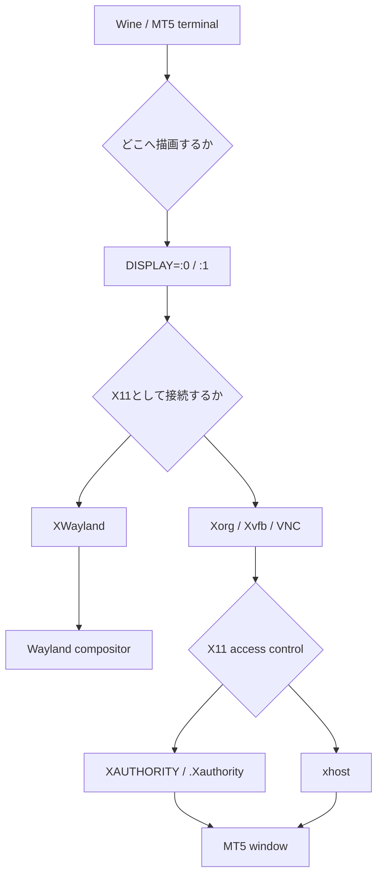

## 概要

Ubuntu系LinuxでWine経由のMT5を動かすとき、エラーの原因をすぐにWineやMT5へ寄せて考えたくなります。

しかしGUIアプリであるMT5は、Wineの上で動くだけではありません。画面を表示するためにdisplay serverへ接続します。ここで`DISPLAY`がない、X11の認証cookieが合わない、手動起動とsystemd起動で実行ユーザーが違う、といった問題があると、MT5以前の層で失敗します。

この記事では、Wayland、X11/Xorg、XWayland、XAuthority、`xauth`、`xhost`、`DISPLAY`の違いを整理し、Ubuntu上でMT5 / Wine / systemdのトラブルをdisplay layer側から切り分けます。

> [!WARNING]
> Waylandは認証システムではありません。WaylandはX11を置き換えるためのdisplay protocol / compositor architectureです。一方、XAuthorityや`xhost`はX11側の接続認証・access controlに関係します。

## この記事で学べること

- Wayland、X11、Xorg、XWaylandの役割の違い
- `DISPLAY`、`XAUTHORITY`、`.Xauthority`、`xauth`、`xhost`の関係
- `No protocol specified`や`cannot open display`をどう切り分けるか
- 手動起動では動くのにsystemdでは動かない理由
- Ubuntu ServerでMT5を動かす前にdisplay layerをどう設計するか

## 前提知識

- MT5はGUIアプリであり、Wine経由でも表示先のdisplayが必要になる
- Ubuntu Desktopや各flavorでは、Wayland session、X11 session、XWayland経由のX11アプリが混ざることがある
- Ubuntu Serverでは通常GUI sessionがないため、XvfbやVNCなどのdisplay layerを自分で用意する必要がある
- systemd serviceは、ログイン中のshellと同じ環境変数を自動では引き継がない

## 本編

### MT5の問題に見えてdisplay layerの問題だったケース

Ubuntu上でMT5が起動しないとき、原因候補は複数あります。

- Wine prefixが違う
- `terminal64.exe`のpathが違う
- broker loginが済んでいない
- fontや依存DLLが足りない
- Python APIが別terminalを探している
- display serverへ接続できていない
- X11認証が通っていない

この中で見落としやすいのがdisplay layerです。たとえば、手動で`wine terminal64.exe`を実行すると起動するのに、`systemd`から起動すると失敗する場合、MT5やWineではなく環境変数とX11認証の差分が原因かもしれません。

### Wayland / X11 / Xorg / XWaylandの整理

まず用語を分けます。

| 用語 | 役割 | MT5 / Wineとの関係 |
|---|---|---|
| Wayland | display protocol / compositor architecture | native Wayland appはcompositorへ接続する |
| X11 | 古典的なwindow system protocol | Wineやlegacy GUI appの切り分けで重要 |
| Xorg | X11 server実装の一つ | X11 sessionでGUI appが接続する先 |
| XWayland | Wayland上でX11 appを動かす互換レイヤ | Wayland session上でWineがX11 appとして動く場合に関係する |
| Xvfb | virtual framebuffer X server | headless serverでGUI appを動かす候補 |
| VNC | remote GUI session | GUI確認用のdisplay sessionとして使える |

Wayland sessionだからすべてのアプリがWayland nativeで動くわけではありません。Wineや古いGUIアプリは、XWayland経由でX11アプリとして動くことがあります。

そのため、現象としては「Wayland環境で動かない」に見えても、実際にはXWayland上のX11接続やX11 access controlの問題である可能性があります。

### X11認証の整理

X11では、アプリがX serverへ接続します。このとき、接続先と接続権限が必要です。

| 用語 | 役割 | 詰まり方 |
|---|---|---|
| `DISPLAY` | 接続先displayを示す | 未設定・別displayでGUIが開かない |
| `XAUTHORITY` | X11 auth fileの場所を示す | systemd / sudo / suで変わる |
| `.Xauthority` | auth cookieを持つfile | 実行ユーザーが読めない、cookieが違う |
| `xauth` | auth cookieを確認・追加する | 正しいdisplayのcookieが必要 |
| `xhost` | X serverのaccess controlを変更する | 広げすぎると危険 |
| MIT-MAGIC-COOKIE-1 | X11のcookie-based auth | cookie不一致で接続拒否される |

`DISPLAY`は「どこへ接続するか」です。`XAUTHORITY`は「接続してよいことを証明するcookieがどこにあるか」です。

この2つが揃っていないと、Wineは起動してもGUIアプリとしてのMT5は表示先へ接続できません。

### 症状別の切り分け

| 症状 | 原因候補 | 確認するもの |
|---|---|---|
| `cannot open display` | `DISPLAY`未設定、display service未起動 | `echo "$DISPLAY"`, `ps aux` |
| `No protocol specified` | X11 auth不一致 | `echo "$XAUTHORITY"`, `xauth list` |
| `Invalid MIT-MAGIC-COOKIE-1 key` | cookie不一致 | `.Xauthority`の所有者と内容 |
| 手動では動くがsystemdでは動かない | service環境にdisplay情報がない | unit file, `systemctl show` |
| VNCでは動くがSSHでは動かない | 接続しているdisplay sessionが違う | `DISPLAY`, VNCのdisplay番号 |
| `sudo`すると動かない | rootがユーザーのcookieを持っていない | `whoami`, `XAUTHORITY` |

特に`sudo wine ...`で一時的に試すと、Wine prefixもX11 cookieも別ユーザーの文脈になります。MT5用のWine prefixをrootで作ってしまうと、後から一般ユーザーやsystemd専用ユーザーで動かすときに切り分けが難しくなります。

### 安全な設計方針

MT5 / Wineをサーバー運用へ寄せるなら、次の方針にします。

- MT5専用ユーザーでWineとMT5を動かす
- rootでWine prefixを作らない
- `DISPLAY`を明示する
- X11を使うなら`XAUTHORITY`も明示する
- systemd unitに`User`、`Environment`、`WorkingDirectory`を明記する
- `xhost +`を恒久運用に使わない
- 必要な場合でも`xhost +SI:localuser:<user>`のように範囲を絞る
- VNCをpublicに直接晒さない
- SSH tunnelやfirewallを前提にする

`xhost +`は原因切り分けのために一時的に使われることがありますが、誰でも接続できる方向へaccess controlを緩めます。恒久的な解決策として記事や運用手順に残すべきではありません。

### 悪い切り分けと良い切り分け

悪い切り分けは、MT5が起動しない理由を最初からWineだけに寄せることです。

```text
MT5が起動しない
↓
Wineの問題だと決めつける
↓
Wine再インストール
↓
prefixが増えてさらに分からなくなる
```

良い切り分けでは、まずGUIアプリとして最低限必要なdisplay layerを見ます。

```text
MT5が起動しない
↓
DISPLAYがあるか
↓
X serverが存在するか
↓
XAUTHORITYが正しいか
↓
同じuser / same WINEPREFIXか
↓
それでも失敗する場合にWine / MT5を見る
```

### 選択肢ごとのメリット・デメリット

| 選択肢 | メリット | デメリット |
|---|---|---|
| Wayland session | 現代的なdesktop構成として自然 | legacy GUI appや自動化の切り分けが難しいことがある |
| X11 / Xorg session | `DISPLAY`やX11 access controlを追いやすい | access controlを緩めると危険 |
| XWayland | Wayland上でX11 appを動かせる | 問題発生時にWayland層とX11層を分けて見る必要がある |
| Xvfb | headless serverで再現性を作りやすい | 実画面での操作確認には向かない場合がある |
| VNC | MT5の画面を直接確認しやすい | 公開設定を誤ると危険、session差分が出やすい |

## 図解



この図では、MT5 / Wineが直接WaylandやX11のどちらかだけを見るのではなく、環境によってXWaylandやX11 access controlを経由することを表しています。

## CLI・設定例

まず、現在のsessionとdisplay関連の値を確認します。

```bash
$ echo "$XDG_SESSION_TYPE"
$ loginctl show-session "$XDG_SESSION_ID" -p Type
$ echo "$DISPLAY"
$ echo "$WAYLAND_DISPLAY"
$ echo "$XAUTHORITY"
```

X11 auth fileとcookieを確認します。

```bash
$ xauth list
$ ls -la ~/.Xauthority
```

display serverやcompositorのプロセスを確認します。

```bash
$ ps aux | grep -E 'Xorg|Xwayland|Xvfb|wayland|weston|kwin|mutter' | grep -v grep
```

systemd serviceから起動している場合は、service側の環境を確認します。

```bash
$ systemctl status mt5.service
$ journalctl -u mt5.service -n 200 --no-pager
$ systemctl show mt5.service | grep -E 'User=|Environment=|ExecStart=|WorkingDirectory='
```

unit fileでは、最低限次のような値を明示します。

```ini
[Service]
User=mt5
WorkingDirectory=/home/mt5
Environment=DISPLAY=:1
Environment=XAUTHORITY=/home/mt5/.Xauthority
Environment=WINEPREFIX=/home/mt5/.wine-mt5
```

`xhost`を使う場合は、全許可ではなく対象ユーザーを絞ります。

```bash
$ xhost +SI:localuser:mt5
$ xhost
```

これはあくまで検証や限定的な運用の例です。恒久的には、X serverを誰が起動し、どのcookieをどのserviceが参照するかを明示する設計に寄せます。

## 内部動作

Wine経由でMT5を起動すると、概念的には次の順に依存します。

```text
systemd or login shell
↓
environment variables
  DISPLAY
  XAUTHORITY
  WINEPREFIX
↓
Wine process
↓
MT5 terminal64.exe
↓
X11-compatible display
↓
X11 access control
↓
window is shown
```

手動起動では、ログイン済みdesktop sessionが`DISPLAY`や`XAUTHORITY`を持っています。一方、systemd serviceはその値を自動では持ちません。

そのため、同じコマンドに見えても、実際には次の差分が出ます。

| 実行方法 | 実行ユーザー | `DISPLAY` | `XAUTHORITY` | `WINEPREFIX` |
|---|---|---|---|---|
| desktop terminal | ログインユーザー | ある | ある | ユーザーのprefix |
| SSH shell | SSHユーザー | ないことが多い | ないことが多い | ユーザーのprefix |
| `sudo` | root | あってもcookieが違う | root側になる | rootのprefix |
| systemd service | unitの`User` | 明示しないとない | 明示しないとない | 明示しないと変わる |

MT5 / Wineの失敗に見えるものでも、実際にはこの表のどこかがズレているだけ、ということがあります。

## まとめ

- Waylandは認証システムではなく、X11を置き換えるためのdisplay protocol / compositor architecture。
- XAuthority、`.Xauthority`、`xauth`、`xhost`、MIT-MAGIC-COOKIE-1はX11側の接続認証・access controlとして考える。
- MT5 / Wineが起動しないときは、Wine再インストールの前に`DISPLAY`、`XAUTHORITY`、実行ユーザー、`WINEPREFIX`を確認する。
- systemd化では、ログインshellとserviceの環境差分を前提にしてunit fileへ明示する。
- `xhost +`を恒久解にせず、専用ユーザー、X11 auth、firewall、SSH tunnelを含めて設計する。

## 参考文献

- [Wayland](https://wayland.freedesktop.org/)
- [Wayland Book: X11 Application Support](https://wayland.freedesktop.org/docs/book/Xwayland.html)
- [X.Org: Xsecurity manual page](https://xorg.freedesktop.org/archive/X11R7.5/doc/man/man7/Xsecurity.7.html)
- [X.Org: xhost manual page](https://xorg.freedesktop.org/archive/X11R7.5/doc/man/man1/xhost.1.html)
- [MetaTrader 5 Help: Installation on Linux](https://www.metatrader5.com/en/terminal/help/start_advanced/install_linux)
