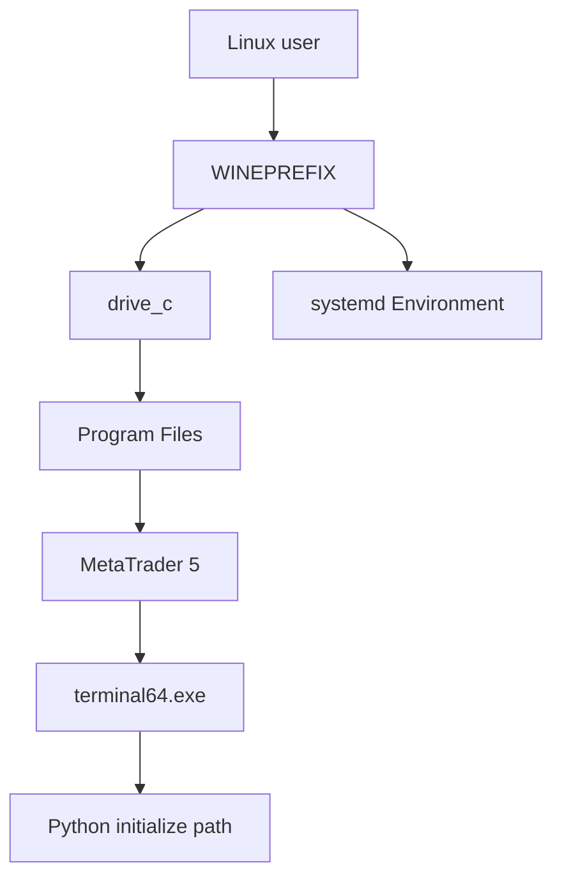

## 概要

Ubuntu系LinuxでMT5を動かす場合、基本的にはWine経由でWindows版MT5を動かす構成になります。

ここで大事なのは、インストールできたかどうかだけではありません。

本番運用へ進めるなら、どのユーザーの、どのWine prefixに、どのterminalが入ったのかを記録する必要があります。

## この記事で学べること

- Wine経由でMT5を扱う前提
- Wine prefixを固定する理由
- `terminal64.exe` pathを記録する理由
- 初回起動時に確認する項目
- Server化する前に残しておくべき値

## 前提知識

- WineはWindowsアプリをUnix-like OS上で動かす互換レイヤー
- MetaTrader 5公式ドキュメントでは、Linux上でWineを使ってplatformを動かす説明がある
- Wine prefixはWindows環境のようなディレクトリ構造を持つため、ユーザーやprefixが変わると別環境になる

## 本編

### Wine経由で動かす前提

MT5はLinux向けネイティブアプリとして動くわけではなく、LinuxではWineを使う構成が前提になります。

MetaTrader 5公式のLinuxインストールページでは、Wineを使ってplatformを動かす説明と、Ubuntu、Debian、Linux Mint、Fedoraなどを判定してWineとplatform installerを実行するscriptが案内されています。

ただし、公式scriptを使う場合でも、内部でどのprefixに何が入ったのかを記録しておかないと、あとでsystemd化やPython連携で詰まりやすくなります。

### インストール方式の比較

| 方式 | メリット | デメリット |
|---|---|---|
| 公式Linux installer / script | 手順が少ない | 内部で何をしたか追いづらい |
| 手動Wine + MT5 installer | prefixや依存関係を管理しやすい | 初期構築が面倒 |
| Bottles / PlayOnLinux等 | GUI管理しやすい | server自動運用では抽象化が増える |
| Windows VPS | MT5との相性は高い | Linux運用のメリットは減る |

どの方式でも、最終的に必要になる確認項目は同じです。

### Wine prefixを固定する

Wine prefixは、Wineが使う仮想的なWindows環境です。

たとえば次のように、MT5用のprefixを明示しておきます。

```text
WINEPREFIX=/home/<user>/.wine-mt5
```

デフォルトの`~/.wine`を使っても動くことはありますが、MT5専用に分けておくと、systemd化や再構築時に説明しやすくなります。

### terminal pathを記録する

Python API連携では、MT5 terminalのpathが重要になります。

例としては次のようなpathになります。

```text
/home/<user>/.wine-mt5/drive_c/Program Files/MetaTrader 5/terminal64.exe
```

実際にはbroker名やインストール先名でpathが変わることがあります。公開記事に書く場合は、broker名をマスクします。

### 初回起動で確認すること

初回起動時には、次を確認します。

- MT5が起動する
- Wine Mono / Gecko / font関連のダイアログを処理できる
- broker serverが見える
- demo accountでログインできる
- Market Watchに対象symbolが見える
- OS再起動後もログイン状態が維持される
- terminal pathを記録できる

実口座情報は記事に出しません。確認はdemo accountまたはマスク済み情報で扱います。

### 詰まりやすいポイント

よくある詰まりポイントは次です。

- font関連で文字化けする
- terminal pathが分からない
- prefixが想定と違う
- rootでインストールしてしまう
- 一般ユーザーで起動すると別prefixを見る
- GUIでは起動するがsystemdでは起動しない
- Pythonから接続すると別terminalを探している

## 図解



## CLI・設定例

インストール後に確認する例です。

```bash
$ echo "$USER"
$ export WINEPREFIX=/home/<user>/.wine-mt5
$ wine --version
$ find "$WINEPREFIX" -iname "terminal64.exe" 2>/dev/null
$ ps aux | grep -i terminal64.exe
```

公式scriptを使う場合も、実行ユーザーと生成されたデータディレクトリを確認します。

## 内部動作

Wine上のMT5は、Linuxプロセスとして起動しますが、内部的にはWine prefix内のWindows風ファイル構造を使います。

```text
Linux user
↓
WINEPREFIX
↓
drive_c
↓
terminal64.exe
↓
MT5 data / login state
↓
Python API connection target
```

prefixが違えば、別のWindows環境を見ているのと同じです。手動起動時とsystemd起動時でprefixがズレると、同じMT5を見ているつもりでも別環境になります。

## まとめ

- Wine + MT5では、インストール成功よりもprefix、terminal path、run userの記録が重要。
- `sudo wine`やroot prefix前提の構成は避ける。
- broker名、口座番号、server名、passwordは公開しない。
- Server化する前に、OS version、Wine version、WINEPREFIX、terminal path、display番号を確認する。

## 参考文献

- [MetaTrader 5 Help: Installation on Linux](https://www.metatrader5.com/en/terminal/help/start_advanced/install_linux)
- [WineHQ](https://www.winehq.org/)
- [MQL5 Reference: initialize](https://www.mql5.com/en/docs/python_metatrader5/mt5initialize_py)

