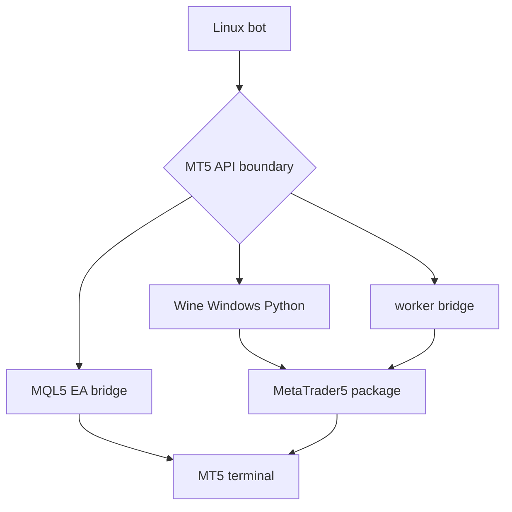

## 概要

MT5 API連携で詰まると、Pythonコードだけを疑いたくなります。

しかしUbuntu + Wine構成では、Pythonコード以前に、Pythonがどこで動いているか、MT5 terminalがどこで動いているか、両者が同じterminalを見ているかが重要です。

この記事では、MetaTrader5 packageと`initialize()`の前提、Linux native Pythonで断定してはいけない点、bridge構成の候補を整理します。

## この記事で学べること

- MT5 Python APIがterminalに接続する前提
- `initialize()`で詰まりやすい原因
- Wine内Windows Python、Linux bot + worker bridge、MQL5 EA bridgeの違い
- 注文処理前に確認する項目
- 金融系コードを記事に出すときの注意

## 前提知識

- MQL5公式ドキュメントでは、Python integrationとして`initialize`、`login`、`shutdown`、`terminal_info`、`copy_rates_*`、`order_send`などが整理されている
- PyPIのMetaTrader5 packageは、2026-06-28時点の最新ファイルでは`win_amd64` wheelとして配布されている
- そのため、Ubuntu native Pythonから公式packageがそのまま動くと断定しない

## 本編

### Python APIでやりたいこと

MT5 API連携でやりたいことは、たとえば次です。

- terminal接続
- account info取得
- symbol情報取得
- tick / bar取得
- position確認
- order requestのdry-runまたはdemo accountでの検証

ただし、注文APIを扱う場合は特に注意が必要です。この記事では収益性や売買判断は扱わず、技術的な接続境界だけを扱います。

### `initialize()`で詰まりやすい理由

`initialize()`は、MetaTrader 5 terminalとの接続を確立する関数です。公式ドキュメントでは、pathを指定してterminal executableへ接続する呼び出しも説明されています。

Ubuntu + Wine構成で失敗する場合、原因候補は次です。

- MT5 terminalが起動していない
- terminal pathが違う
- login済みではない
- broker serverが違う
- PythonがMT5 terminalと同じ環境にいない
- Wine prefixが違う
- DISPLAYがない

### 構成候補A: Wine内Windows Python

```text
Ubuntu
  └─ Wine
      ├─ MT5 terminal64.exe
      └─ Windows Python
          └─ MetaTrader5 package
```

メリットは、MT5 terminalとPython packageが同じWindows/Wine側にいるため、公式packageの前提と合わせやすいことです。

デメリットは、Linux側のbot運用と分離しづらく、venv、logging、deployが複雑になりやすいことです。

### 構成候補B: Linux bot + Wine内worker bridge

```text
Linux Python bot
↓ REST / RPC / socket / file queue
Wine内Windows Python worker
↓ MetaTrader5 package
MT5 terminal64.exe
```

メリットは、bot本体をLinux側で運用し、MT5依存部分だけをworkerに閉じ込められることです。

デメリットは、bridge実装、retry、timeout、idempotency、ログ設計が必要になることです。

### 構成候補C: MQL5 EA bridge

```text
Linux Python bot
↓ socket / HTTP / file
MQL5 EA
↓
MT5
```

メリットは、Python packageのOS問題を回避しやすく、MT5 terminal側の制御をEAに寄せられることです。

デメリットは、MQL5実装が必要になり、PythonとEAにロジックが分散することです。

### 注文処理前に確認すること

注文処理はdemo accountまたはdry-run前提で検証します。

確認すべき項目は次です。

- `symbol_select()`で対象symbolを選択できるか
- volume / lot stepがbroker仕様に合っているか
- filling modeが合っているか
- trade allowedか
- market openか
- marginが足りているか
- `order_send()`のretcodeを必ず確認しているか

## 図解



## CLI・設定例

まずは接続確認だけに絞ります。実口座の認証情報はコードに書きません。

```python
import MetaTrader5 as mt5

terminal_path = "TODO: masked terminal64.exe path"

if not mt5.initialize(path=terminal_path):
    print("initialize failed", mt5.last_error())
    raise SystemExit(1)

print(mt5.terminal_info())
print(mt5.account_info())

mt5.shutdown()
```

PyPIの配布ファイルも確認します。

```bash
$ python -m pip index versions MetaTrader5
$ python -m pip debug --verbose
```

Linux側Pythonでpackageが見つからない場合、OSやPython versionだけでなく、配布wheelのplatform tagを確認します。

## 内部動作

MT5 API連携は、単なるHTTP APIではありません。

```text
Python process
↓
MetaTrader5 package
↓
MetaTrader 5 terminal process
↓
terminal login / symbol / account state
↓
broker connection
```

Pythonがどこで動いているかと、terminalがどこで動いているかがズレると、接続できても期待したterminalではない、またはそもそも`initialize()`できない状態になります。

## まとめ

- MT5 API連携では、Pythonコードより実行環境の境界が重要。
- Ubuntu native Pythonから公式MetaTrader5 packageが必ず動くとは断定しない。
- Wine内Windows Python、Linux bot + worker bridge、MQL5 EA bridgeを候補として比較する。
- 注文APIを扱う場合はdemo account / dry-run前提にし、retcodeを必ず見る。

## 参考文献

- [MQL5 Reference: Python Integration](https://www.mql5.com/en/docs/python_metatrader5)
- [MQL5 Reference: initialize](https://www.mql5.com/en/docs/python_metatrader5/mt5initialize_py)
- [PyPI: MetaTrader5](https://pypi.org/project/MetaTrader5/)
- [MetaTrader 5 Help: Installation on Linux](https://www.metatrader5.com/en/terminal/help/start_advanced/install_linux)
