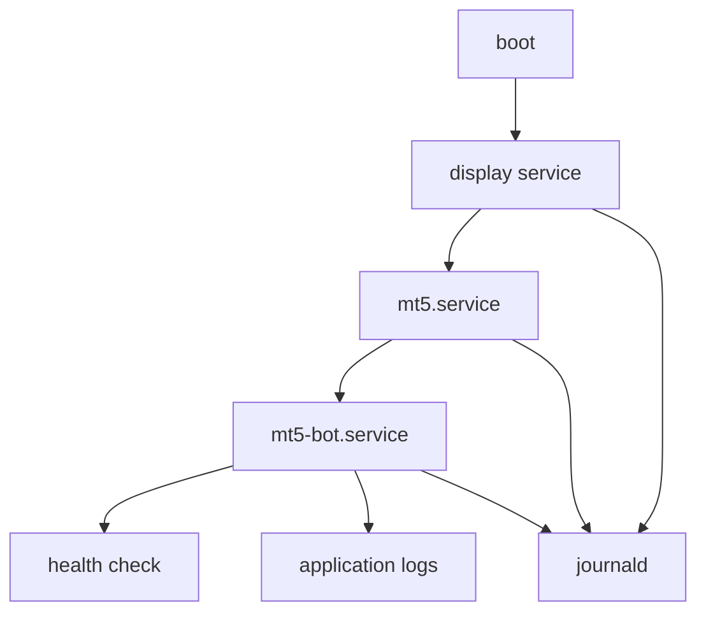

## 概要

手動起動でMT5とPython botが動いても、そのまま本番運用できるとは限りません。

サーバー再起動後に復旧させるには、display、MT5、botを正しい順序で起動し、環境変数とログをsystemd上で管理する必要があります。

この記事では、Ubuntu ServerでMT5とPython botをsystemd管理する設計を整理します。

## この記事で学べること

- 手動起動とsystemd起動の違い
- display → MT5 → botの起動順序
- `DISPLAY`、`WINEPREFIX`、`HOME`、`User`、`WorkingDirectory`の重要性
- restart policyとhealth checkの考え方
- journalでの切り分け方

## 前提知識

- systemd serviceはshellログイン時と同じ環境変数を自動では引き継がない
- GUIアプリをserviceとして扱う場合、display layerを先に起動する必要がある
- Wine prefixと起動ユーザーがズレると、手動時と別環境を見ることがある

## 本編

### 手動起動とservice起動の違い

SSH shellで動いたコマンドが、systemd serviceで失敗することがあります。

理由は、systemdが起動するプロセスは、普段のshellと環境が違うからです。

特にMT5 + Wine構成では、次がズレやすいです。

- `DISPLAY`
- `WINEPREFIX`
- `HOME`
- `PATH`
- current directory
- run user

### serviceを分ける

すべてを1つのserviceに詰め込むと、どこで失敗したかが見えにくくなります。

基本は次のように分けます。

```text
xvfb.service or vnc.service
↓
mt5.service
↓
mt5-bot.service
```

display serviceは画面先を用意します。mt5.serviceはWine経由でterminalを起動します。bot.serviceはterminalが起動した後でPython処理を開始します。

### display service

display serviceの役割は、MT5が描画する先を用意することです。

Xvfbを使うなら、`DISPLAY=:1`のようなdisplay番号を決めます。VNCを使うなら、画面確認方法と公開範囲も設計します。

VNCを使う場合、publicに直接開ける構成は避け、SSH tunnelやfirewallで閉じる方針にします。

### mt5.service

mt5.serviceでは、次を固定します。

- `User=<user>`
- `Environment=DISPLAY=:1`
- `Environment=WINEPREFIX=/home/<user>/.wine-mt5`
- `Environment=HOME=/home/<user>`
- `ExecStart=wine ...terminal64.exe`

`terminal64.exe`のpathには空白が含まれることがあるため、unit fileでのquoteやwrapper scriptの扱いに注意します。

### bot.service

bot.serviceでは、MT5 terminalが起動してから`initialize()`を試します。

bot側には、最低限次を持たせます。

- 起動時retry
- timeout
- health check
- heartbeat log
- 異常終了時のrestart
- 多重起動防止

`Restart=always`だけで安定運用できるとは考えません。壊れた原因が残ったまま再起動を繰り返すと、ログが流れて切り分けが難しくなります。

## 図解



## CLI・設定例

unit fileの断片です。これはテンプレートであり、実環境のunit全文ではありません。

```ini
[Service]
User=<user>
WorkingDirectory=/home/<user>/mt5-bot
Environment=DISPLAY=:1
Environment=WINEPREFIX=/home/<user>/.wine-mt5
Environment=HOME=/home/<user>
Restart=on-failure
```

ログ確認例です。

```bash
$ systemctl status mt5.service
$ systemctl status mt5-bot.service
$ journalctl -u mt5.service -f
$ journalctl -u mt5-bot.service -f
```

unitを変更したら、反映漏れを避けるためにreloadします。

```bash
$ sudo systemctl daemon-reload
```

## 内部動作

systemd化すると、起動順序と環境変数がアプリケーションの一部になります。

```text
systemd
↓
unit dependencies
↓
environment variables
↓
process start
↓
journald
↓
restart policy
```

MT5はGUIアプリなので、通常のCLI daemonよりもdisplay依存が強いです。そのため、service設計ではプロセスの起動だけでなく、描画先とWine環境を明示します。

## まとめ

- systemd化では、display、MT5、botを分けて起動順序を設計する。
- 手動起動とservice起動では、`DISPLAY`、`WINEPREFIX`、`HOME`、`PATH`がズレやすい。
- unit fileは実環境で検証して確定する。未確認の完成版として出さない。
- restart policyだけでなくhealth checkとログ設計が必要。

## 参考文献

- [systemd.service manual](https://www.freedesktop.org/software/systemd/man/systemd.service.html)
- [systemd.exec manual](https://www.freedesktop.org/software/systemd/man/systemd.exec.html)
- [X.Org: Xvfb manual page](https://www.x.org/archive//X11R7.0/doc/html/Xvfb.1.html)
- [MQL5 Reference: initialize](https://www.mql5.com/en/docs/python_metatrader5/mt5initialize_py)
