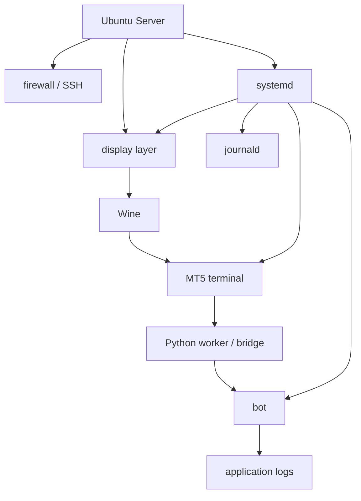

## 概要

Ubuntu Server + Wine + MT5 + Python botの構成は成立します。

ただし、Windows前提のMT5をLinuxサーバーに寄せるため、設計・運用・障害対応のコストは増えます。

この記事では、シリーズ全体の最終構成、メリット・デメリット、トラブルシュート、次にやるなら改善したい点を整理します。

## この記事で学べること

- Ubuntu Server + Wine + MT5 + Python botの最終構成
- この構成にした理由
- メリットとデメリット
- レイヤー別トラブルシュート
- 次に作るなら最初から設計したいこと

## 前提知識

- MT5はLinux上ではWine経由で動かす前提がある
- Ubuntu ServerではGUIがないため、XvfbやVNCなどのdisplay layerが必要になる
- Python API連携では、MT5 terminalとPython実行環境の位置関係が重要になる
- systemdでは手動shellと環境変数が異なる

## 本編

### 最終構成

最終的な構成は、次のように考えます。

```text
[VPS / Ubuntu Server]
  ├─ SSH
  ├─ firewall
  ├─ Wine
  │   └─ MetaTrader 5 terminal64.exe
  ├─ display layer
  │   └─ Xvfb or VNC
  ├─ Python layer
  │   └─ bot / worker / bridge
  ├─ systemd
  │   ├─ display service
  │   ├─ mt5 service
  │   └─ bot service
  └─ logs
      ├─ journald
      └─ application logs
```

この構成では、MT5だけを見るのではなく、MT5を取り巻く運用レイヤーを明示します。

### この構成にした理由

Ubuntu Server構成に寄せる理由は次です。

- SSHベースで運用できる
- systemdで自動起動とrestartを管理できる
- journaldでログ確認できる
- bot本体や周辺処理をLinux側で管理しやすい
- GUIは必要なときだけ確認すればよい

一方で、MT5がWindows前提であることは変わりません。そのため、Wine、display、Python APIの境界を受け入れる必要があります。

### メリット

- VPSリソースを抑えやすい
- Linuxの運用ツールを使える
- botをservice化しやすい
- SSH、firewall、ログ管理を既存のLinux運用に寄せられる
- GUIあり検証とheadless本番を分けられる

### デメリット

- MT5はLinuxネイティブではない
- Wineに依存する
- GUIセッションに依存する
- Python APIの実行環境に注意が必要
- MT5 update、broker update、Wine updateの影響を受ける
- 障害時の切り分けが複雑になる

### レイヤー別トラブルシュート

| レイヤー | 症状 | 原因候補 | 確認方法 |
|---|---|---|---|
| OS | 再起動後に動かない | service disabled | `systemctl status` |
| Display | MT5が起動しない | `DISPLAY`なし | env / journal |
| Wine | terminalが見つからない | prefix違い | `WINEPREFIX` / path |
| MT5 | loginできない | server / credentials / network | MT5 GUI / terminal logs |
| Python | initialize失敗 | terminal path / process | `last_error()` |
| Order | 注文失敗 | volume / filling / market | retcode |
| systemd | 手動では動く | HOME / PATH / WINEPREFIX差分 | unit確認 |

### 次にやるなら

次に同じ構成を作るなら、最初から次を設計します。

- Wine prefixを明示的に管理する
- terminal pathを設定ファイル化する
- MT5 API workerをbot本体から分離する
- account / terminal health checkを作る
- broker固有symbol名をconfig化する
- systemd unitとbot logを最初から設計する
- VNCはSSH tunnel前提にする
- 実環境値を構築ログとして残す

## 図解



## CLI・設定例

障害時は、レイヤーごとに見ます。

```bash
$ systemctl status xvfb.service
$ systemctl status mt5.service
$ systemctl status mt5-bot.service
$ journalctl -u mt5.service --since "1 hour ago"
$ journalctl -u mt5-bot.service --since "1 hour ago"
$ ps aux | grep -E "Xvfb|wine|terminal64|python"
```

Python側では、接続失敗時に`last_error()`を必ず出します。

```python
import MetaTrader5 as mt5

if not mt5.initialize(path="TODO: masked terminal64.exe path"):
    print("initialize failed", mt5.last_error())
    raise SystemExit(1)

mt5.shutdown()
```

## 内部動作

最終構成では、障害は1つのレイヤーだけで完結しません。

```text
boot
↓
systemd
↓
display layer
↓
Wine
↓
MT5 terminal
↓
Python API / bridge
↓
bot
↓
logs / health check
```

たとえば`initialize()`が失敗した場合でも、原因はPythonコードとは限りません。MT5が起動していない、DISPLAYがない、Wine prefixが違う、terminal pathが違う、login状態がない、broker接続が切れているなど、複数の候補があります。

## まとめ

- LinuxでMT5を動かすこと自体は可能だが、Windows前提のアプリをLinux運用に寄せるコストはある。
- 本番運用では、Wine、display、MT5、Python、systemdの境界を設計する必要がある。
- GUIあり検証とUbuntu Server本番を分けると、切り分けしやすい。
- 投資判断ではなく、サーバー運用としての再現性、ログ、復旧性を設計することが重要。

## 参考文献

- [MetaTrader 5 Help: Installation on Linux](https://www.metatrader5.com/en/terminal/help/start_advanced/install_linux)
- [MQL5 Reference: Python Integration](https://www.mql5.com/en/docs/python_metatrader5)
- [MQL5 Reference: initialize](https://www.mql5.com/en/docs/python_metatrader5/mt5initialize_py)
- [systemd.service manual](https://www.freedesktop.org/software/systemd/man/systemd.service.html)
- [X.Org: Xvfb manual page](https://www.x.org/archive//X11R7.0/doc/html/Xvfb.1.html)

