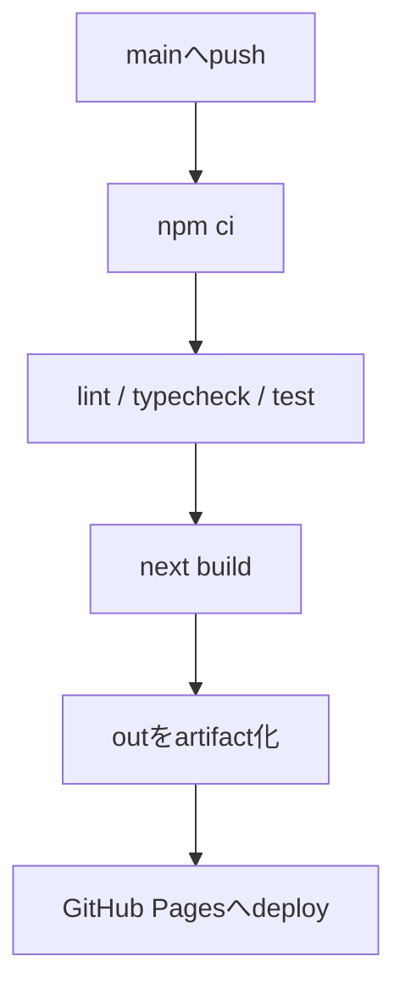

## GitHub Pagesで配信する前提

GitHub Pagesは静的ファイルを配信する仕組みです。Next.jsで使う場合は、Node.jsサーバーが必要な機能を避け、ビルド時にHTML/CSS/JSを生成します。

```ts title="next.config.ts"
import type { NextConfig } from "next";

const nextConfig: NextConfig = {
  output: "export",
  basePath: "/tech-note",
  trailingSlash: true,
  images: {
    unoptimized: true,
  },
};

export default nextConfig;
```

## 避ける機能

- Server Actions
- ISR
- Request依存のRoute Handler
- cookies / headers
- redirects / rewrites / proxy
- デフォルトのImage Optimization

> [!INFO]
> 記事サイトのMVPは、ビルド時生成とクライアント検索だけで十分成立します。

## Actionsの流れ


