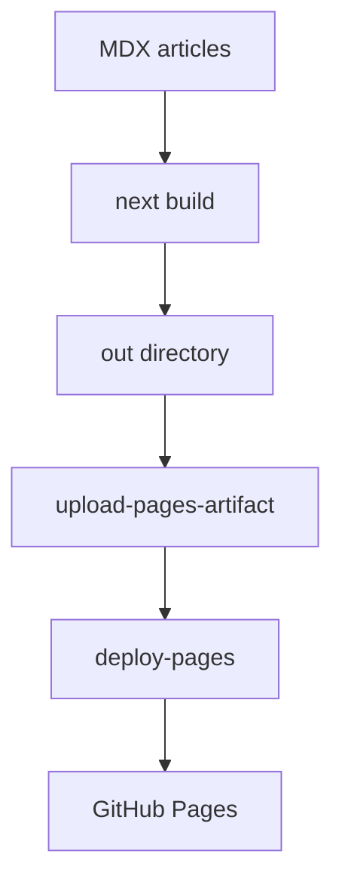
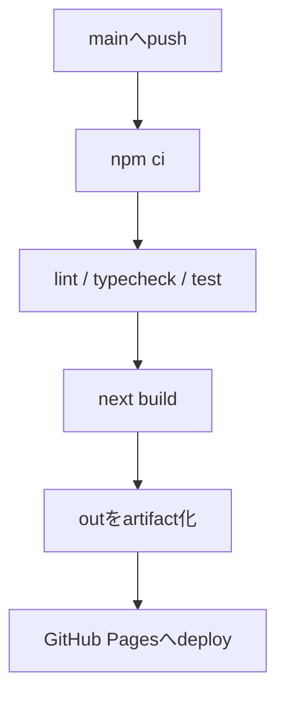

## 概要

Next.js App RouterのサイトをGitHub Pagesへ公開するには、サーバー実行を前提にせず、`next build` で静的HTMLを生成できる構成にする必要があります。

この記事では、`output: "export"`、`basePath`、GitHub Actionsの流れを、GitHub Pages向けの実装として整理します。

## この記事で学べること

- Next.jsの静的Exportで生成されるもの
- GitHub Pagesで必要になる `basePath`
- 静的Exportで避けるべきNext.js機能
- GitHub ActionsからPagesへデプロイする流れ

## 前提知識

- Next.js App Routerの基本的なルーティングを知っている
- GitHub Pagesが静的ファイル配信であることを知っている
- GitHub ActionsでCIを実行したことがある

## 図解



## 実装コード例

```ts title="next.config.ts"
import type { NextConfig } from "next";

const nextConfig: NextConfig = {
  output: "export",
  basePath: "/tech-note",
  trailingSlash: true,
  images: {
    unoptimized: true,
  },
};

export default nextConfig;
```

## 内部動作

```text
next build
↓
App Routerの各routeをSSG
↓
HTML / RSC payload / JS / CSSを生成
↓
out/に静的ファイルとして出力
↓
GitHub Pagesがそのまま配信
```

## 本編

## GitHub Pagesで配信する前提

GitHub Pagesは静的ファイルを配信する仕組みです。Next.jsで使う場合は、Node.jsサーバーが必要な機能を避け、ビルド時にHTML/CSS/JSを生成します。

```ts title="next.config.ts"
import type { NextConfig } from "next";

const nextConfig: NextConfig = {
  output: "export",
  basePath: "/tech-note",
  trailingSlash: true,
  images: {
    unoptimized: true,
  },
};

export default nextConfig;
```

## 避ける機能

- Server Actions
- ISR
- Request依存のRoute Handler
- cookies / headers
- redirects / rewrites / proxy
- デフォルトのImage Optimization

> [!INFO]
> 記事サイトのMVPは、ビルド時生成とクライアント検索だけで十分成立します。

## Actionsの流れ



## まとめ

- GitHub PagesではNext.jsサーバーではなく、生成済みの静的ファイルを配信する。
- `output: "export"` で `out/` を生成する。
- リポジトリPagesでは `basePath` を正しく設定する。
- Server ActionsやISRなど、サーバー実行が必要な機能は使わない。

## 参考文献

- [Next.js Documentation: Static Exports](https://nextjs.org/docs/app/guides/static-exports)
- [GitHub Docs: Using custom workflows with GitHub Pages](https://docs.github.com/en/pages/getting-started-with-github-pages/using-custom-workflows-with-github-pages)
