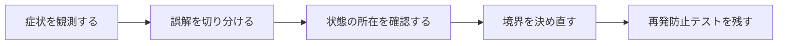

## 概要

DB上で値が変わった事実は残っているのに、`saved_change_to_attribute?`や`previous_changes`が取れなくなる場面に遭遇した。Dirty Trackingを監査ログのような永続的履歴だと誤解していたことが混乱の原因だった。

Dirty TrackingはDBの履歴ではなく、特定のActive Recordインスタンスが保存前後の差分を扱うためのライフサイクル依存APIである。保存前、保存直後、コミット後、reload後、別インスタンスで見える情報を分けて理解する必要がある。

## この記事で学べること

- 同じDB行でもインスタンスが違えば変更情報を共有しないことを示す
- 保存前：`changes_to_save`、`will_save_change_to_attribute?`
- 保存後：`saved_changes`、`saved_change_to_attribute?`、`attribute_before_last_save`
- `previous_changes`の位置づけと利用バージョンでの挙動確認
- コミット後に何が残るか、外側トランザクションがある場合の注意
- `reload`、再検索、別プロセスで情報が失われる理由

## 前提知識

- Rails、Active Record、RSpec、SQLログの基本を読めること
- フレームワークのAPIを使った経験があり、状態・トランザクション・非同期処理の境界で詰まり始めていること
- この記事のコード例は匿名化した最小例であり、利用中のバージョンでは公式ドキュメントと実装を確認すること

## 図解




## 実装コード例

```ruby
class User < ApplicationRecord
  def rename_and_report!(next_name)
    self.name = next_name

    before_save_change = will_save_change_to_name?
    save!
    after_save_change = saved_change_to_name?

    reload

    {
      before_save_change: before_save_change,
      after_save_change: after_save_change,
      after_reload_change: saved_change_to_name?,
    }
  end
end
```

## 本編

### 発生した状況

DB上で値が変わった事実は残っているのに、`saved_change_to_attribute?`や`previous_changes`が取れなくなる場面に遭遇した。Dirty Trackingを監査ログのような永続的履歴だと誤解していたことが混乱の原因だった。

### 当初の理解・誤解

当初は、API名やメソッド名から直感的に挙動を推測していました。しかし実際には、Dirty TrackingはDBの履歴ではなく、特定のActive Recordインスタンスが保存前後の差分を扱うためのライフサイクル依存APIである。保存前... という観点で見る必要がありました。

### 観測したこと

- 状態遷移ごとのRubyコンソール例
- `User.find(user.id)`で取り直した別インスタンスとの比較
- RSpecで保存前・保存後・reload後の値を検証

### 修正案の比較

| 方針 | 見るべき点 |
| --- | --- |
| Dirty Tracking利用 | 実装が軽いが、ライフサイクルに強く依存する |
| 履歴テーブル利用 | 永続性があるが、保存量と設計コストが増える |

## 内部動作

Railsの抽象化は、Rubyオブジェクト、Active Record、SQL、DBトランザクションの上に成り立っています。重要なのは、Railsのメソッド呼び出しがそのままDBの履歴や外部サービスの状態になるわけではない、という点です。

- Dirty TrackingはActive Model/Active Recordの変更検知機構
- 監査ログやDBトリガーの履歴とは役割が異なる
- メソッド名と利用可能なタイミングはRailsバージョン差があるためリポジトリで確認する

```text
Ruby object
  -> Active Record
  -> SQL / transaction
  -> database row
  -> callback or job boundary
```

## 調査手順

1. まず、入力値・保存前状態・保存後状態・コールバックや非同期処理の発火地点をログに残します。
2. 次に、DBやHTTP通信など外部境界をまたぐ処理を分けて、どこまでが同じトランザクションや同じライフサイクルに属するかを確認します。
3. 最後に、修正後の設計を最小テストへ落とし込み、同じ誤解が再発しないようにします。

- Dirty TrackingはActive Model/Active Recordの変更検知機構
- 監査ログやDBトリガーの履歴とは役割が異なる
- メソッド名と利用可能なタイミングはRailsバージョン差があるためリポジトリで確認する

## 再発防止テスト

```ruby
RSpec.describe "active-record-dirty-tracking-lifecycle" do
  it "境界条件を固定する" do
    result = described_class.new.call

    expect(result).to be_present
  end
end
```

## 一般化できる設計原則

- API名が短いほど、裏側の実行モデルを確認する
- 状態を「値」「オブジェクト」「DB row」「外部サービス」のどこに置いているかを分けて考える
- トランザクションや非同期処理の境界をまたぐ副作用は、明示的な設計として扱う
- テストは成功確認だけでなく、誤解しやすい境界条件を固定する

## まとめ

「何が変わったか」だけでなく、「誰が、いつまで、その差分を覚えているか」を確認する習慣へ一般化する。


この記事では、次のような短絡的な一般化は避けます。

- `changed?`など古い/文脈依存APIを無条件に推奨しない
- すべてのメソッドがafter_commitでも永続すると断定しない

## 参考文献

- この記事は、提供された執筆仕様とサムネイルをもとに、公開用の匿名化された技術ノートとして再構成しています。
- Rails、Flutter、Dart、Swiftのバージョン差が関係する箇所は、利用中リポジトリの設定と公式ドキュメントで確認してください。
