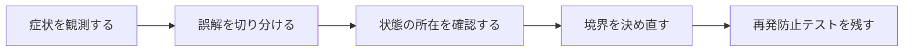

## 概要

`scope :highest_price_first, -&gt; { order(price: :desc, created_at: :desc, id: :desc) }`を読んだとき、1件を返すのか全件を並べるのか迷った。実装は正しくても、名前が戻り値の契約を曖昧にしていた。

Relation全体を返すScopeは、集合と順序を表す名前にする。単一レコードを返すメソッドとは命名とAPIを分け、呼び出し側が戻り値を予測できるようにする。

## この記事で学べること

- `highest`と`first`が単一値を連想させる理由
- ScopeはRelationを返す契約
- `expensive_first`、`order_by_price_desc`等の候補
- 単一レコードなら`highest_priced`等のメソッド
- 同額時のtie-breaker
- scope chainingと再利用性

## 前提知識

- Rails、Active Record、RSpec、SQLログの基本を読めること
- フレームワークのAPIを使った経験があり、状態・トランザクション・非同期処理の境界で詰まり始めていること
- この記事のコード例は匿名化した最小例であり、利用中のバージョンでは公式ドキュメントと実装を確認すること

## 図解




## 実装コード例

```ruby
class Product < ApplicationRecord
  scope :price_desc, -> { order(price: :desc) }
  scope :highest_price_first, -> { price_desc }

  def self.highest_price
    price_desc.first
  end
end
```

## 本編

### 発生した状況

`scope :highest_price_first, -&gt; { order(price: :desc, created_at: :desc, id: :desc) }`を読んだとき、1件を返すのか全件を並べるのか迷った。実装は正しくても、名前が戻り値の契約を曖昧にしていた。

### 当初の理解・誤解

当初は、API名やメソッド名から直感的に挙動を推測していました。しかし実際には、Relation全体を返すScopeは、集合と順序を表す名前にする。単一レコードを返すメソッドとは命名とAPIを分け、呼び出し側が戻り値を予測できるようにする。 という観点で見る必要がありました。

### 観測したこと

- 曖昧なscopeと改善後を比較
- Relationであること、順序、同額時順序をRSpecで確認

### 修正案の比較

| 方針 | 見るべき点 |
| --- | --- |
| 具体的命名 | 長くなる／誤解が減る |
| 短い命名 | 書きやすい／文脈依存 |

## 内部動作

Railsの抽象化は、Rubyオブジェクト、Active Record、SQL、DBトランザクションの上に成り立っています。重要なのは、Railsのメソッド呼び出しがそのままDBの履歴や外部サービスの状態になるわけではない、という点です。

- 命名に唯一の正解はないが、戻り値と副作用を予測できることが重要
- Scopeに`first`を含めても必ず誤りではないが、チーム規約を明示する

```text
Ruby object
  -> Active Record
  -> SQL / transaction
  -> database row
  -> callback or job boundary
```

## 調査手順

1. まず、入力値・保存前状態・保存後状態・コールバックや非同期処理の発火地点をログに残します。
2. 次に、DBやHTTP通信など外部境界をまたぐ処理を分けて、どこまでが同じトランザクションや同じライフサイクルに属するかを確認します。
3. 最後に、修正後の設計を最小テストへ落とし込み、同じ誤解が再発しないようにします。

- 命名に唯一の正解はないが、戻り値と副作用を予測できることが重要
- Scopeに`first`を含めても必ず誤りではないが、チーム規約を明示する

## 再発防止テスト

```ruby
RSpec.describe "active-record-scope-naming" do
  it "境界条件を固定する" do
    result = described_class.new.call

    expect(result).to be_present
  end
end
```

## 一般化できる設計原則

- API名が短いほど、裏側の実行モデルを確認する
- 状態を「値」「オブジェクト」「DB row」「外部サービス」のどこに置いているかを分けて考える
- トランザクションや非同期処理の境界をまたぐ副作用は、明示的な設計として扱う
- テストは成功確認だけでなく、誤解しやすい境界条件を固定する

## まとめ

名前はコメントではなく呼び出し側との契約であり、型と件数まで予測できる語彙を選ぶ。


この記事では、次のような短絡的な一般化は避けます。

- 特定の名前だけを絶対正解としない
- SQL順序に一意性がなければ結果が安定すると断定しない

## 参考文献

- この記事は、提供された執筆仕様とサムネイルをもとに、公開用の匿名化された技術ノートとして再構成しています。
- Rails、Flutter、Dart、Swiftのバージョン差が関係する箇所は、利用中リポジトリの設定と公式ドキュメントで確認してください。
