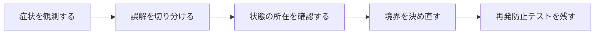

## 概要

関連名とクラス名が一致しないため`class_name`が必要になり、さらに`inverse_of`の意味が分からなかった。同じDB行を指していてもRuby上で別インスタンスになる問題まで追うと理解できた。

`class_name`は関連名からクラスを解決する規約を上書きし、`inverse_of`は双方向関連が同じインメモリオブジェクトを参照できるようにする。DB上の同一行とRubyオブジェクトの同一性は別である。

## この記事で学べること

- Railsが関連名からクラス名・外部キーを推論する規約
- `class_name`と`foreign_key`
- 自動inverse推論が効くケース/効かないケースを利用バージョンで確認
- 未保存親子オブジェクトとvalidation
- nested attributes
- 同じDB行を別インスタンスで読む場合

## 前提知識

- Rails、Active Record、RSpec、SQLログの基本を読めること
- フレームワークのAPIを使った経験があり、状態・トランザクション・非同期処理の境界で詰まり始めていること
- この記事のコード例は匿名化した最小例であり、利用中のバージョンでは公式ドキュメントと実装を確認すること

## 図解




## 実装コード例

```ruby
class User < ApplicationRecord
  has_many :posts, class_name: "Post", inverse_of: :author
end

class Post < ApplicationRecord
  belongs_to :author, class_name: "User", inverse_of: :posts
end
```

## 本編

### 発生した状況

関連名とクラス名が一致しないため`class_name`が必要になり、さらに`inverse_of`の意味が分からなかった。同じDB行を指していてもRuby上で別インスタンスになる問題まで追うと理解できた。

### 当初の理解・誤解

当初は、API名やメソッド名から直感的に挙動を推測していました。しかし実際には、`class_name`は関連名からクラスを解決する規約を上書きし、`inverse_of`は双方向関連が同じインメモリオブジェクトを参照できるようにする。DB... という観点で見る必要がありました。

### 観測したこと

- `User has_many :authored_posts, class_name: 'Post', foreign_key: ...`
- `Post belongs_to :author, inverse_of: :authored_posts`
- `equal?`と`==`でオブジェクトを比較するコンソール例
- 未保存関連のvalidation RSpec

### 修正案の比較

| 方針 | 見るべき点 |
| --- | --- |
| `inverse_of` | 追加クエリや不整合を減らせる／複雑な関連では推論・設定が難しい |

## 内部動作

Railsの抽象化は、Rubyオブジェクト、Active Record、SQL、DBトランザクションの上に成り立っています。重要なのは、Railsのメソッド呼び出しがそのままDBの履歴や外部サービスの状態になるわけではない、という点です。

- `class_name`は名前解決、`inverse_of`は逆関連のインメモリ対応
- RailsのIdentity Map全般を提供する機能ではない

```text
Ruby object
  -> Active Record
  -> SQL / transaction
  -> database row
  -> callback or job boundary
```

## 調査手順

1. まず、入力値・保存前状態・保存後状態・コールバックや非同期処理の発火地点をログに残します。
2. 次に、DBやHTTP通信など外部境界をまたぐ処理を分けて、どこまでが同じトランザクションや同じライフサイクルに属するかを確認します。
3. 最後に、修正後の設計を最小テストへ落とし込み、同じ誤解が再発しないようにします。

- `class_name`は名前解決、`inverse_of`は逆関連のインメモリ対応
- RailsのIdentity Map全般を提供する機能ではない

## 再発防止テスト

```ruby
RSpec.describe "class-name-and-inverse-of" do
  it "境界条件を固定する" do
    result = described_class.new.call

    expect(result).to be_present
  end
end
```

## 一般化できる設計原則

- API名が短いほど、裏側の実行モデルを確認する
- 状態を「値」「オブジェクト」「DB row」「外部サービス」のどこに置いているかを分けて考える
- トランザクションや非同期処理の境界をまたぐ副作用は、明示的な設計として扱う
- テストは成功確認だけでなく、誤解しやすい境界条件を固定する

## まとめ

ORMでは「同じ行」「等価な値」「同じRubyオブジェクト」を分けて観測する必要がある、と締める。


この記事では、次のような短絡的な一般化は避けます。

- `inverse_of`で常に同じインスタンスになると広く一般化しない
- N+1対策としてのみ説明しない

## 参考文献

- この記事は、提供された執筆仕様とサムネイルをもとに、公開用の匿名化された技術ノートとして再構成しています。
- Rails、Flutter、Dart、Swiftのバージョン差が関係する箇所は、利用中リポジトリの設定と公式ドキュメントで確認してください。
