## 概要

RailsのActiveRecordには、modelの属性変更を追跡する **Dirty Tracking** という仕組みがあります。

Dirty Trackingを使うと、保存前に「次のsaveで何が変わるか」を確認できます。

```ruby
user.name = "Bob"

user.will_save_change_to_name?
# => true
```

保存後には、「直前のsaveで何が変わったか」を確認できます。

```ruby
user.save!

user.saved_change_to_name?
# => true

user.saved_change_to_name
# => ["Alice", "Bob"]
```

この仕組みはcallbackと組み合わせてよく使われます。

例えば、ステータスが変わったときだけ通知する、メールアドレスが変わったときだけ確認メールを送る、外部連携が必要な項目が変わったときだけjobをenqueueする、といった処理です。

ただし、Dirty TrackingはDBの差分を毎回SQLで計算しているわけではありません。

ActiveRecordインスタンスがメモリ上に保持している変更情報を参照しています。

そのため、`before_save` と `after_commit` で使うメソッドを間違えたり、`reload` や `with_lock` によってインスタンスが再読み込みされたりすると、期待した判定にならないことがあります。

この記事では、`will_save_change_to_*?` と `saved_change_to_*?` の違いを中心に、Dirty Trackingの使いどころと注意点を整理します。

## この記事で学べること

- RailsのDirty Trackingが何を追跡しているのか
- `will_save_change_to_*?` と `saved_change_to_*?` の違い
- before callbackとafter callbackで使うメソッドの使い分け
- `after_commit` で `saved_change_to_*?` を使う理由
- `reload` するとDirty Tracking情報が消える理由
- 同じ値を保存しても変更扱いにならない理由
- `with_lock` とDirty Trackingを組み合わせるときの注意点

## 前提知識

この記事では、次の前提を置きます。

- RailsのActiveRecordでmodelを扱ったことがある
- `save!`、`update!`、`reload` の基本を知っている
- `before_save`、`after_update`、`after_commit` などのcallbackを見たことがある
- DBのtransactionという言葉を聞いたことがある

例では `User` と `Order` を使います。

実務のmodel名や外部連携名には依存しない、Dirty Trackingの基本的な考え方として読めるようにしています。

## 実装コード例

まず、保存前と保存後で使うメソッドが違うことを見ます。

```ruby
user = User.find(1)
user.name
# => "Alice"

user.name = "Bob"

user.will_save_change_to_name?
# => true

user.name_in_database
# => "Alice"

user.name_change_to_be_saved
# => ["Alice", "Bob"]

user.save!

user.saved_change_to_name?
# => true

user.saved_change_to_name
# => ["Alice", "Bob"]

user.name_before_last_save
# => "Alice"
```

保存前は、これからDBへ保存される変更を見ます。

```ruby
will_save_change_to_name?
name_change_to_be_saved
name_in_database
changes_to_save
```

保存後は、直前のsaveで保存された変更を見ます。

```ruby
saved_change_to_name?
saved_change_to_name
name_before_last_save
saved_changes
```

この違いを混同すると、callbackの条件分岐が意図通りに動かなくなります。

## 本編

### Dirty Trackingとは何か

Dirty Trackingとは、ActiveRecordインスタンスの属性が「DB上の値から変更されたか」を追跡する仕組みです。

例えばDB上に次のユーザーがいるとします。

```ruby
user = User.find(1)
user.name
# => "Alice"
```

この状態で `name` を変更します。

```ruby
user.name = "Bob"
```

まだ `save` はしていません。

しかしRailsは、`name` がDB上の `"Alice"` から、メモリ上では `"Bob"` に変わったことを知っています。

```ruby
user.will_save_change_to_name?
# => true

user.name_in_database
# => "Alice"

user.name_change_to_be_saved
# => ["Alice", "Bob"]

user.changes_to_save
# => { "name" => ["Alice", "Bob"] }
```

これが保存前のDirty Trackingです。

この時点ではDBの値はまだ変わっていません。

変わっているのは、Ruby上のActiveRecordインスタンスが持つ属性値です。

### 保存前に使うメソッド

保存前に使う代表的なメソッドは次の通りです。

| メソッド | 意味 |
|---|---|
| `will_save_change_to_attribute?` | 次のsaveでその属性が変わるか |
| `attribute_change_to_be_saved` | 次のsaveで保存される変更内容 |
| `attribute_in_database` | DB上の現在値 |
| `changes_to_save` | 次のsaveで保存される変更一覧 |
| `has_changes_to_save?` | 次のsaveで保存される変更があるか |

before callbackでは、これらを使います。

```ruby
class User < ApplicationRecord
  before_save :log_role_change

  private

  def log_role_change
    return unless will_save_change_to_role?

    Rails.logger.info(
      "role will change from #{role_in_database} to #{role}"
    )
  end
end
```

`before_save` の時点では、まだsaveは完了していません。

そのため、`saved_change_to_role?` ではなく `will_save_change_to_role?` を使います。

### 保存後に使うメソッド

`save!` や `update!` が完了した後は、使うメソッドが変わります。

保存後に使う代表的なメソッドは次の通りです。

| メソッド | 意味 |
|---|---|
| `saved_change_to_attribute?` | 直前のsaveでその属性が変わったか |
| `saved_change_to_attribute` | 直前のsaveでの変更内容 |
| `attribute_before_last_save` | 直前のsaveより前の値 |
| `saved_changes` | 直前のsaveで変更された属性一覧 |
| `saved_changes?` | 直前のsaveで変更があったか |

例えば、メールアドレスが変わったときだけ通知したい場合は次のように書けます。

```ruby
class User < ApplicationRecord
  after_update :notify_email_changed

  private

  def notify_email_changed
    return unless saved_change_to_email?

    old_email, new_email = saved_change_to_email
    UserMailer.email_changed(id, old_email, new_email).deliver_later
  end
end
```

`after_update` の時点ではsaveは完了しています。

そのため、見るべきなのは「これから保存される変更」ではなく、「直前のsaveで保存された変更」です。

### after_commitで使う場合

外部API連携、メール送信、非同期job enqueueなど、DB transactionの外側に影響する処理は `after_commit` に寄せるのが基本です。

`after_save` はtransactionのcommit前に実行される可能性があります。

その後transactionがrollbackされると、DBには変更が残っていないのに、外部連携だけ実行済みになる可能性があります。

例えば、注文ステータスが変わったときだけ外部連携jobをenqueueするなら、次のように書けます。

```ruby
class Order < ApplicationRecord
  after_commit :enqueue_status_sync_job, on: :update

  private

  def enqueue_status_sync_job
    return unless saved_change_to_status?

    StatusSyncJob.perform_later(id)
  end
end
```

この設計の意図は明確です。

```text
status が変更された
かつ
DB commit が成功した
その後で外部連携 job を enqueue する
```

`after_commit` の中で `saved_change_to_status?` を使うのは、commit後に「直前のsaveでstatusが変わったか」を見たいからです。

### Dirty TrackingはDB差分ではなくインスタンス上の状態

ここが重要です。

`saved_change_to_status?` は、DBに再度問い合わせて、以前のDB値と現在のDB値を比較しているわけではありません。

ActiveRecordインスタンスが保持している「直前のsaveで何が変わったか」という情報を見ています。

そのため、次のような挙動になります。

```ruby
user = User.find(1)

user.update!(status: "active")

user.saved_change_to_status?
# => true

user.reload

user.saved_change_to_status?
# => false
```

`reload` はDBから現在の値を読み直します。

読み直した後のインスタンスは、Railsから見ると「DBと同期済みのきれいな状態」です。

そのため、「直前に何が変わったか」というDirty Tracking情報は消えます。

### 同じ値を保存しても変更扱いにはならない

Dirty Trackingは「値が変わったか」を見ています。

すでに同じ値が入っている場合、再度同じ値を保存しても変更扱いにはなりません。

```ruby
order.status
# => "completed"

order.update!(status: "completed")

order.saved_change_to_status?
# => false
```

これは既存データの補正時に重要です。

例えば、本来 `status` が `"completed"` に変わったタイミングで外部連携jobが作られる設計だったとします。

しかし何らかの理由でjob作成だけ漏れていた場合、後から同じ値で `update!` しても `saved_change_to_status?` は `true` になりません。

この場合は、ステータスを再保存してcallbackに期待するのではなく、job管理レコードや外部連携jobを明示的に作る方が安全です。

### with_lockとの関係

`with_lock` はDBの悲観ロックを扱う便利なAPIです。

ただし、内部で対象レコードをlock付きで `reload` します。

そのため、次のようなコードには注意が必要です。

```ruby
ActiveRecord::Base.transaction do
  order.update!(status: "completed")

  order.with_lock do
    # 関連レコードを作る
  end
end
```

`order.with_lock` の内部で `order` がreloadされると、`order.saved_change_to_status?` が `false` になる可能性があります。

```ruby
order.update!(status: "completed")

order.saved_change_to_status?
# => true

order.with_lock do
  # 内部でreloadされる
end

order.saved_change_to_status?
# => false
```

`after_commit` が `saved_change_to_*?` に依存している場合、更新直後の同じインスタンスをcommit前に `reload` しないことが重要です。

ロックが必要なら、別インスタンスでlockを取る方法があります。

```ruby
ActiveRecord::Base.transaction do
  order.update!(status: "completed")

  locked_order = Order.lock.find(order.id)

  # 排他制御が必要な処理では locked_order を使う
end
```

この場合、元の `order` インスタンスには触らないため、`order.saved_change_to_status?` の情報を保持できます。

ただし、同じDB rowを表すRubyオブジェクトが2つ存在するため、lock後の判定や処理では `locked_order` を使う必要があります。

## 図解

```mermaid
sequenceDiagram
  participant App as Rails code
  participant AR as ActiveRecord instance
  participant DB as Database
  participant CB as after_commit

  App->>AR: user.name = "Bob"
  AR-->>App: will_save_change_to_name? = true
  App->>AR: save!
  AR->>DB: UPDATE users SET name = "Bob"
  DB-->>AR: persisted
  AR-->>App: saved_change_to_name? = true
  DB-->>CB: COMMIT
  CB->>AR: saved_change_to_name?
  AR-->>CB: true
  App->>AR: reload
  AR->>DB: SELECT * FROM users WHERE id = 1
  DB-->>AR: current row
  AR-->>App: saved_change_to_name? = false
```




Dirty Trackingは、DBに毎回問い合わせて差分を作っているわけではありません。

ActiveRecordインスタンス上の状態として、保存前の変更予定と保存後の変更履歴を持っています。

## 内部動作

Dirty Trackingを理解するときは、ActiveRecordインスタンスの中に2種類の状態があると考えると分かりやすいです。

```text
DB上の値
  name = "Alice"

ActiveRecordインスタンス上の現在値
  name = "Bob"

保存予定の変更
  name: ["Alice", "Bob"]
```

保存前は、ActiveRecordは「DB上の値」と「インスタンス上の現在値」の差を知っています。

```ruby
user.name = "Bob"

user.name_in_database
# => "Alice"

user.name
# => "Bob"

user.name_change_to_be_saved
# => ["Alice", "Bob"]
```

`save!` が成功すると、保存前の変更予定は「直前のsaveで保存された変更」として参照できる状態になります。

```ruby
user.save!

user.saved_change_to_name
# => ["Alice", "Bob"]
```

一方で、`reload` するとDBから現在値を読み直します。

```sql
SELECT *
FROM users
WHERE id = 1
LIMIT 1;
```

読み直した後のインスタンスは、DBの現在値と同期済みです。

そのため、保存前の変更予定も、保存後の変更履歴も、現在のインスタンスで判定する意味がなくなります。

```ruby
user.reload

user.will_save_change_to_name?
# => false

user.saved_change_to_name?
# => false
```

この挙動は、callbackやservice objectの中で `reload` が隠れていると見落としやすいです。

特に `with_lock` は内部でlock付きreloadを行うため、`saved_change_to_*?` に依存した `after_commit` と組み合わせるときは注意が必要です。

### レビュー時のチェックポイント

Dirty Trackingを使う実装では、次を確認するとバグを見つけやすくなります。

- `before_*` callbackで `saved_change_to_*?` を使っていないか
- `after_*` callbackで `will_save_change_to_*?` を使っていないか
- `after_commit` 内の条件が `saved_change_to_*?` に依存しているか
- 同じtransaction内で対象インスタンスに `reload` していないか
- 同じtransaction内で対象インスタンスに `with_lock` していないか
- service objectに渡したActiveRecordインスタンスが内部で `reload` されていないか
- 同じ値を再保存してcallback条件を満たそうとしていないか
- 外部連携やjob enqueueが冪等になっているか
- 漏れデータの補正で二重enqueueを防げているか

## まとめ

Dirty Trackingは、ActiveRecordインスタンスの属性変更を追跡する仕組みです。

保存前は「これから何が保存されるか」を見ます。

```ruby
will_save_change_to_status?
status_change_to_be_saved
changes_to_save
```

保存後は「直前のsaveで何が変わったか」を見ます。

```ruby
saved_change_to_status?
saved_change_to_status
status_before_last_save
saved_changes
```

`after_commit` で外部連携jobを作る場合、`saved_change_to_*?` は便利です。

しかし、`saved_change_to_*?` はDBに問い合わせて差分を計算しているわけではなく、ActiveRecordインスタンス上のDirty Tracking情報を見ています。

そのため、`reload` や `with_lock` によってインスタンスが再読み込みされると、変更履歴が消えることがあります。

今回のポイントは次の通りです。

- `before_*` では `will_save_change_to_*?`
- `after_*` では `saved_change_to_*?`
- `reload` するとDirty Tracking情報は消える
- `with_lock` は内部でlock付き `reload` を行う
- `after_commit` が `saved_change_to_*?` に依存する場合、同じインスタンスをcommit前に `reload` しない
- ロックが必要なら、別インスタンスで `Model.lock.find(...)` する選択肢がある

Dirty Trackingは便利ですが、あくまでActiveRecordインスタンス上の状態です。

DBの現在値、保存前の変更予定、保存後の変更履歴を混同しないことが重要です。

## 参考文献

- [Rails API: ActiveRecord::AttributeMethods::Dirty](https://api.rubyonrails.org/classes/ActiveRecord/AttributeMethods/Dirty.html)
- [Rails Guides: Active Record Callbacks](https://guides.rubyonrails.org/active_record_callbacks.html)
- [Rails API: ActiveRecord::Locking::Pessimistic](https://api.rubyonrails.org/classes/ActiveRecord/Locking/Pessimistic.html)
