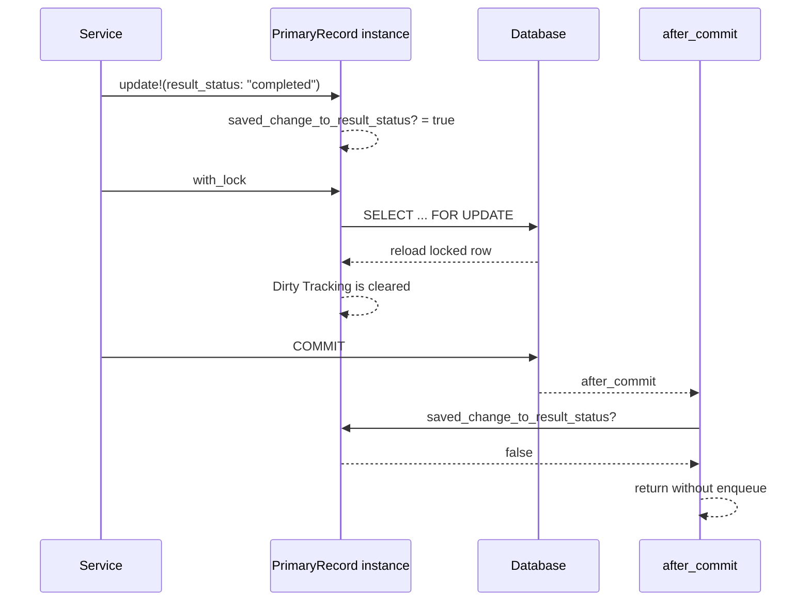

## 概要

ある業務レコードが完了状態に更新されたにもかかわらず、外部連携用の非同期ジョブが作成されないケースがありました。

外部連携ジョブは、対象モデルの `after_commit` を起点に作成されていました。

```ruby
class PrimaryRecord < ApplicationRecord
  after_commit :enqueue_external_sync_job, on: :update
end
```

callback内では、対象レコードのステータスが変更された場合だけ、外部連携ジョブを作成するようにしていました。

```ruby
return unless saved_change_to_workflow_status? || saved_change_to_result_status?
```

本来であれば、完了更新時に `result_status` が変わるため、`saved_change_to_result_status?` は `true` になるはずです。

しかし、完了更新直後に呼ばれる関連レコード作成処理で、同じActiveRecordインスタンスに対して `with_lock` を呼んでいました。

```ruby
primary_record.with_lock do
  # related record creation
end
```

`with_lock` は内部で対象レコードをロック付きで `reload` します。その結果、元のActiveRecordインスタンスが保持していた「直前の保存でどの属性が変わったか」というDirty Tracking情報が消えました。

つまり、今回の問題は「`after_commit` が実行されなかった」ではありません。

```text
after_commit は実行された
↓
しかし saved_change_to_result_status? が false になった
↓
callback 内で早期 return した
↓
外部連携ジョブが作成されなかった
```

この記事では、`with_lock`、`SELECT ... FOR UPDATE`、ActiveRecord Dirty Tracking、`after_commit` の関係を整理し、なぜこの問題が起きたのか、どのように修正したのかをまとめます。

## この記事で学べること

- Railsの `with_lock` が内部で何をしているか
- `with_lock` と `SELECT ... FOR UPDATE` の関係
- `saved_change_to_*?` が何に依存しているか
- `reload` によってDirty Tracking情報が消える理由
- `after_commit` 内の判定が壊れるパターン
- 同じDB rowを別インスタンスでロックする修正方針
- 既に漏れているデータを補正するときの注意点

## 前提知識

- RailsのActiveRecordを使ったことがある
- `after_commit` callbackを見たことがある
- `update!`、`reload`、`transaction` の基本を知っている
- DBの行ロックや `SELECT ... FOR UPDATE` という言葉を聞いたことがある

この記事では、実際のmodel名、table名、job名、外部サービス名は使わず、次の抽象名で説明します。

| 抽象名 | 意味 |
|---|---|
| `PrimaryRecord` | ステータス変更される主レコード |
| `RelatedRecord` | 主レコードの完了に伴って作成される関連レコード |
| `ExternalSyncJob` | 外部システム連携用の非同期ジョブ |
| `JobRun` | 非同期ジョブの実行管理レコード |
| `workflow_status` | 業務フロー上のステータス |
| `result_status` | 結果ステータス |
| `"completed"` | 完了状態を表す値 |

## 図解




ポイントは、`with_lock` がDBのロックだけでなく、Ruby上のActiveRecordインスタンスにも影響することです。

## 実装コード例

### 前提となる処理

対象レコードを完了状態に更新する処理は、概念的には次のような流れでした。

```ruby
ActiveRecord::Base.transaction do
  @primary_record.update!(build_params)
  RelatedRecord.ensure_for_completed_primary_record!(@primary_record)
end
```

`@primary_record.update!` によって、対象レコードは完了状態になります。

この時点で、`@primary_record` はRailsのメモリ上に、直前の保存で発生した変更履歴を持っています。

```ruby
@primary_record.saved_change_to_result_status?
# => true
```

外部連携ジョブの作成処理は、この変更履歴を使っていました。

```ruby
class PrimaryRecord < ApplicationRecord
  after_commit :enqueue_external_sync_job, on: :update

  private

  def enqueue_external_sync_job
    return unless saved_change_to_workflow_status? || saved_change_to_result_status?

    job_run = JobRun.create!(
      job_class: "ExternalSyncJob",
      target: self,
      status: "pending",
      enqueued_at: Time.current
    )

    ExternalSyncJob.perform_later(id, job_run.id)
  end
end
```

この設計では、`after_commit` 内で `saved_change_to_*?` が正しく取れることが前提になります。

### 問題のあった実装

関連レコード作成処理では、二重作成を防ぐために `with_lock` を使っていました。

```ruby
class RelatedRecord < ApplicationRecord
  def self.ensure_for_completed_primary_record!(primary_record)
    primary_record.with_lock do
      next nil unless primary_record.completed?

      related_record = find_or_initialize_by(primary_record_id: primary_record.id)
      next related_record unless related_record.new_record?

      related_record.assign_attributes(status: "initialized")
      related_record.save!
      related_record
    end
  end
end
```

一見すると自然な実装です。

同じ主レコードに対して複数リクエストが並行して走る可能性がある場合、対象行をロックし、その中で関連レコードを作成する方針自体は妥当です。

問題は、完了更新直後の `@primary_record` と同じインスタンスに対して `with_lock` を呼んだことでした。

## 内部動作

### with_lockは対象インスタンスをreloadする

Railsの `with_lock` は、単にRuby側でmutexのようなロックを取るAPIではありません。

DBのrow-level lockを使います。

概念的には、次のような処理です。

```ruby
primary_record.with_lock do
  # locked section
end
```

これは、イメージとしては次に近いです。

```ruby
primary_record.transaction do
  primary_record.reload(lock: true)
  # locked section
end
```

つまり、`with_lock` は内部で対象レコードをロック付きで `reload` します。

そして `reload` すると、そのActiveRecordインスタンスが保持していたDirty Tracking情報がクリアされます。

```ruby
primary_record.update!(result_status: "completed")

primary_record.saved_change_to_result_status?
# => true

primary_record.with_lock do
  # 内部で reload される
end

primary_record.saved_change_to_result_status?
# => false
```

今回の問題は、この挙動によって発生しました。

### with_lockで発行されるSQL

`with_lock` はDBの悲観ロックを使います。

多くの場合、内部的には `SELECT ... FOR UPDATE` が発行されます。

```ruby
primary_record.with_lock do
  # locked section
end
```

PostgreSQLでは、概念的には次のようなSQLになります。

```sql
BEGIN;

SELECT "primary_records".*
FROM "primary_records"
WHERE "primary_records"."id" = $1
LIMIT $2
FOR UPDATE;

-- block内の処理

COMMIT;
```

MySQL / InnoDBでは、概念的には次のようなSQLになります。

```sql
START TRANSACTION;

SELECT `primary_records`.*
FROM `primary_records`
WHERE `primary_records`.`id` = ?
LIMIT 1
FOR UPDATE;

-- block内の処理

COMMIT;
```

実際のSQLは、Railsのバージョン、DB adapter、prepared statementの設定、SQLログの出力形式によって変わります。

重要なのは、`with_lock` が対象行を `SELECT ... FOR UPDATE` で読み直す点です。

### SELECT ... FOR UPDATEの意味

`SELECT ... FOR UPDATE` は、対象行に対するrow-level lockを取得するSQLです。

transaction Aが次を実行したとします。

```sql
BEGIN;

SELECT *
FROM primary_records
WHERE id = 1
FOR UPDATE;
```

transaction Aがcommitまたはrollbackするまで、同じ行に対する別transactionの更新は待たされます。

```sql
-- transaction B
UPDATE primary_records
SET result_status = 'completed'
WHERE id = 1;

-- transaction A が COMMIT / ROLLBACK するまで待機する
```

また、別transactionが同じ行に対して `SELECT ... FOR UPDATE` しようとした場合も待機します。

```sql
-- transaction B
SELECT *
FROM primary_records
WHERE id = 1
FOR UPDATE;

-- transaction A が COMMIT / ROLLBACK するまで待機する
```

一方、通常の `SELECT` は基本的にブロックされません。

```sql
-- transaction B
SELECT *
FROM primary_records
WHERE id = 1;

-- 通常のSELECTは読める
```

つまり、`SELECT ... FOR UPDATE` は「他transactionから読めなくする」ためのものではありません。主な目的は、対象行に対する更新、削除、または同種のロック取得を待たせることです。

## 本編

### 発生していたこと

今回起きていたことを簡略化すると、次の流れです。

```ruby
ActiveRecord::Base.transaction do
  @primary_record.update!(result_status: "completed")

  @primary_record.saved_change_to_result_status?
  # => true

  RelatedRecord.ensure_for_completed_primary_record!(@primary_record)

  # この中で @primary_record.with_lock が呼ばれる
  # => @primary_record が reload される
  # => saved_change_to_result_status? が false になる
end
```

transaction commit後に `after_commit` が呼ばれます。

```ruby
def enqueue_external_sync_job
  return unless saved_change_to_workflow_status? || saved_change_to_result_status?

  # 外部連携ジョブを作成する
end
```

しかし、`@primary_record` のDirty Tracking情報はすでに消えています。

そのため、次の条件に入りません。

```ruby
return unless saved_change_to_workflow_status? || saved_change_to_result_status?
```

結果として、外部連携用の `JobRun` が作成されませんでした。

### 原因

原因は `with_lock` 自体ではありません。

問題は、次の条件が重なったことです。

```text
1. after_commit内でsaved_change_to_*?を使っていた
2. update!後の同じActiveRecordインスタンスを使い回していた
3. その同じインスタンスに対してwith_lockを呼んだ
4. with_lock内部のreloadによってDirty Tracking情報が消えた
```

正確には、次の問題です。

```text
after_commitの判定に使うDirty Tracking情報を保持しているインスタンスを、
commit前にwith_lockでreloadしてしまった。
```

### 修正方針

修正方針は、完了更新直後の `@primary_record` インスタンスを壊さないことです。

そのため、関連レコード作成処理では、引数で受け取った `primary_record` インスタンスに対して直接 `with_lock` するのをやめました。

代わりに、別インスタンスとしてDBからロック付きで取得します。

```ruby
locked_primary_record = PrimaryRecord.lock.find_by(id: primary_record.id)
```

修正後の実装イメージは次の通りです。

```ruby
class RelatedRecord < ApplicationRecord
  def self.ensure_for_completed_primary_record!(primary_record)
    transaction do
      locked_primary_record = PrimaryRecord.lock.find_by(id: primary_record.id)
      next nil unless locked_primary_record&.completed?

      related_record = find_or_initialize_by(primary_record_id: locked_primary_record.id)
      next related_record unless related_record.new_record?

      related_record.assign_attributes(status: "initialized")
      related_record.save!
      related_record
    end
  end
end
```

これにより、次を両立できます。

- 関連レコード作成時の排他制御は維持する
- 完了更新直後の `@primary_record` インスタンスは `reload` しない
- `after_commit` 内で参照する `saved_change_to_result_status?` の情報を消さない

### with_lockとModel.lock.findの違い

DB的には、`primary_record.with_lock` も `PrimaryRecord.lock.find_by(id: primary_record.id)` も、同じようにrow-level lockを使います。

違いは、どのRubyオブジェクトが `reload` されるかです。

| 方針 | メリット | 注意点 |
|---|---|---|
| 同じインスタンスに `with_lock` | 実装が短い。block内で同じ変数を使える。 | 内部で `reload` されるため、Dirty Tracking情報が消える。 |
| 別インスタンスを `Model.lock.find_by(...)` | 元インスタンスのDirty Tracking情報を保持できる。 | 同じDB rowを表すRubyオブジェクトが2つになる。 |

今回のケースでは、`after_commit` が元インスタンスのDirty Tracking情報を使う設計だったため、別インスタンスでlockする方針を選びました。

### 別インスタンスでロックする場合の注意点

修正後は、同じDB rowを表すRubyオブジェクトが2つ存在します。

```ruby
primary_record         # 呼び出し元から渡された元インスタンス
locked_primary_record  # ロック付きで取得した別インスタンス
```

この場合、ロック後の処理では `locked_primary_record` を使う必要があります。

悪い例です。

```ruby
transaction do
  locked_primary_record = PrimaryRecord.lock.find_by(id: primary_record.id)

  # NG: ロック取得後なのに元のprimary_recordを使っている
  next nil unless primary_record.completed?
end
```

良い例です。

```ruby
transaction do
  locked_primary_record = PrimaryRecord.lock.find_by(id: primary_record.id)

  # OK: ロック付きで取得したインスタンスを見る
  next nil unless locked_primary_record&.completed?
end
```

`PrimaryRecord.lock.find_by(...)` でロックを取った以上、ロック後の判定や関連レコード作成には `locked_primary_record` を使うべきです。

### Rails consoleでの再現イメージ

同種の問題はRails consoleでも確認できます。

```ruby
primary_record = PrimaryRecord.find(1)

PrimaryRecord.transaction do
  primary_record.update!(result_status: "completed")

  puts primary_record.saved_change_to_result_status?
  # => true

  primary_record.with_lock do
    # 内部でreloadされる
  end

  puts primary_record.saved_change_to_result_status?
  # => false
end
```

より直接的には、`with_lock` ではなく `reload` でも再現できます。

```ruby
primary_record = PrimaryRecord.find(1)

primary_record.update!(result_status: "completed")

primary_record.saved_change_to_result_status?
# => true

primary_record.reload

primary_record.saved_change_to_result_status?
# => false
```

つまり、問題の本質は `with_lock` そのものではなく、`with_lock` が内部で `reload` することです。

### 既に漏れているデータへの対応

既に `result_status = "completed"` になっているレコードに対して、再度同じ値で `update!` しても、`saved_change_to_result_status?` は `true` になりません。

```ruby
primary_record.update!(result_status: "completed")

primary_record.saved_change_to_result_status?
# 既にcompletedならtrueにならない
```

すでに `"completed"` の値が入っている場合、値としては変化していないためです。

そのため、既存の漏れデータについては、ジョブ管理レコードを明示的に作成し、外部連携ジョブをenqueueする方針が安全です。

```ruby
targets.each do |target|
  primary_record = PrimaryRecord.find(target[:primary_record_id])

  if JobRun.exists?(
    job_class: "ExternalSyncJob",
    target_type: "PrimaryRecord",
    target_id: primary_record.id
  )
    Rails.logger.info("skip primary_record_id=#{primary_record.id}")
    next
  end

  job_run = JobRun.create!(
    job_class: "ExternalSyncJob",
    target: primary_record,
    status: "pending",
    enqueued_at: Time.current
  )

  ExternalSyncJob.perform_later(primary_record.id, job_run.id)
end
```

ポイントは、既に同種のジョブ管理レコードが存在する対象をスキップすることです。二重連携を避けるため、再投入スクリプトでは冪等性を意識する必要があります。

### SQL直接更新ではcallbackは動かない

既存データを修正するときに、SQLで直接対象テーブルを更新してもRails callbackは動きません。

```sql
UPDATE primary_records
SET result_status = 'completed'
WHERE id = 1001;
```

このような更新では、ActiveRecordの `after_commit` は実行されません。そのため、外部連携ジョブも自動作成されません。

Rails callbackを期待する処理では、ActiveRecord経由で更新する必要があります。ただし今回のように、すでに `"completed"` になっているデータに再度同じ値を入れても `saved_change_to_result_status?` は `true` になりません。

そのため、漏れデータについてはジョブ管理レコードを手動作成し、ジョブをenqueueする方針が安全です。

### テストで確認すべきこと

今回のようなバグでは、単に関連レコードが作られることだけを確認しても不十分です。

確認すべきことは、次の両方です。

```text
1. 完了時に関連レコードが作成されること
2. 完了時に外部連携用のジョブ管理レコードが作成されること
```

たとえば、次のような観点のテストが必要です。

```ruby
it "creates related record and enqueues external sync job when primary record is completed" do
  service.call

  expect(RelatedRecord.exists?(primary_record: primary_record)).to be true

  expect(
    JobRun.exists?(
      job_class: "ExternalSyncJob",
      target_type: "PrimaryRecord",
      target_id: primary_record.id
    )
  ).to be true
end
```

重要なのは、関連レコード作成処理と外部連携ジョブ作成処理を別々に見るのではなく、完了更新処理全体のintegrationに近い形で確認することです。

### 避けた方がよい実装パターン

今回のケースでは、次のような実装が危険でした。

```ruby
ActiveRecord::Base.transaction do
  primary_record.update!(result_status: "completed")

  primary_record.with_lock do
    # 別処理
  end
end
```

`with_lock` に限らず、次のような `reload` も同様に注意が必要です。

```ruby
ActiveRecord::Base.transaction do
  primary_record.update!(result_status: "completed")

  primary_record.reload
end
```

service objectにActiveRecordインスタンスを渡す場合も注意が必要です。

```ruby
ActiveRecord::Base.transaction do
  primary_record.update!(result_status: "completed")

  SomeService.call(primary_record)
end
```

`SomeService.call(primary_record)` の内部で `primary_record.reload` や `primary_record.with_lock` が呼ばれると、呼び出し元が期待していた `saved_change_to_*?` の情報が消える可能性があります。

### 代替案

今回の修正では、別インスタンスでロックを取得する方法を採用しました。

ただし、設計としては他の選択肢もあります。

| 代替案 | メリット | デメリット |
|---|---|---|
| callback側でDB状態だけを見る | `reload` に強い | 完了後の別更新でも条件を満たしやすく、二重enqueue防止が必須 |
| `with_lock` 前に判定結果を退避する | 判定タイミングが明示的 | callbackからservice側へ責務が移動する |
| ジョブ作成を冪等にする | 二重enqueueに強い | unique indexやretry設計が必要 |

今回の修正では、既存設計への影響を最小にしつつroot causeを潰すため、関連レコード作成側で別インスタンスをlockする方針にしました。

## まとめ

今回のバグは、`with_lock`、`after_commit`、ActiveRecord Dirty Trackingの組み合わせで発生しました。

重要なのは、`after_commit` が呼ばれなかったわけではないという点です。

実際には、`after_commit` は呼ばれていました。しかし、`after_commit` 内で使っていた `saved_change_to_result_status?` が `false` になっていました。

原因は、完了更新直後の同じ `primary_record` インスタンスに対して `with_lock` を呼び、内部の `reload` によってDirty Tracking情報が消えていたことです。

修正では、元の `@primary_record` インスタンスには触らず、別インスタンスとして `PrimaryRecord.lock.find_by(id: primary_record.id)` を使うようにしました。

今回の教訓は次の通りです。

- `with_lock` は内部で `reload` する
- `reload` はActiveRecord Dirty Tracking情報をクリアする
- `saved_change_to_*?` はafter callbackで便利だが、同じインスタンスの状態に依存する
- 更新直後のインスタンスをcallback前に `reload` すると、`saved_change_to_*?` の結果が変わる
- ロックが必要な場合でも、callbackが参照するインスタンスとは別インスタンスでロックを取る選択肢がある
- `SELECT ... FOR UPDATE` はDBのrow-level lockであり、DB種別、index、isolation levelによって挙動が変わる

## 参考文献

- [Rails API: ActiveRecord::Locking::Pessimistic](https://api.rubyonrails.org/v8.0/classes/ActiveRecord/Locking/Pessimistic.html)
- [Rails API: ActiveRecord::AttributeMethods::Dirty](https://api.rubyonrails.org/classes/ActiveRecord/AttributeMethods/Dirty.html)
- [Rails Guides: Active Record Callbacks](https://guides.rubyonrails.org/active_record_callbacks.html)
- [Rails API: ActiveRecord::FinderMethods](https://api.rubyonrails.org/classes/ActiveRecord/FinderMethods.html)
- [PostgreSQL Documentation: Explicit Locking](https://www.postgresql.org/docs/current/explicit-locking.html)
- [MySQL Documentation: InnoDB Locking Reads](https://dev.mysql.com/doc/refman/8.4/en/innodb-locking-reads.html)
