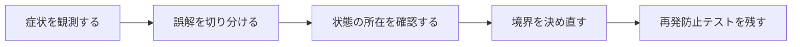

## 概要

S3オブジェクトとDBレコードを突き合わせ、孤児ファイルと欠損レコードを検出・削除する保守処理が必要になった。単純な差集合だけでは、ページネーション、論理削除、競合、誤削除、再実行時の安全性が不足する。

外部ストレージとの整合性修復は、一度だけ成功するスクリプトではなく、観測可能・冪等・段階的・再実行可能なバッチとして設計する。検出と削除を分離し、Dry Runと安全期間を持たせる。

## この記事で学べること

- DB側をS3キーで索引化し、S3側キー集合と比較する基本
- 論理削除済みレコードを含めるかの判断
- S3 ListObjectsのページネーション
- 孤児ファイルと欠損レコードの定義
- 検出と削除を同じループで即実行しない理由
- アップロード中・削除中との競合

## 前提知識

- Rails、Active Record、RSpec、SQLログの基本を読めること
- フレームワークのAPIを使った経験があり、状態・トランザクション・非同期処理の境界で詰まり始めていること
- この記事のコード例は匿名化した最小例であり、利用中のバージョンでは公式ドキュメントと実装を確認すること

## 図解




## 実装コード例

```ruby
class StorageConsistencyScanner
  def call
    s3_keys = storage_client.list_keys(prefix: "uploads/")
    db_keys = ImageRecord.pluck(:storage_key)

    orphan_keys = s3_keys - db_keys
    missing_keys = db_keys - s3_keys

    StorageIssue.insert_all(issue_rows(orphan_keys, missing_keys))
  end
end
```

## 本編

### 発生した状況

S3オブジェクトとDBレコードを突き合わせ、孤児ファイルと欠損レコードを検出・削除する保守処理が必要になった。単純な差集合だけでは、ページネーション、論理削除、競合、誤削除、再実行時の安全性が不足する。

### 当初の理解・誤解

当初は、API名やメソッド名から直感的に挙動を推測していました。しかし実際には、外部ストレージとの整合性修復は、一度だけ成功するスクリプトではなく、観測可能・冪等・段階的・再実行可能なバッチとして設計する。検出と削除を分離し、Dry Run... という観点で見る必要がありました。

### 観測したこと

- `Set`の差集合を使う最小例
- S3クライアントをFake化したテスト
- Dry Run結果の構造化ログ例
- 削除対象が閾値を超えたら停止するガード

### 修正案の比較

| 方針 | 見るべき点 |
| --- | --- |
| 即時削除 | コスト削減が早い／誤削除の影響が大きい |
| 隔離後削除 | 回復可能／一時的な保管コストと運用が増える |

## 内部動作

Railsの抽象化は、Rubyオブジェクト、Active Record、SQL、DBトランザクションの上に成り立っています。重要なのは、Railsのメソッド呼び出しがそのままDBの履歴や外部サービスの状態になるわけではない、という点です。

- S3一覧APIはページングを考慮する
- DBとS3を同一ACIDトランザクションには含められない
- 現在のS3整合性仕様を古い知識で断定せず、公式仕様または利用環境を確認する

```text
Ruby object
  -> Active Record
  -> SQL / transaction
  -> database row
  -> callback or job boundary
```

## 調査手順

1. まず、入力値・保存前状態・保存後状態・コールバックや非同期処理の発火地点をログに残します。
2. 次に、DBやHTTP通信など外部境界をまたぐ処理を分けて、どこまでが同じトランザクションや同じライフサイクルに属するかを確認します。
3. 最後に、修正後の設計を最小テストへ落とし込み、同じ誤解が再発しないようにします。

- S3一覧APIはページングを考慮する
- DBとS3を同一ACIDトランザクションには含められない
- 現在のS3整合性仕様を古い知識で断定せず、公式仕様または利用環境を確認する

## 再発防止テスト

```ruby
RSpec.describe "s3-db-consistency-reconciliation" do
  it "境界条件を固定する" do
    result = described_class.new.call

    expect(result).to be_present
  end
end
```

## 一般化できる設計原則

- API名が短いほど、裏側の実行モデルを確認する
- 状態を「値」「オブジェクト」「DB row」「外部サービス」のどこに置いているかを分けて考える
- トランザクションや非同期処理の境界をまたぐ副作用は、明示的な設計として扱う
- テストは成功確認だけでなく、誤解しやすい境界条件を固定する

## まとめ

整合性修復は「正しい集合を計算する処理」ではなく、「間違えても戻せる運用」を含む、と結論づける。


この記事では、次のような短絡的な一般化は避けます。

- 本番でいきなり削除するコードを完成形にしない
- S3一覧を1回で全件取れる前提にしない

## 参考文献

- この記事は、提供された執筆仕様とサムネイルをもとに、公開用の匿名化された技術ノートとして再構成しています。
- Rails、Flutter、Dart、Swiftのバージョン差が関係する箇所は、利用中リポジトリの設定と公式ドキュメントで確認してください。
