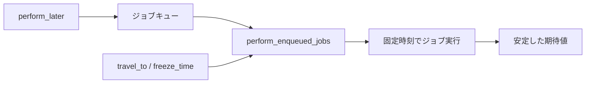

## 概要

Railsアプリケーションでは、非同期ジョブや現在時刻に依存する処理をテストすることがあります。

例えば、次のような処理です。

```text
- ユーザー登録後にメール送信ジョブをenqueueする
- 決済完了後に通知ジョブを実行する
- 期限切れかどうかを現在時刻で判定する
- 特定時刻になったらステータスを変更する
```

このようなテストでは、Railsが用意しているテストヘルパーが便利です。

```ruby
include ActiveJob::TestHelper
include ActiveSupport::Testing::TimeHelpers
```

この記事では、この2つが何をするものなのかを整理します。

## この記事で学べること

- ActiveJob::TestHelperの役割
- perform_laterとperform_enqueued_jobsの違い
- TimeHelpersで現在時刻を固定する方法
- ジョブと時刻依存を組み合わせてテストする方法

## 前提知識

- RailsのActiveJobを使ったことがある
- RSpecでjob specを書いたことがある
- 時刻依存のテストが不安定になった経験がある

## 実装コード例

この記事の中心になる実装例です。細部のクラス名は公開用に抽象化しています。

```ruby
class ExpirationNotificationJob < ApplicationJob
  def perform(user_id)
    user = User.find(user_id)
    ExpirationMailer.notify(user).deliver_now
  end
end

RSpec.describe ExpirationNotificationJob, type: :job do
  include ActiveJob::TestHelper
  include ActiveSupport::Testing::TimeHelpers

  it "期限切れユーザーに通知する" do
    user = create(:user, trial_ends_at: Time.zone.local(2026, 7, 1))

    travel_to Time.zone.local(2026, 7, 2) do
      perform_enqueued_jobs do
        described_class.perform_later(user.id)
      end
    end

    expect(ActionMailer::Base.deliveries.count).to eq(1)
  end
end
```

## 本編

### includeとは

Rubyの `include` は、モジュールに定義されたメソッドを使えるようにする仕組みです。

RSpec内で次のように書くと、

```ruby
include ActiveJob::TestHelper
include ActiveSupport::Testing::TimeHelpers
```

そのspec内でジョブ用のヘルパーや時刻操作用のヘルパーを使えるようになります。

### ActiveJob::TestHelperとは

`ActiveJob::TestHelper` は、ActiveJobのテストを支援するためのヘルパーです。

代表的には、次のようなメソッドを使えます。

```text
perform_enqueued_jobs
enqueued_jobs
performed_jobs
clear_enqueued_jobs
clear_performed_jobs
```

### perform_laterはその場で実行されない

ActiveJobでは、通常 `perform_later` を呼ぶとジョブはキューに積まれます。

```ruby
WelcomeMailJob.perform_later(user.id)
```

ただし、これはその場で即座に実行されるわけではありません。

そのため、ジョブの中身までテストしたい場合は、`perform_enqueued_jobs` を使います。

```ruby
include ActiveJob::TestHelper

it "メール送信ジョブを実行する" do
  perform_enqueued_jobs do
    WelcomeMailJob.perform_later(user.id)
  end

  expect(ActionMailer::Base.deliveries.count).to eq(1)
end
```

`perform_enqueued_jobs` のブロック内でenqueueされたジョブが、テスト中に実行されます。

### enqueueされたことだけ確認する場合

ジョブの中身まで実行せず、ジョブが積まれたことだけ確認したい場合もあります。

```ruby
it "WelcomeMailJobをenqueueする" do
  expect {
    described_class.new(user).call
  }.to have_enqueued_job(WelcomeMailJob).with(user.id)
end
```

このテストでは、ジョブが実行されたかではなく、enqueueされたかを確認しています。

### 実行まで見るか、enqueueだけ見るか

ジョブのテストでは、次の2つを分けて考えるとよいです。

```text
1. その処理がジョブをenqueueするか
2. ジョブ自体が正しく実行されるか
```

例えば、サービスクラス側ではenqueueだけ確認します。

```ruby
expect {
  described_class.new(user).call
}.to have_enqueued_job(WelcomeMailJob).with(user.id)
```

ジョブの中身は、job specで確認します。

```ruby
RSpec.describe WelcomeMailJob, type: :job do
  it "メールを送信する" do
    expect {
      described_class.perform_now(user.id)
    }.to change { ActionMailer::Base.deliveries.count }.by(1)
  end
end
```

このように分けると、責務が明確になります。

### ActiveSupport::Testing::TimeHelpersとは

`ActiveSupport::Testing::TimeHelpers` は、テスト中に現在時刻を固定したり、未来・過去へ移動したりするためのヘルパーです。

代表的なメソッドは次の通りです。

```text
travel_to
travel
freeze_time
travel_back
```

### travel_toの例

例えば、トライアル期限切れを判定するメソッドがあるとします。

```ruby
class User < ApplicationRecord
  def trial_expired?
    trial_ends_at < Time.current
  end
end
```

このテストでは、現在時刻を固定した方が安定します。

```ruby
include ActiveSupport::Testing::TimeHelpers

it "トライアル期限を過ぎている場合trueを返す" do
  user = build(:user, trial_ends_at: Time.zone.local(2026, 7, 1, 0, 0, 0))

  travel_to Time.zone.local(2026, 7, 2, 0, 0, 0) do
    expect(user.trial_expired?).to eq(true)
  end
end
```

実行日がいつであっても、テスト中は現在時刻が `2026-07-02 00:00:00` として扱われます。

### freeze_timeの例

`freeze_time` は、現在時刻を固定するために使います。

```ruby
include ActiveSupport::Testing::TimeHelpers

it "created_atが現在時刻になる" do
  freeze_time do
    user = create(:user)

    expect(user.created_at).to eq(Time.current)
  end
end
```

ブロック内では `Time.current` が固定されます。

### ブロック形式で書く

時刻操作は、基本的にブロック形式で書くのが安全です。

```ruby
travel_to Time.zone.local(2026, 7, 1, 10, 0, 0) do
  # この中だけ時刻が固定される
end
```

ブロックを抜けると、時刻は元に戻ります。

避けたいのは、次のような書き方です。

```ruby
travel_to Time.zone.local(2026, 7, 1, 10, 0, 0)

# test
```

この場合、時刻を戻し忘れると他のテストに影響する可能性があります。

### travel_backとは

`travel_back` は、固定した時刻を元に戻すためのメソッドです。

```ruby
travel_to Time.zone.local(2026, 7, 1, 10, 0, 0)

# test

travel_back
```

ただし、戻し忘れを避けるためにも、基本的にはブロック形式の方が安全です。

### JobとTimeHelpersを組み合わせる例

指定時刻を基準にジョブを実行したい場合は、両方を組み合わせます。

```ruby
include ActiveJob::TestHelper
include ActiveSupport::Testing::TimeHelpers

it "期限切れユーザーに通知する" do
  user = create(:user, trial_ends_at: Time.zone.local(2026, 7, 1, 0, 0, 0))

  travel_to Time.zone.local(2026, 7, 2, 0, 0, 0) do
    perform_enqueued_jobs do
      ExpirationNotificationJob.perform_later(user.id)
    end
  end

  expect(ActionMailer::Base.deliveries.count).to eq(1)
end
```

時刻依存のジョブは、このように現在時刻を固定したうえで実行すると安定します。

## 図解




## 内部動作

ActiveJobのperform_laterは、その場でジョブ本体を実行するのではなくキューへ積みます。テストで実行まで見たい場合はperform_enqueued_jobsを使います。TimeHelpersはTime.currentなどの現在時刻をテスト中だけ固定します。ジョブと時刻依存を組み合わせるときは、時刻を固定したうえでジョブを実行するとテストが安定します。

## まとめ

`ActiveJob::TestHelper` は、ジョブのenqueueや実行をテストするためのヘルパーです。

```text
perform_enqueued_jobs
enqueued_jobs
performed_jobs
```

などを使えます。

`ActiveSupport::Testing::TimeHelpers` は、現在時刻を固定・移動するためのヘルパーです。

```text
travel_to
travel
freeze_time
travel_back
```

などを使えます。

ジョブと時刻依存のテストでは、次を意識するとよいです。

```text
- enqueueされたことを見るのか
- ジョブの中身まで実行するのか
- 現在時刻に依存するなら時刻を固定する
- travel_toやfreeze_timeはブロック形式で使う
```

これにより、不安定なテストを避けやすくなります。

## 参考文献

- [Rails API](ActiveJob::TestHelper: https://api.rubyonrails.org/classes/ActiveJob/TestHelper.html)
- [Rails API](ActiveSupport::Testing::TimeHelpers: https://api.rubyonrails.org/classes/ActiveSupport/Testing/TimeHelpers.html)
