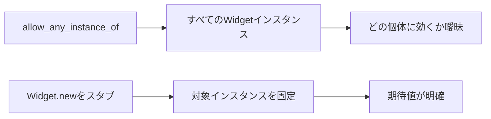

## 概要

RSpecには、次のような書き方があります。

```ruby
allow_any_instance_of(Widget).to receive(:name).and_return("stub name")
```

これは、`Widget` クラスから作られる任意のインスタンスに対して、`name` メソッドをスタブする書き方です。

一見すると便利ですが、RSpecでは `allow_any_instance_of` や `expect_any_instance_of` は避けられがちです。

理由はいくつかありますが、特に大きいのは **対象が広すぎて、テストの意図が曖昧になりやすいこと** です。

この記事では、次のコードを例にして、なぜ分かりにくいのかを整理します。

```ruby
allow_any_instance_of(Widget).to receive(:name).twice
```

## この記事で学べること

- allow_any_instance_ofの意味
- インスタンス単位の期待値が曖昧になる理由
- twice指定で誤解しやすい点
- 対象インスタンスを明示する代替案

## 前提知識

- RSpecのallow/receiveを使ったことがある
- Railsのserviceやmodelのテストを書いたことがある
- 複数インスタンスが生成される処理をテストしたことがある

## 実装コード例

この記事の中心になる実装例です。細部のクラス名は公開用に抽象化しています。

```ruby
class Widget
  def run
    # expensive process
  end
end

RSpec.describe WidgetRunner do
  it "対象インスタンスを明示して検証する" do
    widget = instance_double(Widget)
    allow(Widget).to receive(:new).and_return(widget)
    allow(widget).to receive(:run)

    described_class.new.call

    expect(widget).to have_received(:run).once
  end
end
```

## 本編

### any_instance_ofとは何か

まず、通常のスタブは特定のインスタンスに対して書きます。

```ruby
widget = Widget.new

allow(widget)
  .to receive(:name)
  .and_return("stub name")
```

この場合、対象は明確です。

```text
このwidgetオブジェクトのnameメソッドをスタブする
```

一方で、`allow_any_instance_of` は次のように書きます。

```ruby
allow_any_instance_of(Widget)
  .to receive(:name)
  .and_return("stub name")
```

これは、`Widget` の任意のインスタンスに対して `name` をスタブします。

```ruby
Widget.new.name
Widget.new.name
```

このように、どのインスタンスに対してもスタブが適用されます。

### 問題のコード

次のコードを見てみます。

```ruby
allow_any_instance_of(Widget).to receive(:name).twice
```

このコードは、一見すると次の2通りに読めてしまいます。

```text
解釈1:
各Widgetインスタンスがnameメソッドを2回受け取る

解釈2:
Widgetインスタンス全体で合計2回、nameメソッドを受け取る
```

正しい解釈は、基本的には **各インスタンスごとに2回** です。

### 各インスタンスごとに2回とは

例えば、次のようなコードを考えます。

```ruby
widget1 = Widget.new
widget2 = Widget.new

widget1.name
widget1.name

widget2.name
widget2.name
```

この場合、`widget1` は `name` を2回呼んでいます。
`widget2` も `name` を2回呼んでいます。

つまり、各インスタンスごとに2回です。

```text
widget1: nameを2回
widget2: nameを2回
```

### 全体で合計2回ではない

一方で、次のような意味ではありません。

```ruby
widget1 = Widget.new
widget2 = Widget.new

widget1.name # 全体の1回目
widget2.name # 全体の2回目
widget1.name # 全体の3回目なのでNG
```

`allow_any_instance_of(Widget).to receive(:name).twice` は、
「Widgetクラス全体で合計2回だけnameを呼べる」という意味ではありません。

ここが読み手にとって混乱しやすい点です。

### なぜ混乱するのか

理由は、`any_instance_of` が特定のオブジェクトを指していないからです。

```ruby
allow(widget).to receive(:name).twice
```

これなら、対象は `widget` です。

```text
このwidgetがnameを2回受け取る
```

一方で、

```ruby
allow_any_instance_of(Widget).to receive(:name).twice
```

では、対象が広くなります。

```text
どのWidgetなのか
すでに作られたWidgetなのか
これから作られるWidgetなのか
複数インスタンスの場合、回数はどう数えるのか
```

読み手がこうしたことを考える必要があります。

### テストの意図が曖昧になる

`allow_any_instance_of` を使うと、テスト対象が見えにくくなります。

例えば、次のようなサービスがあるとします。

```ruby
class ReportService
  def call
    report = Report.new
    report.generate
  end
end
```

このテストで、次のように書くことはできます。

```ruby
allow_any_instance_of(Report)
  .to receive(:generate)
  .and_return(true)

ReportService.new.call
```

しかし、この書き方だと、どの `Report` インスタンスが使われたのかが分かりにくいです。

より明確にするなら、生成するインスタンスを明示的に差し替えます。

```ruby
report = instance_double(Report)

allow(Report)
  .to receive(:new)
  .and_return(report)

allow(report)
  .to receive(:generate)
  .and_return(true)

ReportService.new.call

expect(report).to have_received(:generate)
```

こちらの方が、どのオブジェクトに対する期待なのかが明確です。

### any_instance_ofを使う場面

とはいえ、`allow_any_instance_of` が常に悪いわけではありません。

既存コードの都合で、依存オブジェクトを注入できない場合などには使うことがあります。

例えば、対象クラスの内部で直接 `SomeClass.new` していて、それを簡単に差し替えられない場合です。

```ruby
class SomeService
  def call
    SomeClient.new.request
  end
end
```

このようなコードに対して、設計を変えずに一時的にテストを書くなら、`allow_any_instance_of` を使うことがあります。

ただし、長期的には依存を外から渡せる設計にした方がテストしやすくなります。

### 代替案1：対象インスタンスを明示する

対象が分かっているなら、特定のインスタンスに対してスタブします。

```ruby
widget = instance_double(Widget)

allow(widget)
  .to receive(:name)
  .twice
  .and_return("stub name")
```

これなら意味は明確です。

```text
このwidgetがnameを2回受け取る
```

### 代替案2：newをスタブする

内部でインスタンス生成している場合は、`new` をスタブして対象を固定できます。

```ruby
widget = instance_double(Widget)

allow(Widget)
  .to receive(:new)
  .and_return(widget)

allow(widget)
  .to receive(:name)
  .and_return("stub name")
```

これにより、テスト内で扱うインスタンスを明示できます。

### 代替案3：依存性注入にする

最もテストしやすいのは、依存オブジェクトを外から渡す設計です。

```ruby
class ReportService
  def initialize(report: Report.new)
    @report = report
  end

  def call
    report.generate
  end

  private

  attr_reader :report
end
```

テストでは、次のように書けます。

```ruby
report = instance_double(Report, generate: true)

described_class.new(report: report).call

expect(report).to have_received(:generate)
```

この形なら、`allow_any_instance_of` は不要になります。

### メリット・デメリット

#### allow_any_instance_ofのメリット

```text
- 既存コードに手を入れずにスタブできる
- 内部でnewされるオブジェクトにも対応できる
- 一時的なテストでは便利
```

#### allow_any_instance_ofのデメリット

```text
- 対象インスタンスが曖昧になる
- 回数指定が直感的に分かりにくい
- テストの意図が読み取りづらい
- 設計上の依存関係が見えにくくなる
```

## 図解




## 内部動作

any_instance_ofは、特定の1オブジェクトではなく、そのクラスから作られる任意のインスタンスに作用します。そのため、テスト対象が内部で複数インスタンスを作る場合、どの個体に対する期待なのかが読み取りにくくなります。対象インスタンスを作って渡す、newをスタブして返す、依存性注入にする、という形に寄せるとテストの意図が明確になります。

## まとめ

`allow_any_instance_of` は便利ですが、対象が広すぎるため、テストの意図が曖昧になりやすいです。

特に次のようなコードは注意が必要です。

```ruby
allow_any_instance_of(Widget).to receive(:name).twice
```

これは「Widget全体で合計2回」ではなく、各インスタンスごとに2回という意味に読まれます。

読み手の混乱を避けるためには、できるだけ次のように書く方がよいです。

```ruby
widget = instance_double(Widget)

allow(widget)
  .to receive(:name)
  .twice
```

RSpecでは、テストが通ることだけでなく、テストの意図が読みやすいことも重要です。

`allow_any_instance_of` を使う前に、次を考えるとよいです。

```text
特定のインスタンスに対して書けないか
newをスタブして対象を固定できないか
依存性注入にできないか
```

これらを検討した上で、必要な場合だけ使うのがよいです。

## 参考文献

- [RSpec Mocks](https://rspec.info/features/3-13/rspec-mocks/)
