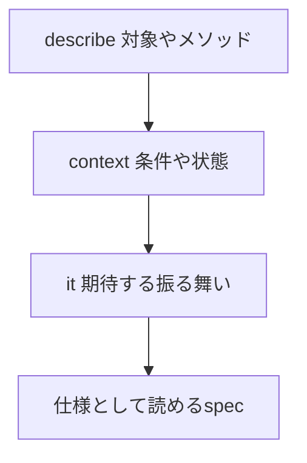

## 概要

RSpecでは、テストを構造化するために `describe`、`context`、`it` を使います。

```ruby
RSpec.describe User do
  describe "#active?" do
    context "退会していない場合" do
      it "trueを返す" do
        # test
      end
    end
  end
end
```

これらはRSpecを書く上で最も基本的な構文ですが、実務でspecが大きくなると、使い分けが曖昧になりやすいです。

この記事では、`describe`、`context`、`it` の役割を整理し、読みやすいRSpecの構造についてまとめます。

## この記事で学べること

- describe/context/itの役割
- context名を具体的にする理由
- letとcontextの組み合わせ方
- ネストしすぎたspecを避ける考え方

## 前提知識

- RSpecの基本構文を見たことがある
- model specやservice specを書き始めている
- specの読みやすさを改善したい

## 実装コード例

この記事の中心になる実装例です。細部のクラス名は公開用に抽象化しています。

```ruby
class User
  def active?
    !deleted? && confirmed?
  end
end

RSpec.describe User, type: :model do
  describe "#active?" do
    context "退会しておらず確認済みの場合" do
      it "trueを返す" do
        user = build(:user, deleted: false, confirmed: true)

        expect(user).to be_active
      end
    end
  end
end
```

## 本編

### 基本の考え方

使い分けは次のように考えると分かりやすいです。

```text
describe: 何をテストするか
context: どんな条件・状態か
it: どうなるべきか
```

例えば、ユーザーが有効かどうかを判定する `#active?` メソッドをテストする場合です。

```ruby
RSpec.describe User do
  describe "#active?" do
    context "退会していない場合" do
      it "trueを返す" do
        user = build(:user, deleted_at: nil)

        expect(user.active?).to eq(true)
      end
    end

    context "退会済みの場合" do
      it "falseを返す" do
        user = build(:user, deleted_at: Time.current)

        expect(user.active?).to eq(false)
      end
    end
  end
end
```

自然文として読むと、次のようになります。

```text
User#active?
  退会していない場合
    trueを返す

User#active?
  退会済みの場合
    falseを返す
```

このように、RSpecはうまく構造化すると仕様書のように読めます。

### describeの役割

`describe` には、テスト対象を書きます。

主に次のようなものを指定します。

```text
- クラス
- メソッド
- APIエンドポイント
- 機能単位
```

例です。

```ruby
RSpec.describe User do
  describe "#active?" do
  end

  describe ".search" do
  end
end
```

慣習として、インスタンスメソッドは `#`、クラスメソッドは `.` で表します。

```ruby
describe "#active?"
describe ".search"
```

request specでは、エンドポイントを書くことも多いです。

```ruby
describe "GET /users" do
end

describe "POST /orders" do
end
```

### contextの役割

`context` は、条件や状態を表すために使います。

例えば、ログイン状態で分ける場合です。

```ruby
describe "GET /mypage" do
  context "ログインしている場合" do
    it "200を返す" do
      # test
    end
  end

  context "ログインしていない場合" do
    it "401を返す" do
      # test
    end
  end
end
```

`context` には、「どんな場合か」を書きます。

```text
- ログインしている場合
- 管理者の場合
- 一般ユーザーの場合
- パラメータが正しい場合
- 必須項目が不足している場合
- 外部APIが成功した場合
- 外部APIが失敗した場合
```

### itの役割

`it` には、期待する結果を書きます。

```ruby
it "trueを返す" do
end

it "レコードを作成する" do
end

it "エラーレスポンスを返す" do
end
```

`it` は「どうなるべきか」を表します。

そのため、`it` の中に条件を書きすぎると読みにくくなります。

```ruby
it "ユーザーが管理者で、対象レコードが存在し、パラメータが正しい場合に更新できる" do
end
```

このような場合は、`context` で条件を分けた方がよいです。

```ruby
context "ユーザーが管理者の場合" do
  context "対象レコードが存在する場合" do
    context "パラメータが正しい場合" do
      it "更新できる" do
      end
    end
  end
end
```

ただし、ネストしすぎると逆に読みにくくなるので注意が必要です。

### context名は具体的に書く

次のような `context` は便利ですが、やや抽象的です。

```ruby
context "正常系" do
end

context "異常系" do
end
```

完全に悪いわけではありませんが、条件が分かりにくくなります。

より具体的に書くなら、次のようにします。

```ruby
context "有効なパラメータの場合" do
end

context "nameが空の場合" do
end

context "対象レコードが存在しない場合" do
end
```

これにより、テストが失敗したときに、どの条件のテストが落ちたのか分かりやすくなります。

### letとcontextを組み合わせる

`context` の中では、`let` を上書きできます。

```ruby
RSpec.describe Product do
  describe "#available?" do
    subject { product.available? }

    let(:product) { build(:product, stock: stock) }

    context "在庫がある場合" do
      let(:stock) { 10 }

      it { is_expected.to eq(true) }
    end

    context "在庫がない場合" do
      let(:stock) { 0 }

      it { is_expected.to eq(false) }
    end
  end
end
```

この構造では、共通部分を外側に置き、差分だけを `context` 内で定義しています。

```text
共通:
product.available?

差分:
stock = 10
stock = 0
```

RSpecでは、このように「外側に共通条件、内側に差分」を置くと読みやすくなります。

### subjectを使う場合

テスト対象の実行処理は `subject` にまとめることがあります。

```ruby
RSpec.describe UserSearchService do
  describe "#call" do
    subject(:call_service) { described_class.new(params: params).call }

    let(:params) { { name: "Taro" } }

    context "nameが指定されている場合" do
      it "該当ユーザーを返す" do
        expect(call_service).to include(user)
      end
    end

    context "nameが空の場合" do
      let(:params) { { name: "" } }

      it "全ユーザーを返す" do
        expect(call_service).to include(user)
      end
    end
  end
end
```

`subject` を使うと、各contextで同じ処理を繰り返し書かずに済みます。

ただし、`subject` が複雑になりすぎると読みにくくなるため、シンプルな実行処理に限定した方がよいです。

### ネストしすぎに注意する

`context` は便利ですが、ネストしすぎると読みづらくなります。

```ruby
context "ログインしている場合" do
  context "管理者の場合" do
    context "対象レコードが存在する場合" do
      context "パラメータが正しい場合" do
        it "更新できる" do
        end
      end
    end
  end
end
```

このように深くなりすぎる場合は、条件を整理した方がよいです。

例えば、次のように分けられます。

```ruby
context "管理者が有効なパラメータを送信した場合" do
  it "更新できる" do
  end
end

context "一般ユーザーが送信した場合" do
  it "403を返す" do
  end
end

context "対象レコードが存在しない場合" do
  it "404を返す" do
  end
end
```

ネストが深すぎると、テストの前提を追いづらくなります。
目安として、`context` のネストは2〜3階層程度に抑えると扱いやすいです。

## 図解




## 内部動作

RSpecは、describe、context、itの階層がそのまま仕様の読みやすさに影響します。describeは対象、contextは条件、itは期待する振る舞いに寄せると、失敗メッセージも仕様書のように読めます。逆に、contextが曖昧だったりネストが深すぎたりすると、テストが通っていても仕様の理解に時間がかかります。

## まとめ

`describe`、`context`、`it` は次のように使い分けると読みやすくなります。

```text
describe: 何をテストするか
context: どんな条件か
it: どうなるべきか
```

RSpecは、構造化すれば仕様書のように読めます。

良いspecを書くポイントは次の通りです。

```text
- describeにはテスト対象を書く
- contextには条件を書く
- itには期待結果を書く
- context名は具体的にする
- 共通部分は外側に置く
- 差分はcontext内で定義する
- ネストしすぎない
```

RSpecはテストコードであると同時に、仕様を表現するドキュメントでもあります。
読みやすい構造にすることで、変更時の影響範囲も把握しやすくなります。

## 参考文献

- [RSpec Core](https://rspec.info/features/3-13/rspec-core/)
