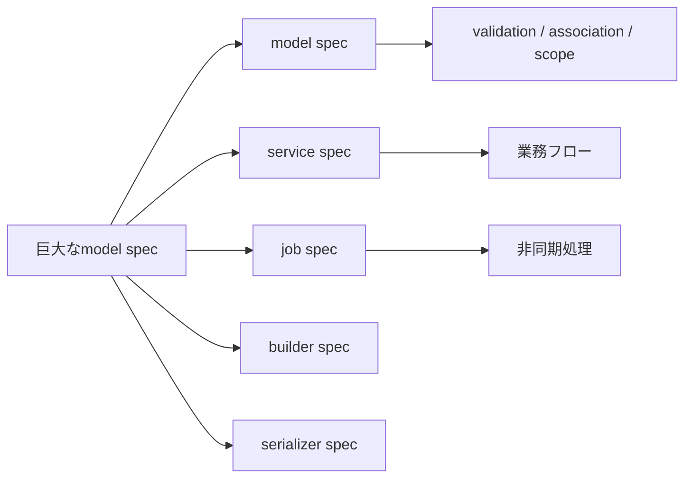

## 概要

Railsアプリケーションが大きくなると、1つのmodel specが非常に大きくなることがあります。

例えば、1つのモデルに対して次のようなテストがすべて入っているケースです。

```text
- association
- validation
- scope
- callback
- instance method
- 表示用Hash生成
- 通知処理
- ActiveJobのenqueue
- CSV生成
- 外部ストレージ連携
- 外部API連携
```

このようなspecを見ると、次の疑問が出てきます。

```text
モデルのテストだから長くても仕方ないのか
削減するべきなのか
ファイルを分けるべきなのか
そもそもモデルの責務が大きすぎるのか
```

この記事では、巨大化したmodel specをどう整理するかを考えます。

## この記事で学べること

- model specが巨大化する理由
- model specに残すべきテスト
- service/job/builder/serializerへ分ける判断基準
- 削るテストと残すテストの見極め

## 前提知識

- Railsのmodel specを書いたことがある
- specファイルが長くなって困った経験がある
- service objectやjobへの責務分割に関心がある

## 実装コード例

この記事の中心になる実装例です。細部のクラス名は公開用に抽象化しています。

```ruby
class NotificationService
  def initialize(user)
    @user = user
  end

  def call
    UserMailer.notification(@user).deliver_later
  end
end

RSpec.describe NotificationService do
  it "通知メールをenqueueする" do
    user = create(:user)

    expect { described_class.new(user).call }
      .to have_enqueued_mail(UserMailer, :notification)
  end
end
```

## 本編

### 長いこと自体は必ずしも悪ではない

まず、specが長いこと自体は必ずしも悪ではありません。

業務上重要なモデルであれば、validation、scope、callback、状態遷移など、確認すべき仕様が多くなるのは自然です。

問題は、単に行数が多いことではなく、**責務が混在していること**です。

判断基準は次の通りです。

```text
長いだけなら許容できる。
責務が混ざって長いなら分けるべき。
```

### model specに残すべきもの

model specに残すべきものは、モデルの責務に近いものです。

```text
- association
- validation
- nested attributes
- enumや状態判定
- scope
- model callbackの結果
- DB保存に関わる業務ルール
- モデル自身のインスタンスメソッド
```

例えば、次のようなテストはmodel specに置いてよいです。

```ruby
RSpec.describe User, type: :model do
  describe "validations" do
    it "emailが必須である" do
      user = build(:user, email: nil)

      expect(user).to be_invalid
      expect(user.errors[:email]).to be_present
    end
  end

  describe "#active?" do
    it "退会していなければtrueを返す" do
      user = build(:user, deleted_at: nil)

      expect(user).to be_active
    end
  end
end
```

### model specから分けた方がよいもの

一方で、次のようなものはmodel specから切り出した方がよい場合があります。

```text
- メール送信の詳細
- push通知の詳細
- 外部APIリクエストの詳細
- CSV生成の詳細
- 外部ストレージへのアップロード詳細
- 複雑な表示用Hashの組み立て
- PDF生成
- 画像処理
```

これらは、モデルそのものというより、service、job、serializer、presenter、builderなどの責務に近いです。

### 通知処理はserviceへ切り出す

例えば、モデルのcallbackで通知を送っている場合を考えます。

```ruby
class Order < ApplicationRecord
  after_commit :notify_completed, if: :completed?

  private

  def notify_completed
    NotificationService.new(self).call
  end
end
```

model specでは、通知の細かい中身まで見る必要はありません。

model specでは、次の程度で十分です。

```ruby
RSpec.describe Order, type: :model do
  describe "completion notification" do
    it "完了時に通知サービスを呼ぶ" do
      order = create(:order, status: "pending")

      allow(NotificationService)
        .to receive(:new)
        .and_return(instance_double(NotificationService, call: true))

      order.update!(status: "completed")

      expect(NotificationService).to have_received(:new).with(order)
    end
  end
end
```

通知対象者の選定や送信内容は、`NotificationService` のspecで確認します。

```text
spec/services/notification_service_spec.rb
```

### Job enqueueとJobの中身を分ける

モデルの変更をきっかけにジョブをenqueueする場合もあります。

```ruby
class Order < ApplicationRecord
  after_commit :enqueue_export_job, if: :export_required?

  private

  def enqueue_export_job
    ExportOrderJob.perform_later(id)
  end
end
```

model specでは、ジョブがenqueueされたことだけ確認します。

```ruby
RSpec.describe Order, type: :model do
  it "条件を満たすとExportOrderJobをenqueueする" do
    order = create(:order, status: "draft")

    expect {
      order.update!(status: "confirmed")
    }.to have_enqueued_job(ExportOrderJob).with(order.id)
  end
end
```

一方で、ジョブの中身はjob specで確認します。

```ruby
RSpec.describe ExportOrderJob, type: :job do
  it "注文データをエクスポートする" do
    order = create(:order)

    described_class.perform_now(order.id)

    expect(...)
  end
end
```

このように分けることで、model specが肥大化しにくくなります。

### CSV生成はbuilderへ切り出す

CSV生成ロジックがmodel specに入っている場合は、builderクラスへ切り出すと整理しやすくなります。

```ruby
class OrderCsvBuilder
  def initialize(order)
    @order = order
  end

  def build
    CSV.generate do |csv|
      csv << ["注文ID", "合計金額"]
      csv << [order.id, order.total_price]
    end
  end

  private

  attr_reader :order
end
```

specも専用に分けます。

```ruby
RSpec.describe OrderCsvBuilder do
  describe "#build" do
    it "注文情報をCSVとして出力する" do
      order = create(:order, total_price: 1000)

      csv = described_class.new(order).build

      expect(csv).to include(order.id.to_s)
      expect(csv).to include("1000")
    end
  end
end
```

CSVの何列目に何が入るか、という詳細はmodel specではなくbuilder specで見る方が自然です。

### 表示用Hashはserializerやpresenterへ切り出す

モデルに次のようなメソッドが増えていくことがあります。

```ruby
def summary
  {
    id: id,
    name: name,
    status: status,
    created_at: created_at.strftime("%Y/%m/%d")
  }
end
```

簡単なものなら問題ありませんが、項目が増えてくるとmodelが表示ロジックを持ちすぎます。

その場合は、serializerやpresenterへ切り出すとよいです。

```ruby
class UserSummarySerializer
  def initialize(user)
    @user = user
  end

  def as_json
    {
      id: user.id,
      name: user.name,
      status: user.status,
      created_at: user.created_at.strftime("%Y/%m/%d")
    }
  end

  private

  attr_reader :user
end
```

specも分離できます。

```ruby
RSpec.describe UserSummarySerializer do
  describe "#as_json" do
    it "ユーザー概要をHashで返す" do
      user = create(:user, name: "Taro")

      result = described_class.new(user).as_json

      expect(result).to include(
        id: user.id,
        name: "Taro"
      )
    end
  end
end
```

### ファイル分割の例

1つのmodel specにすべてを書く必要はありません。

例えば、`Order` モデルなら次のように分けられます。

```text
spec/models/order_spec.rb
spec/models/order/validations_spec.rb
spec/models/order/scopes_spec.rb
spec/models/order/status_spec.rb
spec/models/order/callbacks_spec.rb
spec/models/order/notifications_spec.rb
spec/models/order/job_enqueue_spec.rb
```

さらに責務を切り出した場合は、次のようになります。

```text
spec/services/order_notification_service_spec.rb
spec/jobs/export_order_job_spec.rb
spec/services/order_csv_builder_spec.rb
spec/serializers/user_summary_serializer_spec.rb
```

RSpecでは、1モデルにつき1specファイルにしなければならないという決まりはありません。

読みやすさと責務に応じて分割して問題ありません。

### 削るべきテストと残すべきテスト

巨大なspecを整理するとき、単純に削ればよいわけではありません。

削ってよい可能性があるのは、次のようなテストです。

```text
- 実装詳細だけを確認している
- 重要度の低いprivate methodを直接テストしている
- 同じようなケースを過剰に重複して確認している
- フレームワークの挙動そのものを細かく確認している
```

一方で、次のようなテストは残すべきです。

```text
- 業務上重要な状態遷移
- 保存条件
- 通知やジョブの発火条件
- 重要scope
- callbackの結果
- 外部連携の起点
```

特に、過去に不具合が起きた箇所は残した方がよいです。

### まずはファイル分割から始める

巨大なspecを整理するとき、いきなり実装を大きく変更するのは危険です。

まずはファイル分割から始めるのが安全です。

```text
1. validationを分ける
2. scopeを分ける
3. callbackを分ける
4. 通知系を分ける
5. job enqueue系を分ける
```

ファイルを分けるだけでも、読みやすさはかなり改善します。

その後、必要に応じてservice、job、serializer、builderへ実装を切り出します。

### 最終的な整理方針

巨大なmodel specを整理するときは、次の順番がおすすめです。

```text
1. specの責務を分類する
2. ファイルを分ける
3. modelに残すべきテストを判断する
4. 通知・CSV・外部連携などをservice/jobへ切り出す
5. 表示用Hashをserializer/presenterへ切り出す
6. 重複している単純テストを共通化・テーブル駆動化する
```

目的はテストを減らすことではありません。
テストの置き場所を正しくすることです。

### メリット・デメリット

#### 分割するメリット

```text
- specの見通しがよくなる
- 変更時の影響範囲が分かりやすくなる
- modelの責務が整理される
- service/job/serializer単位でテストしやすくなる
```

#### 分割するデメリット

```text
- ファイル数は増える
- 最初の整理に時間がかかる
- 共通setupの置き場所を考える必要がある
```

ただし、長期的には分割した方が保守しやすくなることが多いです。

## 図解




## 内部動作

model specが巨大化する原因は、modelの責務だけでなく、通知、CSV生成、job enqueue、表示用Hash生成などが同じファイルに集まることです。まずはファイルを分け、次に責務として切り出せる処理をservice、job、builder、serializerへ移します。削る判断より先に、何を保証しているテストなのかを分類することが重要です。

## まとめ

model specが巨大化したとき、単に「モデルのテストだから仕方ない」と考えるのは危険です。

大事なのは、長さそのものではなく、責務が混在していないかです。

```text
長いだけなら許容できる。
責務が混ざって長いなら分けるべき。
```

model specに残すべきものは、モデルの責務に近いテストです。

```text
- validation
- association
- scope
- 状態判定
- callbackの結果
- DB保存に関わる業務ルール
```

一方で、次のようなものは切り出しを検討します。

```text
- 通知
- Jobの中身
- CSV生成
- 外部ストレージ連携
- 外部API連携
- 表示用Hash生成
```

巨大なspecを整理する目的は、テストを減らすことではありません。
テストが何を保証しているのかを明確にし、変更に強い構造にすることです。

タグ候補は、共通で `Ruby`, `Rails`, `RSpec`, `テスト`, `自動テスト` あたりが使いやすいです。
記事9だけは `設計`, `リファクタリング`, `ActiveJob` も追加候補になります。

## 参考文献

- [RSpec Core](https://rspec.info/features/3-13/rspec-core/)
- [RSpec Mocks](https://rspec.info/features/3-13/rspec-mocks/)
