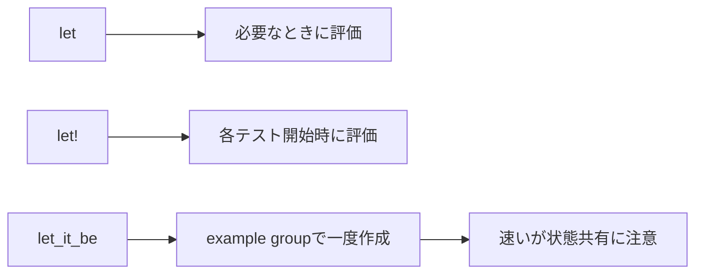

## 概要

RSpecでは、テストデータを定義するために `let` や `let!` をよく使います。

```ruby
let(:user) { create(:user) }
let!(:post) { create(:post) }
```

また、test-profを導入しているプロジェクトでは、`let_it_be` を使うこともあります。

```ruby
let_it_be(:user) { create(:user) }
```

`let_it_be` はテストデータの作成回数を減らせるため、specの高速化に有効です。
しかし、すべてのテストで `let_it_be` を使えばよいわけではありません。

この記事では、`let`、`let!`、`let_it_be` の使い分けを整理します。

## この記事で学べること

- letとlet!の違い
- let_it_beが高速化に効く理由
- 全テストでlet_it_beを使うべきではない理由
- reload/refindが必要になるケース

## 前提知識

- RSpecのletを使ったことがある
- テストの速度改善に関心がある
- TestProfのlet_it_beという名前を聞いたことがある

## 実装コード例

この記事の中心になる実装例です。細部のクラス名は公開用に抽象化しています。

```ruby
class UserService
  def call(user)
    user.update!(name: "updated")
  end
end

RSpec.describe UserService do
  let(:user) { create(:user) }

  it "ユーザーを更新する" do
    described_class.new.call(user)

    expect(user.reload.name).to eq("updated")
  end
end
```

## 本編

### letとは

`let` は、参照されたタイミングで初めて評価されます。

```ruby
let(:user) { create(:user) }

it "ユーザー名を確認する" do
  expect(user.name).to eq("Taro")
end
```

この場合、`user` が呼ばれたタイミングで `create(:user)` が実行されます。

もし、そのexample内で `user` が使われなければ、作成されません。

```ruby
let(:user) { create(:user) }

it "userを使わないテスト" do
  expect(1 + 1).to eq(2)
end
```

この場合、`user` は作成されません。

### let!とは

`let!` は、各exampleの前に必ず評価されます。

```ruby
let!(:user) { create(:user) }

it "ユーザー数を確認する" do
  expect(User.count).to eq(1)
end
```

`user` を直接参照していなくても、exampleの前に作成されます。

事前にDBへデータを作っておきたい場合に使います。

### letとlet!の使い分け

基本的には、必要になるまで作成しなくてよいものは `let` を使います。

```ruby
let(:user) { create(:user) }
```

一方で、テスト実行前にDB上に存在している必要があるものは `let!` を使います。

```ruby
let!(:published_post) { create(:post, published: true) }
let!(:draft_post) { create(:post, published: false) }

it "公開済み記事だけを返す" do
  expect(Post.published).to include(published_post)
  expect(Post.published).not_to include(draft_post)
end
```

このように、scopeのテストでは `let!` を使うことがあります。

### let_it_beとは

`let_it_be` は、test-profが提供する機能です。
RSpec標準の機能ではありません。

`let` や `let!` はexampleごとに評価されます。
一方で、`let_it_be` はexample group内で一度だけ作成し、それを使い回します。

```ruby
let_it_be(:user) { create(:user) }

it "case 1" do
  expect(user).to be_present
end

it "case 2" do
  expect(user).to be_persisted
end
```

この場合、`user` は各exampleごとに作成されるのではなく、example group内で1回だけ作成されます。

### let_it_beの目的

`let_it_be` の主な目的は、テストの高速化です。

FactoryBotでDBレコードを大量に作成しているspecでは、データ作成がボトルネックになることがあります。

例えば、次のようなspecです。

```ruby
let!(:category) { create(:category) }

it "case 1" do
end

it "case 2" do
end

it "case 3" do
end
```

この場合、`category` は各exampleで作成されます。
3exampleあれば3回作成されます。

`category` が読み取り専用で、各exampleで変更されないなら、`let_it_be` にすることで作成回数を減らせます。

```ruby
let_it_be(:category) { create(:category) }
```

### let_it_beが向いているケース

`let_it_be` が向いているのは、次のようなデータです。

```text
- 複数exampleで共通して使う
- 各exampleで変更しない
- 作成コストが高い
- 参照専用のデータ
```

例えば、検索対象の固定データです。

```ruby
RSpec.describe ProductSearchService do
  let_it_be(:published_product) { create(:product, published: true) }
  let_it_be(:draft_product) { create(:product, published: false) }

  describe "#call" do
    it "公開済み商品を返す" do
      result = described_class.new(published: true).call

      expect(result).to include(published_product)
    end

    it "非公開商品を返さない" do
      result = described_class.new(published: true).call

      expect(result).not_to include(draft_product)
    end
  end
end
```

このように、データを変更せず参照するだけなら、`let_it_be` は有効です。

### let_it_beが向いていないケース

一方で、次のような場合は `let_it_be` に向いていません。

```text
- example内で更新するデータ
- example内で削除するデータ
- callbackで状態が変わるデータ
- テストごとに状態を変えたいデータ
- updated_atやstatusが変わるデータ
```

危険な例です。

```ruby
let_it_be(:user) { create(:user, name: "Taro") }

it "名前を変更する" do
  user.update!(name: "Jiro")

  expect(user.name).to eq("Jiro")
end

it "元の名前である" do
  expect(user.name).to eq("Taro")
end
```

この場合、1つ目のexampleで `user` オブジェクトの状態が変わります。
DBのtransactionがrollbackされても、Rubyオブジェクトのメモリ上の状態が残ることがあります。

そのため、2つ目のexampleに影響する可能性があります。

### reloadやrefindを使う場合

`let_it_be` には、`reload: true` や `refind: true` のようなオプションがあります。

```ruby
let_it_be(:user, reload: true) { create(:user) }
```

これは、各exampleで `reload` して新しいDB状態を読む用途です。

```ruby
let_it_be(:user, refind: true) { create(:user) }
```

これは、各exampleで `find` し直すようなイメージです。

ただし、これらを多用するくらいなら、普通に `let` を使った方が分かりやすい場合もあります。

### 全テストでlet_it_beを使うべきではない

`let_it_be` は便利ですが、デフォルトの書き方にするべきではありません。

理由は次の通りです。

```text
- example間で状態が漏れる可能性がある
- 更新系のテストと相性が悪い
- テストの独立性が下がる
- 読み手がライフサイクルを意識する必要がある
```

基本的には、まず `let` / `let!` で安全に書きます。
その上で、データ作成が明確にボトルネックになっている箇所だけ `let_it_be` を検討するのがよいです。

### 使い分けの目安

```text
let:
必要になったときだけ作成したいデータ

let!:
example前に必ずDBへ作っておきたいデータ

let_it_be:
複数exampleで使い回せる読み取り専用の重いデータ
```

表にすると次の通りです。

| 用途               | 推奨             |
| ---------------- | -------------- |
| 必要になったら作る        | `let`          |
| 必ず事前に作る          | `let!`         |
| 読み取り専用で使い回す      | `let_it_be`    |
| 更新・削除する          | `let`          |
| exampleごとに状態を変える | `let` / `let!` |
| 大量の参照データ         | `let_it_be`を検討 |

## 図解




## 内部動作

letは遅延評価され、使われたときに初めて値を作ります。let!は各exampleの前に必ず評価されます。let_it_beはexample group全体で一度だけデータを作るため高速ですが、同じデータを複数テストで共有します。そのため、テスト内で破壊的に変更するデータには向きません。速度よりも独立性を優先すべき場面があります。

## まとめ

`let_it_be` は、RSpecの高速化に有効な道具です。
しかし、すべてのテストで使うものではありません。

基本方針は次の通りです。

```text
通常は let / let! を使う
作成コストが問題になる箇所だけ let_it_be を検討する
let_it_beは読み取り専用データに限定する
更新・削除するデータには使わない
```

テストでは、速さだけでなく独立性も重要です。

`let_it_be` はパフォーマンス最適化として使い、デフォルトの書き方にはしない方が安全です。

## 参考文献

- [RSpec Core](https://rspec.info/features/3-13/rspec-core/)
- [TestProf let_it_be](https://test-prof.evilmartians.io/#/let_it_be)
