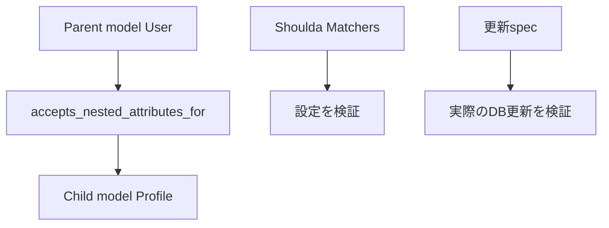

## 概要

Railsでは、親モデルを保存するときに関連モデルも一緒に作成・更新したいことがあります。

そのときに使うのが `accepts_nested_attributes_for` です。

```ruby
class Order < ApplicationRecord
  has_one :shipping_address

  accepts_nested_attributes_for :shipping_address
end
```

RSpecでは、この設定をShoulda Matchersで簡潔にテストできます。

```ruby
it { is_expected.to accept_nested_attributes_for(:shipping_address) }
```

この記事では、このテストが何を確認しているのか、また何を確認していないのかを整理します。

## この記事で学べること

- accepts_nested_attributes_forの基本
- Shoulda Matchersで設定を確認する方法
- 設定確認だけでは保証できないこと
- 実際の作成・更新・削除まで見るテスト

## 前提知識

- Railsのassociationを使ったことがある
- accepts_nested_attributes_forを見たことがある
- Shoulda Matchersでmodel specを書いたことがある

## 実装コード例

この記事の中心になる実装例です。細部のクラス名は公開用に抽象化しています。

```ruby
class User < ApplicationRecord
  has_one :profile
  accepts_nested_attributes_for :profile, allow_destroy: true
end

RSpec.describe User, type: :model do
  it do
    is_expected.to accept_nested_attributes_for(:profile).allow_destroy(true)
  end

  it "ネストした属性でプロフィールを更新する" do
    user = create(:user, profile: build(:profile, bio: "before"))

    user.update!(profile_attributes: { id: user.profile.id, bio: "after" })

    expect(user.profile.reload.bio).to eq("after")
  end
end
```

## 本編

### accepts_nested_attributes_forとは

`accepts_nested_attributes_for` は、関連先モデルの属性を親モデル経由で受け取れるようにするRailsの機能です。

例えば、注文と配送先住所の関係を考えます。

```ruby
class Order < ApplicationRecord
  has_one :shipping_address

  accepts_nested_attributes_for :shipping_address
end
```

この設定があると、次のように `shipping_address_attributes` を渡せます。

```ruby
order.update!(
  shipping_address_attributes: {
    postal_code: "1000001",
    city: "Tokyo"
  }
)
```

これにより、`Order` の更新と同時に `ShippingAddress` も作成・更新できます。

### Shoulda Matchersでのテスト

Shoulda Matchersを使うと、次のように書けます。

```ruby
RSpec.describe Order, type: :model do
  describe "nested attributes" do
    it { is_expected.to accept_nested_attributes_for(:shipping_address) }
  end
end
```

これは、対象モデルに次の設定があることを確認しています。

```ruby
accepts_nested_attributes_for :shipping_address
```

以前の書き方では、次のように `should` を使うこともあります。

```ruby
it { should accept_nested_attributes_for(:shipping_address) }
```

最近は、`is_expected.to` の方が明示的で読みやすいです。

```ruby
it { is_expected.to accept_nested_attributes_for(:shipping_address) }
```

### このテストが保証していること

このテストが保証しているのは、主に次のことです。

```text
対象モデルが関連先のnested attributesを受け取れる設定になっている
```

具体的には、Rails内部で次のようなsetterが使える状態になっていることを確認しています。

```ruby
shipping_address_attributes=
```

### このテストが保証していないこと

一方で、このテストだけでは確認できないこともあります。

```text
- 実際に関連レコードが作成されるか
- 実際に関連レコードが更新されるか
- strong parametersでpermitされているか
- validation error時に親子まとめてrollbackされるか
- allow_destroyが期待通り動くか
- reject_ifが期待通り動くか
```

つまり、Shoulda Matchersのテストは「設定の存在確認」に近いです。
実際の業務挙動まで確認しているわけではありません。

### 実際の更新まで確認するテスト

業務上重要な場合は、実際に更新できることまでテストした方がよいです。

```ruby
RSpec.describe Order, type: :model do
  describe "nested attributes" do
    it "shipping_address_attributesで配送先住所を更新できる" do
      order = create(:order)
      address = create(:shipping_address, order: order, city: "Before")

      order.update!(
        shipping_address_attributes: {
          id: address.id,
          city: "After"
        }
      )

      expect(address.reload.city).to eq("After")
    end
  end
end
```

このテストでは、設定の存在だけでなく、実際に関連レコードが更新されることを確認しています。

### 作成まで確認するテスト

関連レコードを新規作成するケースも確認できます。

```ruby
it "shipping_address_attributesで配送先住所を作成できる" do
  order = create(:order)

  order.update!(
    shipping_address_attributes: {
      postal_code: "1000001",
      city: "Tokyo"
    }
  )

  expect(order.shipping_address).to be_present
  expect(order.shipping_address.city).to eq("Tokyo")
end
```

### allow_destroyを使う場合

`allow_destroy: true` を指定している場合、関連レコードを削除できるようになります。

```ruby
class Order < ApplicationRecord
  has_one :shipping_address

  accepts_nested_attributes_for :shipping_address, allow_destroy: true
end
```

この場合は、削除の挙動もテストすると安心です。

```ruby
it "_destroyで配送先住所を削除できる" do
  order = create(:order)
  address = create(:shipping_address, order: order)

  order.update!(
    shipping_address_attributes: {
      id: address.id,
      _destroy: "1"
    }
  )

  expect(ShippingAddress.exists?(address.id)).to eq(false)
end
```

### reject_ifを使う場合

`reject_if` を使っている場合は、空の属性を無視することがあります。

```ruby
class Order < ApplicationRecord
  has_one :shipping_address

  accepts_nested_attributes_for :shipping_address,
                                reject_if: :all_blank
end
```

この場合は、空の属性では作成されないことを確認できます。

```ruby
it "空の属性では配送先住所を作成しない" do
  order = create(:order)

  order.update!(
    shipping_address_attributes: {
      postal_code: "",
      city: ""
    }
  )

  expect(order.shipping_address).to be_nil
end
```

### strong parametersは別で確認する

`accepts_nested_attributes_for` が設定されていても、Controller側でparamsがpermitされていなければ更新できません。

例えば、次のようにpermitする必要があります。

```ruby
params.require(:order).permit(
  :status,
  shipping_address_attributes: [
    :id,
    :postal_code,
    :city,
    :_destroy
  ]
)
```

model specでは、strong parametersまでは確認できません。
request specで、実際にリクエストを送って更新できるかを確認するとよいです。

### メリット・デメリット

#### Shoulda Matchersで書くメリット

```text
- 短く書ける
- 設定漏れに気づける
- associationやvalidationと並べて読みやすい
```

#### デメリット

```text
- 実際の作成・更新までは確認できない
- strong parametersの設定漏れには気づけない
- 複雑な条件は別途テストが必要
```

## 図解




## 内部動作

Shoulda Matchersのaccept_nested_attributes_forは、modelがネスト属性を受け付ける設定になっていることを確認します。ただし、そのテストだけではstrong parameters、フォーム入力、実際の作成・更新・削除が正しく動くことまでは保証しません。設定確認と振る舞い確認を分けることで、薄いテストと実用的なテストの役割が明確になります。

## まとめ

次のテストは、

```ruby
it { is_expected.to accept_nested_attributes_for(:shipping_address) }
```

対象モデルに `accepts_nested_attributes_for :shipping_address` が設定されていることを確認するテストです。

ただし、これは設定確認に近いテストです。

実際に業務上重要なら、次のような挙動も別途確認した方がよいです。

```text
- 関連レコードを作成できるか
- 関連レコードを更新できるか
- _destroyで削除できるか
- reject_ifが期待通り動くか
- request specでparams経由の更新ができるか
```

Shoulda Matchersは便利ですが、設定確認と業務挙動の確認は分けて考えることが重要です。

## 参考文献

- [Rails API](Nested Attributes: https://api.rubyonrails.org/classes/ActiveRecord/NestedAttributes/ClassMethods.html)
- [Shoulda Matchers ActiveRecord](https://matchers.shoulda.io/docs/v6.5.0/Shoulda/Matchers/ActiveRecord.html)
