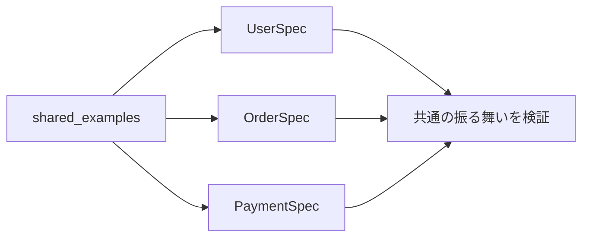

## 概要

RSpecを書いていると、複数のspecで同じようなテストを書くことがあります。

例えば、複数のAPIで「未ログインなら401を返す」という仕様がある場合です。

```ruby
describe "GET /posts" do
  it "未ログインなら401を返す" do
    get "/posts"

    expect(response).to have_http_status(:unauthorized)
  end
end

describe "POST /posts" do
  it "未ログインなら401を返す" do
    post "/posts", params: { title: "title" }

    expect(response).to have_http_status(:unauthorized)
  end
end
```

このような重複を整理するために使えるのが `RSpec.shared_examples` です。

## この記事で学べること

- shared_examplesの基本
- it_behaves_likeで共通specを再利用する方法
- 引数やletを使うパターン
- 共通化しすぎたspecの読みづらさ

## 前提知識

- RSpecで複数modelの似たspecを書いたことがある
- 共通化と可読性のバランスに悩んだことがある
- shared_examplesとshared_contextの違いを整理したい

## 実装コード例

この記事の中心になる実装例です。細部のクラス名は公開用に抽象化しています。

```ruby
class User
  def valid?
    true
  end
end

RSpec.shared_examples "validatable" do
  it "有効な状態である" do
    expect(subject).to be_valid
  end
end

RSpec.describe User do
  subject(:user) { build(:user) }

  it_behaves_like "validatable"
end
```

## 本編

### shared_examplesとは

`RSpec.shared_examples` は、複数のspecで共通して使いたいテストケースを定義する仕組みです。

例えば、認証が必要なAPIの共通テストを次のように書けます。

```ruby
RSpec.shared_examples "認証が必要なAPI" do
  it "401を返す" do
    subject

    expect(response).to have_http_status(:unauthorized)
  end
end
```

これを使う側では、`it_behaves_like` で呼び出します。

```ruby
describe "GET /posts" do
  subject { get "/posts" }

  it_behaves_like "認証が必要なAPI"
end

describe "POST /posts" do
  subject { post "/posts", params: { title: "title" } }

  it_behaves_like "認証が必要なAPI"
end
```

これで、同じテストを複数箇所で再利用できます。

### 何のために使うのか

`shared_examples` の目的は、単なる行数削減ではありません。
共通の仕様を明示することです。

例えば、次のような仕様は複数箇所に出てきやすいです。

```text
- 未ログインなら401を返す
- 権限がなければ403を返す
- nameが空なら無効になる
- 削除済みレコードは検索結果に含まれない
- 特定のinterfaceを実装している
```

こうした「同じ振る舞い」を共通化するのが `shared_examples` です。

### 引数を渡す

`shared_examples` には引数を渡すこともできます。

```ruby
RSpec.shared_examples "指定したステータスを返すAPI" do |status|
  it "#{status}を返す" do
    subject

    expect(response).to have_http_status(status)
  end
end
```

使う側です。

```ruby
describe "GET /posts" do
  subject { get "/posts" }

  it_behaves_like "指定したステータスを返すAPI", :ok
end

describe "GET /unknown" do
  subject { get "/unknown" }

  it_behaves_like "指定したステータスを返すAPI", :not_found
end
```

引数を使うことで、期待値だけを変えながら共通テストを再利用できます。

### letを使う

`shared_examples` の中では、呼び出し元で定義した `let` を参照できます。

```ruby
RSpec.shared_examples "nameが必須" do
  it "nameが空だと無効になる" do
    record.name = nil

    expect(record).to be_invalid
    expect(record.errors[:name]).to be_present
  end
end
```

使う側です。

```ruby
RSpec.describe User do
  let(:record) { build(:user) }

  it_behaves_like "nameが必須"
end

RSpec.describe Company do
  let(:record) { build(:company) }

  it_behaves_like "nameが必須"
end
```

このように、`shared_examples` 側では `record` が何かを知らなくても、共通のテストを書けます。

### shared_contextとの違い

似たものに `shared_context` があります。

違いは次の通りです。

```text
shared_examples:
共通のitを共有する

shared_context:
共通のlet、before、helper methodを共有する
```

#### shared_examplesの例

```ruby
RSpec.shared_examples "認証が必要" do
  it "401を返す" do
    subject

    expect(response).to have_http_status(:unauthorized)
  end
end
```

これはテストケースを共有しています。

#### shared_contextの例

```ruby
RSpec.shared_context "ログイン済みユーザー" do
  let(:current_user) { create(:user) }

  before do
    sign_in current_user
  end
end
```

これは前提条件を共有しています。

使う側では次のように書きます。

```ruby
include_context "ログイン済みユーザー"
```

### 使いすぎると読みにくくなる

`shared_examples` は便利ですが、使いすぎるとspecが読みにくくなります。

例えば、次のようなspecです。

```ruby
it_behaves_like "正常系"
it_behaves_like "異常系"
it_behaves_like "権限チェック"
it_behaves_like "レスポンス形式"
```

これだけを見ると、具体的に何をテストしているのか分かりません。
実際の中身を別ファイルまで追う必要があります。

共通化しすぎると、テストの意図が見えづらくなります。

### 名前は具体的にする

`shared_examples` の名前は具体的にした方がよいです。

悪い例です。

```ruby
it_behaves_like "共通処理"
```

良い例です。

```ruby
it_behaves_like "未ログイン時に401を返すAPI"
it_behaves_like "管理者権限が必要なAPI"
it_behaves_like "nameが必須のモデル"
```

名前を具体的にすると、呼び出し元のspecだけでも何をテストしているのか分かります。

### 使う判断基準

`shared_examples` を使う目安は次の通りです。

```text
同じ仕様が3箇所以上出てくる
共通仕様として名前を付けられる
呼び出し元のspecが読みやすくなる
```

逆に、2箇所程度の重複なら、無理に共通化しなくてもよい場合があります。

共通化すると、変更時に影響範囲が広がることもあります。
単に行数を減らす目的だけで使うのは避けた方がよいです。

### メリット・デメリット

#### メリット

```text
- 重複を減らせる
- 共通仕様を明示できる
- 変更箇所を集約できる
- 複数クラス・複数APIの振る舞いを揃えられる
```

#### デメリット

```text
- 使いすぎるとspecが読みにくくなる
- 呼び出し元だけでは中身が分かりにくい
- letへの依存が増えると追いづらい
- 共通化しすぎると変更しづらくなる
```

## 図解




## 内部動作

shared_examplesは、同じ振る舞いを複数の対象で検証したいときに使います。共通specを1箇所に定義し、各specからit_behaves_likeで呼び出します。ただし、抽象化しすぎると、各specを読んだだけでは何を検証しているのか分かりにくくなります。重複を消すことよりも、仕様が読めることを優先します。

## まとめ

`RSpec.shared_examples` は、複数のspecで同じテストを再利用するための仕組みです。

向いているのは、次のようなケースです。

```text
- 認証必須API
- 権限チェック
- 共通validation
- 同じinterfaceを持つクラス
- 同じ振る舞いを持つ複数モデル
```

ただし、共通化しすぎると可読性が落ちます。

基本方針は次の通りです。

```text
同じ仕様が複数回出てくる
共通仕様として名前を付けられる
呼び出し元が読みやすくなる
```

この条件を満たす場合に使うと、`shared_examples` はかなり有効です。

## 参考文献

- [RSpec Core](https://rspec.info/features/3-13/rspec-core/)
