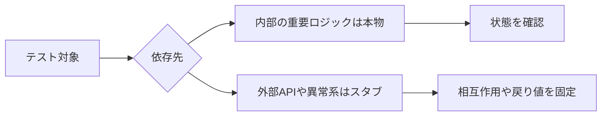

## 概要

Ruby on RailsでRSpecを書いていると、`allow` や `receive`、`instance_double` などを使って、実際のクラスやメソッドを呼ばずにテストを書くことがあります。

例えば、次のようなコードです。

```ruby
allow(PaymentClient).to receive(:charge).and_return(true)
```

このような書き方を見ると、最初は次のような疑問が出てきます。

> 実際の処理を動かしていないなら、それはテストとして意味があるのか？

テストは本来、実際のコードが正しく動くことを確認するためのものです。
それなのに、スタブやモックで偽物の戻り値を返してしまうと、実際の挙動を確認できていないように見えます。

結論から言うと、**スタブやモックを使ったテストにも意味はあります**。
ただし、何を保証していて、何を保証していないのかを理解せずに使うと、価値の低いテストになります。

この記事では、RSpecにおけるスタブ・モックの意味を整理します。

## この記事で学べること

- RSpecにおけるスタブとモックの違い
- 状態を確認するテストと相互作用を確認するテストの違い
- 外部APIや異常系をスタブする理由
- モックしすぎたテストが弱くなる理由

## 前提知識

- RSpecの基本的なexpect構文を見たことがある
- Railsでservice objectやmodel specを書いたことがある
- 外部APIや通知処理を含むテストに触れたことがある

## 実装コード例

この記事の中心になる実装例です。細部のクラス名は公開用に抽象化しています。

```ruby
class UserNameService
  def initialize(user:, full_name:)
    @user = user
    @full_name = full_name
  end

  def call
    short_name = NameFormatter.new(@full_name).short
    @user.update!(name: short_name)
  end
end

RSpec.describe UserNameService do
  it "短縮名でユーザー名を更新する" do
    user = create(:user, name: nil)
    formatter = instance_double(NameFormatter, short: "Nick")

    allow(NameFormatter).to receive(:new).and_return(formatter)

    described_class.new(user: user, full_name: "Nick Martin").call

    expect(user.reload.name).to eq("Nick")
  end
end
```

## 本編

### テストには大きく2種類ある

RSpecのテストは、大きく分けると次の2種類があります。

```text
1. 状態を確認するテスト
2. 相互作用を確認するテスト
```

#### 状態を確認するテスト

状態を確認するテストとは、処理の結果として何が変わったかを見るテストです。

例えば、ユーザー名が更新されたかを確認する場合です。

```ruby
user = create(:user, name: "Before")

described_class.new(user: user, name: "After").call

expect(user.reload.name).to eq("After")
```

このテストでは、内部でどのメソッドが呼ばれたかは気にしていません。
最終的にDB上の `user.name` が `"After"` になったかを確認しています。

これはかなり実際の挙動に近いテストです。

#### 相互作用を確認するテスト

一方で、相互作用を確認するテストでは、あるオブジェクトが別のオブジェクトに対して期待したメッセージを送ったかを確認します。

例えば、通知サービスが呼ばれたかを確認する場合です。

```ruby
expect(NotificationService).to receive(:notify).with(user)

described_class.new(user: user).call
```

このテストでは、通知が本当に送られたかではなく、`NotificationService.notify(user)` が呼ばれたかを確認しています。

### スタブとは何か

スタブは、メソッドの戻り値を差し替えるための仕組みです。

```ruby
allow(NameFormatter)
  .to receive(:shorten)
  .with("Nick Martin")
  .and_return("Nick")
```

この例では、`NameFormatter.shorten("Nick Martin")` が呼ばれたとき、本物の処理を実行せずに `"Nick"` を返します。

つまり、スタブは次のような用途で使います。

```text
この依存先の処理内容は、今回のテスト対象ではない。
今回は固定の戻り値を返すものとして扱いたい。
```

### モックとは何か

モックは、特定のメソッドが呼ばれることを期待する仕組みです。

```ruby
expect(NotificationService)
  .to receive(:notify)
  .with(user)
```

これは、`NotificationService.notify(user)` が呼ばれなければテストが失敗します。

スタブが「戻り値の差し替え」に近いのに対して、モックは「呼び出しの検証」に近いです。

### なぜ本物を使わないのか

本物を使えるなら、本物を使った方がよい場面は多いです。

特にRailsでは、以下のようなものは本物で確認した方が価値があります。

```text
- ActiveRecordのvalidation
- scope
- DB保存
- DB更新
- 業務上重要なモデルメソッド
- request specでのレスポンス
```

しかし、常に本物を使うべきとは限りません。

理由は、テスト対象以外の影響を排除したい場面があるからです。

例えば、次のようなサービスを考えます。

```ruby
class UserNameService
  def initialize(user:, full_name:)
    @user = user
    @full_name = full_name
  end

  def call
    short_name = NameFormatter.new(full_name).short

    user.update!(name: short_name)
  end

  private

  attr_reader :user, :full_name
end
```

このサービスの責務は、次の通りです。

```text
1. NameFormatterで短縮名を取得する
2. 取得した短縮名でuser.nameを更新する
```

ここで、`NameFormatter#short` の中身まで本物で動かすと、`UserNameService` のテストでありながら、`NameFormatter` のバグにも影響されます。

そのため、`NameFormatter` はスタブして、`UserNameService` の責務に絞ることがあります。

```ruby
RSpec.describe UserNameService do
  describe "#call" do
    it "短縮名でuser.nameを更新する" do
      user = create(:user, name: nil)
      formatter = instance_double(NameFormatter)

      allow(NameFormatter)
        .to receive(:new)
        .with("Nick Martin")
        .and_return(formatter)

      allow(formatter)
        .to receive(:short)
        .and_return("Nick")

      described_class.new(user: user, full_name: "Nick Martin").call

      expect(user.reload.name).to eq("Nick")
    end
  end
end
```

このテストでは、`NameFormatter` の変換ロジックは確認していません。
しかし、`UserNameService` が受け取った短縮名を保存することは確認しています。

### 外部APIは基本的に本物を使わない

スタブ・モックが特に有効なのは、外部APIを扱う場合です。

例えば、決済APIを呼ぶ処理があるとします。

```ruby
PaymentClient.charge(user: user, amount: 1000)
```

テストでこれを本当に実行すると、次のような問題があります。

```text
- 実際に課金される可能性がある
- 外部APIの障害でテストが落ちる
- ネットワーク環境に依存する
- API制限に引っかかる
- テストの実行が遅くなる
```

そのため、外部APIはスタブするのが一般的です。

```ruby
allow(PaymentClient)
  .to receive(:charge)
  .and_return(true)
```

このテストで確認するのは、決済APIそのものが正しいかではありません。
決済が成功したときに、アプリケーション側が正しく動くかです。

### 異常系を再現しやすい

スタブは異常系のテストでも有効です。

例えば、外部APIがタイムアウトしたケースを本物のAPIで再現するのは難しいです。
しかし、スタブなら簡単に再現できます。

```ruby
allow(PaymentClient)
  .to receive(:charge)
  .and_raise(PaymentClient::TimeoutError)
```

これにより、次のようなテストを書けます。

```ruby
it "決済APIがタイムアウトした場合は失敗扱いにする" do
  allow(PaymentClient)
    .to receive(:charge)
    .and_raise(PaymentClient::TimeoutError)

  result = described_class.new(user: user, amount: 1000).call

  expect(result).to be_failure
end
```

これは、本物の外部APIを使うよりも安定しています。

### モックしすぎると危険

一方で、何でもモックすればよいわけではありません。

例えば、次のようなテストは弱いです。

```ruby
user = instance_double(User)

allow(user)
  .to receive(:update!)
  .with(name: "Nick")

described_class.new(user: user, full_name: "Nick Martin").call

expect(user)
  .to have_received(:update!)
  .with(name: "Nick")
```

このテストで確認できるのは、`update!` が呼ばれたことだけです。

確認できないことは多くあります。

```text
- 実際にDBに保存されたか
- validationに通るか
- callbackが正しく動くか
- ActiveRecordとして正しく扱えるか
```

もし仕様として重要なのが「ユーザー名が保存されること」なら、次のようにDBまで確認した方がよいです。

```ruby
user = create(:user, name: nil)

described_class.new(user: user, full_name: "Nick Martin").call

expect(user.reload.name).to eq("Nick")
```

### メリット

スタブ・モックのメリットは次の通りです。

```text
- テスト対象の責務を切り分けられる
- 外部APIに依存しない
- テストが速くなる
- 異常系を再現しやすい
- 失敗原因を特定しやすい
```

### デメリット

一方で、デメリットもあります。

```text
- 実際の挙動とのズレに気づきにくい
- 実装詳細に依存したテストになりやすい
- モックしすぎると何も保証しないテストになる
- リファクタリングで壊れやすくなる
```

## 図解




## 内部動作

RSpecのスタブは、依存先メソッドの戻り値をテスト用に固定します。モックは、指定したメッセージが送られたかを検証します。つまり、スタブは「依存先をどう振る舞わせるか」、モックは「依存先とどうやり取りしたか」を扱います。DB更新のように結果状態が重要なものは本物に寄せ、外部APIのように境界の外にあるものはスタブする、という切り分けが実務では扱いやすいです。

## まとめ

スタブやモックは、実際の挙動確認を放棄するためのものではありません。
テスト対象を明確に切り分けるための道具です。

基本方針は次の通りです。

```text
- 外部APIや重い処理はスタブする
- 内部の重要な業務ロジックは本物で確認する
- DB更新が重要ならDBの状態を見る
- 呼び出し自体が仕様ならモックで確認する
```

重要なのは、テストごとに次を説明できることです。

```text
このテストは何を保証しているのか
このテストは何を保証していないのか
```

この視点を持つと、スタブやモックを使うべき場面と避けるべき場面が判断しやすくなります。

## 参考文献

- [RSpec Mocks](https://rspec.info/features/3-13/rspec-mocks/)
- [RSpec Core](https://rspec.info/features/3-13/rspec-core/)
