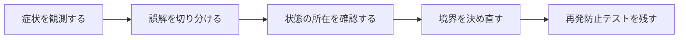

## 概要

検索条件をHashへ変換するため`to_unsafe_h`を使うコードを見た。GETパラメータだから安全に見えるが、許可していないキーをすべて通常Hashへ落とすため、後段でMass Assignmentや動的条件へ流すと境界が崩れる。

`to_unsafe_h`はデータを危険に変換するのではなく、Strong Parametersが保持していた「許可済みかどうか」という安全境界を捨てるAPIである。必要なキーを明示してから変換する。

## この記事で学べること

- `ActionController::Parameters`が持つpermitted状態
- `permit`、`to_h`、`to_unsafe_h`の違い
- GET/POSTというHTTPメソッドと信頼性は別問題
- 検索条件・Ransack・ソート条件で起きる想定外キー
- Mass Assignmentに流れた場合
- ネストしたパラメータと配列

## 前提知識

- Rails、Active Record、RSpec、SQLログの基本を読めること
- フレームワークのAPIを使った経験があり、状態・トランザクション・非同期処理の境界で詰まり始めていること
- この記事のコード例は匿名化した最小例であり、利用中のバージョンでは公式ドキュメントと実装を確認すること

## 図解




## 実装コード例

```ruby
class UsersController < ApplicationController
  def create
    user = User.create!(user_params)
    render json: { id: user.id }
  end

  private

  def user_params
    params.require(:user).permit(:name, :email, :age)
  end
end
```

## 本編

### 発生した状況

検索条件をHashへ変換するため`to_unsafe_h`を使うコードを見た。GETパラメータだから安全に見えるが、許可していないキーをすべて通常Hashへ落とすため、後段でMass Assignmentや動的条件へ流すと境界が崩れる。

### 当初の理解・誤解

当初は、API名やメソッド名から直感的に挙動を推測していました。しかし実際には、`to_unsafe_h`はデータを危険に変換するのではなく、Strong Parametersが保持していた「許可済みかどうか」という安全境界を捨てるAPIで... という観点で見る必要がありました。

### 観測したこと

- 危険な例: `Model.where(params.to_unsafe_h)`
- 安全な例: `params.permit(:q, :status, :page).to_h`
- Query Objectでソート列をallowlistする例
- 不許可キーが無視/拒否されるRequest Spec

### 修正案の比較

| 方針 | 見るべき点 |
| --- | --- |
| `permit` | 境界が明確／許可項目の保守が必要 |
| Query Object | 型と制約を集約／クラスが増える |

## 内部動作

Railsの抽象化は、Rubyオブジェクト、Active Record、SQL、DBトランザクションの上に成り立っています。重要なのは、Railsのメソッド呼び出しがそのままDBの履歴や外部サービスの状態になるわけではない、という点です。

- Strong Parametersは認可全体を代替しない
- `permit`したから業務上アクセス可能とは限らない

```text
Ruby object
  -> Active Record
  -> SQL / transaction
  -> database row
  -> callback or job boundary
```

## 調査手順

1. まず、入力値・保存前状態・保存後状態・コールバックや非同期処理の発火地点をログに残します。
2. 次に、DBやHTTP通信など外部境界をまたぐ処理を分けて、どこまでが同じトランザクションや同じライフサイクルに属するかを確認します。
3. 最後に、修正後の設計を最小テストへ落とし込み、同じ誤解が再発しないようにします。

- Strong Parametersは認可全体を代替しない
- `permit`したから業務上アクセス可能とは限らない

## 再発防止テスト

```ruby
RSpec.describe "rails-to-unsafe-h-strong-parameters" do
  it "境界条件を固定する" do
    result = described_class.new.call

    expect(result).to be_present
  end
end
```

## 一般化できる設計原則

- API名が短いほど、裏側の実行モデルを確認する
- 状態を「値」「オブジェクト」「DB row」「外部サービス」のどこに置いているかを分けて考える
- トランザクションや非同期処理の境界をまたぐ副作用は、明示的な設計として扱う
- テストは成功確認だけでなく、誤解しやすい境界条件を固定する

## まとめ

入力値の安全性ではなく、「どの時点で信頼境界を解除したか」をコード上で追えることが重要だと締める。


この記事では、次のような短絡的な一般化は避けます。

- `to_unsafe_h`自体を脆弱性と断定しない
- GETは副作用がないから入力検証不要、と書かない

## 参考文献

- この記事は、提供された執筆仕様とサムネイルをもとに、公開用の匿名化された技術ノートとして再構成しています。
- Rails、Flutter、Dart、Swiftのバージョン差が関係する箇所は、利用中リポジトリの設定と公式ドキュメントで確認してください。
