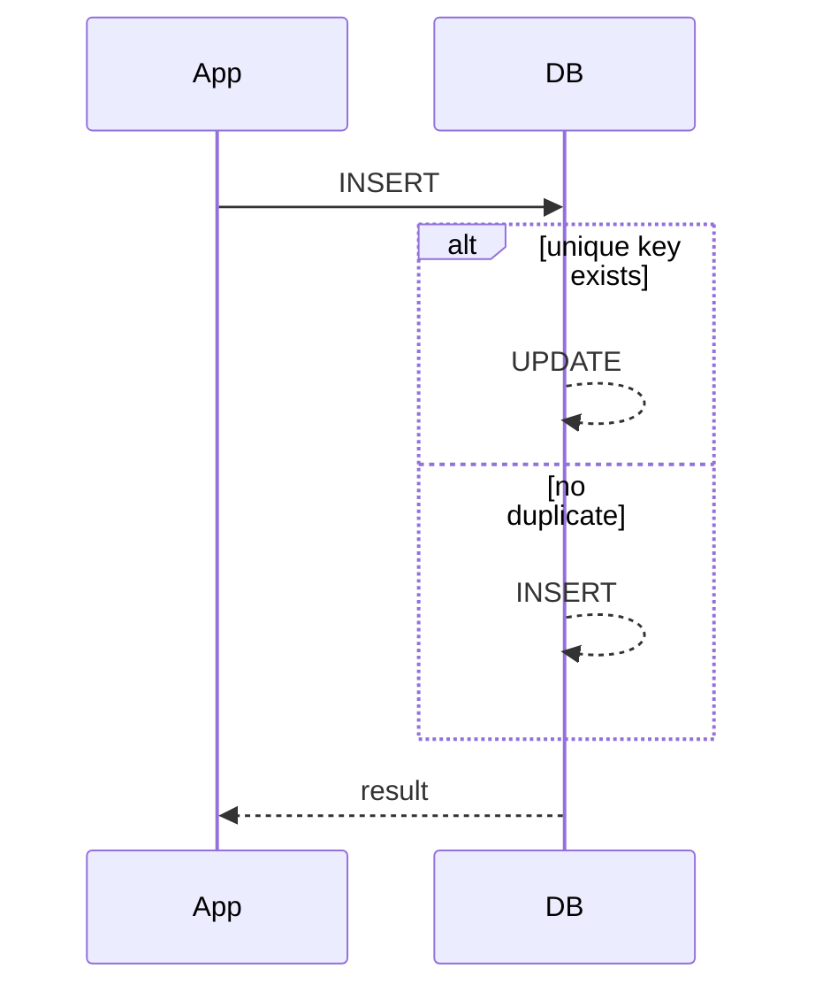

## UPSERTとは

UPSERTは、存在しなければINSERTし、存在すればUPDATEする処理です。MySQLでは `ON DUPLICATE KEY UPDATE` を使います。

## 基本形

```sql title="upsert.sql"
INSERT INTO user_scores (user_id, score, updated_at)
VALUES (1, 120, NOW())
ON DUPLICATE KEY UPDATE
  score = VALUES(score),
  updated_at = VALUES(updated_at);
```

`user_id` に一意制約がある場合、同じ `user_id` の行がすでにあればUPDATEに切り替わります。

## 注意点

> [!IMPORTANT]
> 重複判定はUNIQUE INDEXまたはPRIMARY KEYに依存します。アプリケーション上の「同じはず」では発火しません。



## ActiveRecordの選択肢

Railsには `upsert_all` もあります。生SQLを使うのは、式や複雑な更新条件が必要なときに限定すると扱いやすくなります。
