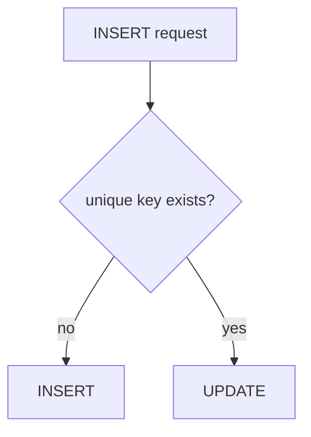
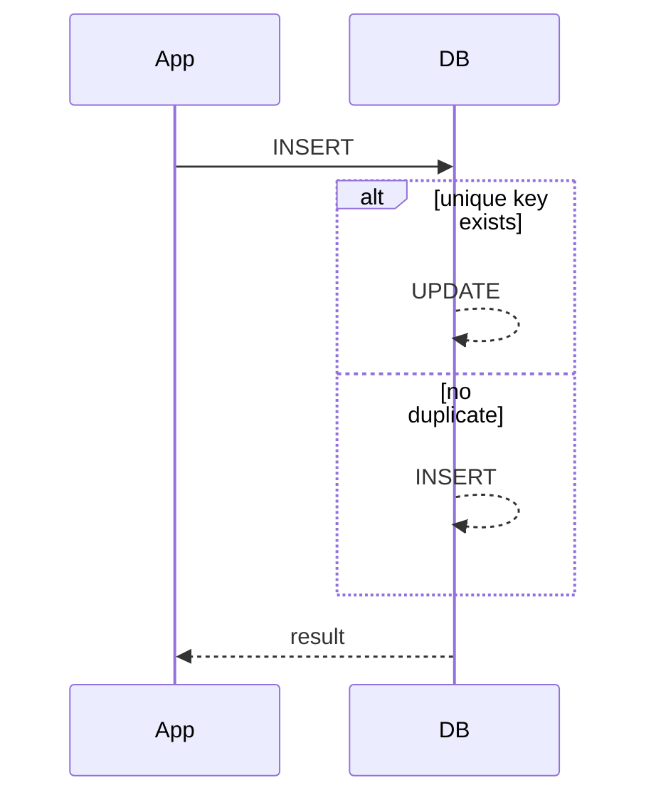

## 概要

`ON DUPLICATE KEY UPDATE` は、MySQLでINSERT時にPRIMARY KEYやUNIQUE KEYの重複が起きた場合、INSERTではなくUPDATEへ切り替えるUPSERT構文です。

Railsのデータ移行では、同じMigrationを複数回流しても破綻しにくい処理を作るときに役立ちます。

## この記事で学べること

- UPSERTの考え方
- MySQLの `ON DUPLICATE KEY UPDATE` の基本形
- 衝突キーがどのように決まるか
- Railsではどの選択肢があるか

## 前提知識

- PRIMARY KEYとUNIQUE KEYの違いを知っている
- RailsでMigrationを書いたことがある
- `INSERT` と `UPDATE` の基本構文を知っている

## 図解



## 実装コード例

```ruby
execute(<<~SQL)
  INSERT INTO user_scores (user_id, score, updated_at)
  VALUES (1, 120, NOW())
  ON DUPLICATE KEY UPDATE
    score = VALUES(score),
    updated_at = VALUES(updated_at)
SQL
```

## 内部動作

```text
INSERT
↓
UNIQUE INDEXを確認
↓
重複なし: 新規行を追加
↓
重複あり: 対象行をUPDATE
```

## 本編

## UPSERTとは

UPSERTは、存在しなければINSERTし、存在すればUPDATEする処理です。MySQLでは `ON DUPLICATE KEY UPDATE` を使います。

## 基本形

```sql title="upsert.sql"
INSERT INTO user_scores (user_id, score, updated_at)
VALUES (1, 120, NOW())
ON DUPLICATE KEY UPDATE
  score = VALUES(score),
  updated_at = VALUES(updated_at);
```

`user_id` に一意制約がある場合、同じ `user_id` の行がすでにあればUPDATEに切り替わります。

## 注意点

> [!IMPORTANT]
> 重複判定はUNIQUE INDEXまたはPRIMARY KEYに依存します。アプリケーション上の「同じはず」では発火しません。



## ActiveRecordの選択肢

Railsには `upsert_all` もあります。生SQLを使うのは、式や複雑な更新条件が必要なときに限定すると扱いやすくなります。

## まとめ

`ON DUPLICATE KEY UPDATE` は、UNIQUE制約を基準にINSERTとUPDATEを切り替えるMySQLのUPSERT構文です。

Railsで使う場合は、制約の設計と再実行時の安全性をセットで確認することが重要です。

## 参考文献

- [MySQL Reference Manual: INSERT ... ON DUPLICATE KEY UPDATE Statement](https://dev.mysql.com/doc/refman/8.4/en/insert-on-duplicate.html)
- [Ruby on Rails API: upsert_all](https://api.rubyonrails.org/classes/ActiveRecord/Persistence/ClassMethods.html#method-i-upsert_all)
