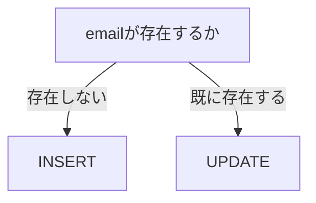

## はじめに

普段はActiveRecordを利用して開発することがほとんどですが、データ移行やバッチ処理では、生SQLを書く機会があります。

先日、PRレビューでデータ移行用のMigrationを読んでいた際に、ActiveRecordだけではあまり触れることのないSQL構文やMySQLの関数が数多く登場しました。

この記事では、その中でも実務で頻繁に利用されるSQL構文や関数について、RailsのMigrationを例にしながらまとめていきます。

なお、実際の業務で学んだ内容をもとにしていますが、テーブル名やカラム名は理解しやすいように一般的なものへ置き換えています。

対象読者は以下のような方です。

- 普段はActiveRecordを利用しているRailsエンジニア
- Migrationやバッチ処理で生SQLを書く機会がある方
- SQLをもう一歩深く理解したい方

## executeで生SQLを実行する

RailsではMigrationやバッチ処理などで、生SQLを直接実行できます。

```ruby
execute(<<~SQL)
  SELECT *
  FROM users
SQL
```

## `<<~SQL` とは？

これはヒアドキュメント（Heredoc）と呼ばれるRubyの構文です。

複数行の文字列をそのまま記述できるため、長いSQLでも読みやすく書くことができます。

例えば以下のコードがあります。

```ruby
sql = <<~SQL
  SELECT *
  FROM users
SQL
```

これは以下と同じ意味になります。

```ruby
sql = "SELECT *\nFROM users\n"
```

> [!NOTE]
> `\n` は文字列中での改行を意味します。

## INSERT ... SELECT

普段よく見る `INSERT` は以下のような形です。

```sql
INSERT INTO users (name, age)
VALUES ('Alice', 20);
```

ですが、大量データの移行では以下のような書き方もできます。

```sql
INSERT INTO user_profiles (
  email,
  name,
  created_at
)
SELECT
  email,
  name,
  NOW()
FROM users;
```

これは、`SELECT` で取得した結果をそのまま `INSERT` するSQLです。

Rubyで以下のようにループする必要がなく、DB内部だけで処理が完結するため、大量データの移行では非常に高速です。

```ruby
User.find_each do |user|
  UserProfile.create!(
    email: user.email,
    name: user.name
  )
end
```

## ON DUPLICATE KEY UPDATE

MySQLにはUPSERT用の構文があります。

```sql
INSERT INTO user_profiles (
  email,
  name
)
VALUES (
  'alice@example.com',
  'Alice'
)
ON DUPLICATE KEY UPDATE
  name = VALUES(name);
```

ここで重要なのは、衝突キー（Conflict Key）はSQLでは指定していないということです。

衝突キーは以下によって決まります。

- `PRIMARY KEY`
- `UNIQUE INDEX`

例えば以下のようなindexがある場合、`email` が衝突キーになります。

```ruby
add_index :user_profiles, :email, unique: true
```

つまり、以下のような動きになります。



## VALUES()

`ON DUPLICATE KEY UPDATE` では、以下のような書き方ができます。

```sql
name = VALUES(name)
```

これは、INSERTしようとしていた値という意味です。

例えば以下のSQLなら、`VALUES(name)` は `Alice` になります。

```sql
INSERT INTO users(name)
VALUES ('Alice')
```

つまり、`name = VALUES(name)` は「INSERTしようとしていたnameで更新する」という意味になります。

## NOW()

`updated_at = NOW()` は、DBサーバーの現在時刻を取得する関数です。

Railsでいう `Time.current` に近い役割になります。

## ROW_NUMBER()

`ROW_NUMBER()` はウィンドウ関数（Window Function）の一つです。

```sql
ROW_NUMBER() OVER (
    PARTITION BY user_id
    ORDER BY updated_at DESC
)
```

例えば以下のデータがあるとします。

| id | user_id | updated_at |
| --- | --- | --- |
| 1 | 1 | 2024-01-01 |
| 2 | 1 | 2025-01-01 |
| 3 | 2 | 2023-01-01 |
| 4 | 2 | 2024-05-01 |

これに対して実行すると、以下のようになります。

| id | user_id | updated_at | rn |
| --- | --- | --- | --- |
| 2 | 1 | 2025-01-01 | 1 |
| 1 | 1 | 2024-01-01 | 2 |
| 4 | 2 | 2024-05-01 | 1 |
| 3 | 2 | 2023-01-01 | 2 |

そのため、`WHERE rn = 1` とすると、各ユーザーの最新レコードだけ取得できます。

## PARTITION BY

`PARTITION BY user_id` は、`user_id` ごとにグループ分けするという意味です。

`GROUP BY` との違いは、元のレコードを失わないことです。

順位付けや累積計算でよく利用されます。

## FROM (...) ranked

```sql
FROM (
  SELECT ...
) ranked
```

これはDerived Table（派生テーブル）と呼ばれます。

`SELECT` 結果へ一時的に `ranked` という名前を付けています。

そのため、以下のように参照できます。

- `ranked.created_at`
- `ranked.updated_by`
- `ranked.rn`

これはViewとは異なり、SQL実行中だけ存在します。

## LEFT JOIN ... IS NULL

例えば以下のSQLがあります。

```sql
SELECT
    u.*
FROM users u
LEFT JOIN user_profiles p
    ON p.user_id = u.id
WHERE p.id IS NULL;
```

このように書くと、プロフィールがまだ作成されていないユーザーだけ取得できます。

例えば以下のデータがあるとします。

users

| id | name |
| --- | --- |
| 1 | Alice |
| 2 | Bob |
| 3 | Carol |

user_profiles

| user_id |
| --- |
| 1 |
| 3 |

この場合、取得されるのは以下だけです。

| id | name |
| --- | --- |
| 2 | Bob |

重複INSERTを防いだり、未作成データだけ取得したいときによく使われます。

## REGEXP_REPLACE

```sql
REGEXP_REPLACE(
    phone_number,
    '[[:space:]]',
    ''
)
```

正規表現に一致した文字列を置換できます。

例えば以下のように空白をすべて削除できます。

```text
090 1234 5678
↓
09012345678
```

## UPPER

`UPPER(country_code)` は、文字列を大文字へ変換します。

例えば `jp` は `JP` になります。

Rubyでは `string.upcase` と同じような役割です。

## CHAR_LENGTH と LENGTH

見た目は似ていますが意味が異なります。

| 関数 | 意味 |
| --- | --- |
| `CHAR_LENGTH(column)` | 文字数 |
| `LENGTH(column)` | バイト数 |

例えば `ABC` なら、`CHAR_LENGTH = 3`、`LENGTH = 3` です。

ですが、`ＡＢＣ` なら、`CHAR_LENGTH = 3`、`LENGTH = 9` になります。

そのため、以下のように書けば全角文字を含むデータだけ判定できます。

```sql
CHAR_LENGTH(column) <> LENGTH(column)
```

## SQLはRubyのようにループしていない

例えば以下のようなSQLを見ると、Rubyで `User.find_each` しているように見えます。

```sql
INSERT INTO ...
SELECT ...
FROM users
```

しかし実際には違います。

SQLは集合（Set）を扱う言語です。

DBエンジンが内部で最適化して処理するため、Ruby側へ1件ずつ返しているわけではありません。

そのため、数万件から数百万件のデータでも高速に処理できます。

## ActiveRecordだけでは見えない世界

普段のRails開発ではActiveRecordだけでも十分ですが、Migrationや大量データ更新では以下を知っているだけで、Rubyでループを書くよりも高速でシンプルに実装できるケースが多くあります。

- `INSERT ... SELECT`
- `ON DUPLICATE KEY UPDATE`
- `ROW_NUMBER()`
- Window Function
- Derived Table
- `LEFT JOIN ... IS NULL`
- `REGEXP_REPLACE`

今後もMigrationやバッチ処理を書く際には、ActiveRecordだけで実装を考えるのではなく、「SQLで一括処理できないか？」という視点も持ちながら設計していきたいと思います。
