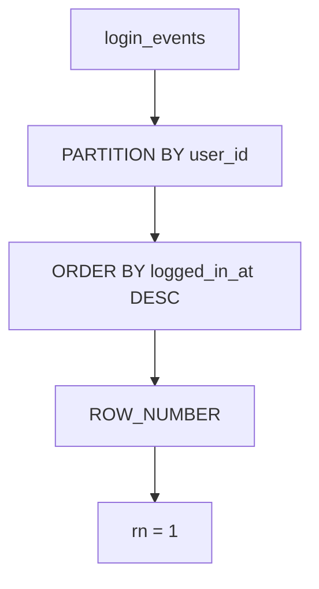

## 概要

`ROW_NUMBER()` は、グループ内で順位を付けるWindow Functionです。

Railsのバッチや集計SQLでは、「ユーザーごとの最新レコードを1件だけ取る」のような処理でよく使います。

## この記事で学べること

- `ROW_NUMBER()` の基本
- `PARTITION BY` と `ORDER BY` の役割
- 各グループから最新1件を取り出すSQL
- RailsからWindow Functionを使う考え方

## 前提知識

- `SELECT` と `ORDER BY` の基本を知っている
- RailsからSQLを実行したことがある
- 同じユーザーに複数レコードが紐づくテーブルを扱ったことがある

## 図解



## 実装コード例

```ruby
ranked_sql = <<~SQL
  SELECT
    login_events.*,
    ROW_NUMBER() OVER (
      PARTITION BY user_id
      ORDER BY logged_in_at DESC
    ) AS row_num
  FROM login_events
SQL
```

## 内部動作

```text
FROM login_events
↓
user_idごとにpartitionを作る
↓
partition内をlogged_in_at DESCで並べる
↓
各行に連番を付ける
↓
row_num = 1だけを残す
```

## 本編

## ROW_NUMBERとは

`ROW_NUMBER()` は、指定した並び順に従って行番号を振るWindow Functionです。グループごとの最新行を1件だけ取りたいときに便利です。

> [!NOTE]
> `ROW_NUMBER()` は同順位を作りません。同じ値が並んでも必ず連番になります。

## 最新ログインを1件だけ取得する

```sql title="latest_login.sql"
WITH ranked_logins AS (
  SELECT
    user_id,
    logged_in_at,
    ROW_NUMBER() OVER (
      PARTITION BY user_id
      ORDER BY logged_in_at DESC
    ) AS row_num
  FROM login_events
)
SELECT user_id, logged_in_at
FROM ranked_logins
WHERE row_num = 1;
```

## PARTITION BYとORDER BY

$$
\text{row\_num} = f(partition, order)
$$

- `PARTITION BY user_id`: ユーザーごとに番号を振り直す
- `ORDER BY logged_in_at DESC`: 新しいログインから順に並べる

## Railsで使う場合

```ruby title="latest_login_query.rb"
LoginEvent
  .select("user_id, logged_in_at")
  .from("(#{ranked_sql}) ranked_logins")
  .where(row_num: 1)
```

> [!WARNING]
> ActiveRecordのクエリメソッドだけで無理に表現すると読みづらくなる場合があります。複雑なWindow FunctionはSQLとして管理する方が安全です。

## まとめ

`ROW_NUMBER()` は、グループ内の順位付けをSQL側で表現できるWindow Functionです。

Railsで最新レコード抽出や重複排除を行う場合、Rubyで後処理する前にSQLで集合処理できないかを検討するとよいです。

## 参考文献

- [PostgreSQL Documentation: Window Functions](https://www.postgresql.org/docs/current/functions-window.html)
- [MySQL Reference Manual: Window Function Descriptions](https://dev.mysql.com/doc/refman/8.4/en/window-function-descriptions.html)
