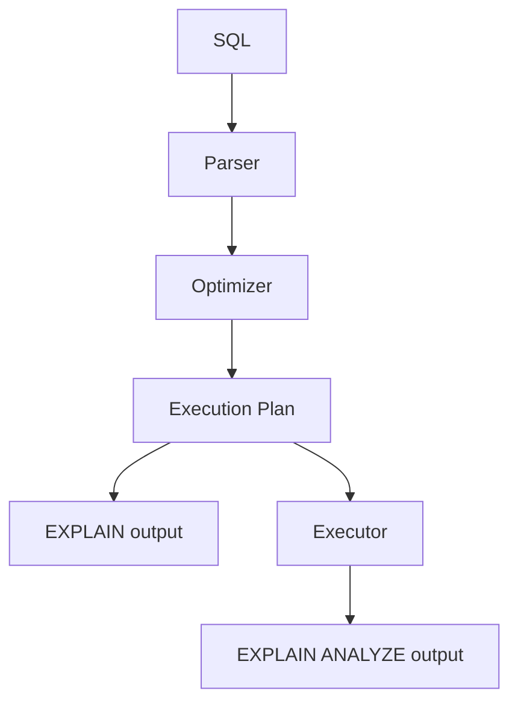
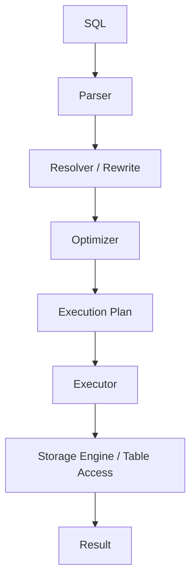

## 概要

`EXPLAIN` と `EXPLAIN ANALYZE` は、SQLがDB内部でどのように実行されるかを確認するための構文です。

この記事では、MySQLとPostgreSQLを例に、実行計画の見方、実測値の読み方、`ANALYZE` との違いを整理します。

## この記事で学べること

- `EXPLAIN` と `EXPLAIN ANALYZE` の違い
- 推定値と実測値の読み方
- MySQLとPostgreSQLの出力形式の違い
- 実行計画から改善候補を見つける方法

## 前提知識

- `SELECT`、`WHERE`、Indexの基本を知っている
- MySQLまたはPostgreSQLでSQLを実行したことがある
- SQLが遅いときに原因を調べたい場面がある

## 図解



## SQL例

```sql
SELECT *
FROM users
WHERE email = 'alice@example.com';
```

## EXPLAIN

```sql
EXPLAIN
SELECT *
FROM users
WHERE email = 'alice@example.com';
```

```text
Index Scan using idx_users_email on users  (cost=0.42..8.44 rows=1 width=128)
  Index Cond: (email = 'alice@example.com'::text)
```

## 実際の性能比較

```text
Indexなし: Seq Scan / rows=100000 / Execution Time=25.000 ms
Indexあり: Index Scan / rows=1 / Execution Time=0.061 ms
```

数値は環境によって変わりますが、実行計画を見ることで「全件読む」のか「Indexで絞る」のかを判断できます。

## 内部動作

```text
SQL
↓
Parser
↓
Optimizer
↓
Execution Plan
↓
Executor
↓
Storage Engine / Table Access
↓
Result
```

## 本編

SQLのパフォーマンスを調べるときによく出てくるのが `EXPLAIN` や `EXPLAIN ANALYZE` です。

例えば、次のようなSQLがあります。

```sql title="query.sql"
SELECT *
FROM users
WHERE email = 'alice@example.com';
```

このSQLが遅いとき、ただSQLを眺めていても原因は分かりません。

- Indexが使われているのか
- 全件スキャンしているのか
- 何件くらい読む見込みなのか
- 実際には何件読んだのか
- Sortや一時領域が発生しているのか
- Joinの順序は妥当なのか

こうした情報を確認するために使うのが `EXPLAIN` や `EXPLAIN ANALYZE` です。

> [!TIP]
> View、派生テーブル、CTE、Temporary Tableが実行計画上どう見えるかは、[SQLのView・派生テーブル・CTE・一時テーブルは何が違うのか？内部動作から理解する](../view-derived-table-cte-temporary-table/) と合わせて読むと理解しやすいです。

## まず結論

| 構文 | 何を見るものか | 実際にSQLを実行するか |
| --- | --- | --- |
| `EXPLAIN` | Optimizerが作った実行計画 | 原則実行しない |
| `EXPLAIN ANALYZE` | 実行計画 + 実行時の実測値 | 実行する |
| `ANALYZE` / `ANALYZE TABLE` | 統計情報を更新する | 対象テーブルを解析する |

一番重要なのは、`EXPLAIN` と `EXPLAIN ANALYZE` は目的が違うということです。

`EXPLAIN` は「このSQLを実行するなら、DBはこう処理する予定です」という推定の実行計画を表示します。

一方、`EXPLAIN ANALYZE` は実際にSQLを実行し、その結果として「実際に何行読んだか」「どの処理に何msかかったか」まで表示します。

## SQLが実行される流れ

SQLは大きく次のような流れで処理されます。



`EXPLAIN` は、主に `Optimizer` が作った `Execution Plan` を確認するための構文です。

```text
SQL
↓
Parser
↓
Optimizer
↓
Execution Plan
↓
表示
```

一方、`EXPLAIN ANALYZE` は実行計画を作ったあと、実際にExecutorまで動かします。

```text
SQL
↓
Parser
↓
Optimizer
↓
Execution Plan
↓
Executor
↓
実測値つきで表示
```

そのため、`EXPLAIN ANALYZE` では実行時間や実際の行数が分かります。

## EXPLAINとは

`EXPLAIN` は、SQLの実行計画を表示する構文です。

MySQLでは次のように使います。

```sql title="mysql_explain.sql"
EXPLAIN
SELECT *
FROM users
WHERE email = 'alice@example.com';
```

PostgreSQLでも基本は同じです。

```sql title="postgres_explain.sql"
EXPLAIN
SELECT *
FROM users
WHERE email = 'alice@example.com';
```

`EXPLAIN` を見ると、DBがどのようにSQLを処理しようとしているかが分かります。

ただし、表示される行数やコストは基本的に推定値です。

## EXPLAIN ANALYZEとは

`EXPLAIN ANALYZE` は、SQLを実際に実行した上で、実行計画と実測値を表示します。

PostgreSQLでは次のように使います。

```sql title="postgres_explain_analyze.sql"
EXPLAIN ANALYZE
SELECT *
FROM users
WHERE email = 'alice@example.com';
```

よく使う形は、`BUFFERS` も付ける書き方です。

```sql title="postgres_explain_analyze_buffers.sql"
EXPLAIN (ANALYZE, BUFFERS)
SELECT *
FROM users
WHERE email = 'alice@example.com';
```

`BUFFERS` を付けると、メモリ上の共有バッファやディスク読み込みに関する情報も見られます。

MySQLでも `EXPLAIN ANALYZE` を使えます。

```sql title="mysql_explain_analyze.sql"
EXPLAIN ANALYZE
SELECT *
FROM users
WHERE email = 'alice@example.com';
```

MySQLの `EXPLAIN ANALYZE` はツリー形式で、各処理の実行時間や行数を確認できます。

## 実行すると実際にどう表示されるのか

ここでは、次のSQLを例にします。

```sql title="target_query.sql"
SELECT *
FROM users
WHERE email = 'alice@example.com';
```

数値は環境やデータ件数によって変わります。

見るべきなのは、細かい数値そのものよりも、どのような形式で表示され、どの項目を読むのかです。

### MySQLのEXPLAIN

MySQLで `EXPLAIN` を実行すると、通常は表形式で表示されます。

```sql title="mysql_explain.sql"
EXPLAIN
SELECT *
FROM users
WHERE email = 'alice@example.com';
```

例えば、`email` にIndexがある場合は次のように表示されます。

```text title="mysql_explain_output.txt"
+----+-------------+-------+------------+------+-----------------+-----------------+---------+-------+------+----------+-------------+
| id | select_type | table | partitions | type | possible_keys   | key             | key_len | ref   | rows | filtered | Extra       |
+----+-------------+-------+------------+------+-----------------+-----------------+---------+-------+------+----------+-------------+
|  1 | SIMPLE      | users | NULL       | ref  | idx_users_email | idx_users_email | 1022    | const |    1 |   100.00 | Using where |
+----+-------------+-------+------------+------+-----------------+-----------------+---------+-------+------+----------+-------------+
```

この出力では、`key` に `idx_users_email` が表示されています。

つまり、Optimizerが `idx_users_email` を使う計画を選んだことが分かります。

一方、Indexが使われない場合は、次のようになります。

```text title="mysql_explain_full_scan.txt"
+----+-------------+-------+------------+------+---------------+------+---------+------+--------+----------+-------------+
| id | select_type | table | partitions | type | possible_keys | key  | key_len | ref  | rows   | filtered | Extra       |
+----+-------------+-------+------------+------+---------------+------+---------+------+--------+----------+-------------+
|  1 | SIMPLE      | users | NULL       | ALL  | NULL          | NULL | NULL    | NULL | 100000 |    10.00 | Using where |
+----+-------------+-------+------------+------+---------------+------+---------+------+--------+----------+-------------+
```

`type` が `ALL`、`key` が `NULL` なので、Indexを使わずに全件スキャンする計画です。

### MySQLのEXPLAIN ANALYZE

MySQLで `EXPLAIN ANALYZE` を実行すると、実行計画がツリー形式で表示されます。

```sql title="mysql_explain_analyze.sql"
EXPLAIN ANALYZE
SELECT *
FROM users
WHERE email = 'alice@example.com';
```

出力例は次のようになります。

```text title="mysql_explain_analyze_output.txt"
+--------------------------------------------------------------------------------------------------------------------------------+
| EXPLAIN                                                                                                                        |
+--------------------------------------------------------------------------------------------------------------------------------+
| -> Index lookup on users using idx_users_email (email='alice@example.com')  (cost=0.35 rows=1) (actual time=0.041..0.043 rows=1 loops=1) |
+--------------------------------------------------------------------------------------------------------------------------------+
```

ここで重要なのは、`cost` と `actual` の違いです。

| 表示 | 意味 |
| --- | --- |
| `cost=0.35 rows=1` | Optimizerが見積もったコストと行数 |
| `actual time=0.041..0.043` | 実際に処理にかかった時間 |
| `rows=1` in `actual` | 実際に返した行数 |
| `loops=1` | その処理が実行された回数 |

`EXPLAIN` だけでは推定値しか分かりません。

`EXPLAIN ANALYZE` を使うと、推定と実測がどれくらいズレているかを確認できます。

### PostgreSQLのEXPLAIN

PostgreSQLで `EXPLAIN` を実行すると、ツリー形式で表示されます。

```sql title="postgres_explain.sql"
EXPLAIN
SELECT *
FROM users
WHERE email = 'alice@example.com';
```

Indexが使われる場合は、次のような出力になります。

```text title="postgres_explain_output.txt"
                                      QUERY PLAN
--------------------------------------------------------------------------------------
 Index Scan using idx_users_email on users  (cost=0.42..8.44 rows=1 width=128)
   Index Cond: (email = 'alice@example.com'::text)
(2 rows)
```

`Index Scan using idx_users_email` と表示されているため、`idx_users_email` が使われています。

Indexがない場合は、次のように `Seq Scan` になります。

```text title="postgres_explain_seq_scan.txt"
                       QUERY PLAN
---------------------------------------------------------
 Seq Scan on users  (cost=0.00..1820.00 rows=1 width=128)
   Filter: (email = 'alice@example.com'::text)
(2 rows)
```

`Seq Scan` は、テーブルを先頭から順番に読む処理です。

大量データで `Seq Scan` が出ている場合は、Indexが必要かどうかを検討します。

### PostgreSQLのEXPLAIN ANALYZE

PostgreSQLで `EXPLAIN ANALYZE` を実行すると、`actual time`、実際の `rows`、`loops` が追加されます。

```sql title="postgres_explain_analyze.sql"
EXPLAIN ANALYZE
SELECT *
FROM users
WHERE email = 'alice@example.com';
```

出力例は次のとおりです。

```text title="postgres_explain_analyze_output.txt"
                                      QUERY PLAN
---------------------------------------------------------------------------------------
 Index Scan using idx_users_email on users  (cost=0.42..8.44 rows=1 width=128)
                                           (actual time=0.031..0.033 rows=1 loops=1)
   Index Cond: (email = 'alice@example.com'::text)
 Planning Time: 0.210 ms
 Execution Time: 0.061 ms
(5 rows)
```

PostgreSQLでは、`BUFFERS` を付けることも多いです。

```sql title="postgres_explain_analyze_buffers.sql"
EXPLAIN (ANALYZE, BUFFERS)
SELECT *
FROM users
WHERE email = 'alice@example.com';
```

この場合は、共有バッファをどれくらい読んだかも表示されます。

```text title="postgres_explain_analyze_buffers_output.txt"
                                      QUERY PLAN
---------------------------------------------------------------------------------------
 Index Scan using idx_users_email on users  (cost=0.42..8.44 rows=1 width=128)
                                           (actual time=0.031..0.033 rows=1 loops=1)
   Index Cond: (email = 'alice@example.com'::text)
   Buffers: shared hit=4
 Planning:
   Buffers: shared hit=12
 Planning Time: 0.210 ms
 Execution Time: 0.061 ms
(8 rows)
```

`shared hit=4` は、ディスクから直接読むのではなく、共有バッファ上にあるページを読んだことを表します。

IOが重いSQLでは、`BUFFERS` を付けると原因を追いやすくなります。

### ANALYZE / ANALYZE TABLEの表示

`ANALYZE` は実行計画を見る構文ではなく、統計情報を更新する構文です。

PostgreSQLでは、成功するとシンプルに `ANALYZE` と表示されます。

```sql title="postgres_analyze.sql"
ANALYZE users;
```

```text title="postgres_analyze_output.txt"
ANALYZE
```

MySQLでは `ANALYZE TABLE` を使い、表形式で結果が表示されます。

```sql title="mysql_analyze_table.sql"
ANALYZE TABLE users;
```

```text title="mysql_analyze_table_output.txt"
+-----------+---------+----------+----------+
| Table     | Op      | Msg_type | Msg_text |
+-----------+---------+----------+----------+
| app.users | analyze | status   | OK       |
+-----------+---------+----------+----------+
```

`EXPLAIN ANALYZE` と名前は似ていますが、出力されるものはまったく違います。

`ANALYZE` / `ANALYZE TABLE` は、Optimizerが使う統計情報を更新するためのものです。

## ANALYZEだけは別物

`ANALYZE` という名前が出てくるため混乱しやすいですが、`ANALYZE` と `EXPLAIN ANALYZE` は別物です。

PostgreSQLでは `ANALYZE users;`、MySQLでは `ANALYZE TABLE users;` のように使います。

これらは、実行計画を表示するための構文ではありません。

DBがより良い実行計画を作れるように、テーブルの統計情報を更新するための構文です。

## EXPLAINで見るべきポイント

実行計画は細かく見ようとすると非常に深いですが、最初は次の5つを見ると実務で使いやすいです。

| 見るところ | 確認したいこと |
| --- | --- |
| 読み取り方法 | Full ScanなのかIndex Scanなのか |
| 推定行数 | どれくらい読む見込みなのか |
| 実測行数 | 実際には何件読んだのか |
| Sort / Temporary | 並び替えや一時領域が発生しているか |
| Join | Join順序やJoin方式が妥当か |

特に重要なのは、推定行数と実測行数のズレです。

Optimizerは統計情報を元に実行計画を作ります。

そのため、推定が大きく外れていると、Indexを使うべきところで全件スキャンしたり、Join順序を間違えたりすることがあります。

## MySQLのEXPLAINで見る列

MySQLの `EXPLAIN` は表形式で表示されます。

代表的な列は次のとおりです。

| 列 | 意味 |
| --- | --- |
| `id` | SELECTの識別子 |
| `select_type` | SELECTの種類 |
| `table` | アクセス対象のテーブル |
| `type` | アクセス方法 |
| `possible_keys` | 利用候補のIndex |
| `key` | 実際に使われたIndex |
| `rows` | 読み取ると見積もられた行数 |
| `filtered` | 条件で残ると見積もられた割合 |
| `Extra` | 追加情報 |

例えば、Indexが使われず全件スキャンになっていると、次のような出力になります。

```text
id | select_type | table | type | possible_keys | key  | rows   | Extra
---+-------------+-------+------+---------------+------+--------+-------------
1  | SIMPLE      | users | ALL  | NULL          | NULL | 100000 | Using where
```

ここで見るべきなのは、主に次の点です。

- `type` が `ALL` になっている
- `key` が `NULL` になっている
- `rows` が大きい

`ALL` は全件スキャンを意味します。

もちろん小さいテーブルなら問題にならないこともありますが、大量データで `ALL` が出ている場合は注意が必要です。

## Indexが使われる場合

`email` にIndexがある場合、次のような実行計画になります。

```text
id | select_type | table | type | possible_keys    | key             | rows | Extra
---+-------------+-------+------+------------------+-----------------+------+-------------
1  | SIMPLE      | users | ref  | idx_users_email  | idx_users_email | 1    | Using where
```

この場合は、`key` に `idx_users_email` が入り、`rows` も小さくなっています。

つまり、OptimizerがIndexを使って対象行を絞り込む計画を選んだことが分かります。

## MySQLのExtraでよく見るもの

`Extra` には追加情報が表示されます。

| Extra | 意味 |
| --- | --- |
| `Using where` | WHERE条件で絞り込んでいる |
| `Using index` | Indexだけで必要な列を取得できている |
| `Using temporary` | 一時テーブルを使っている |
| `Using filesort` | Sort処理が発生している |

`Using temporary` や `Using filesort` は、`GROUP BY` や `ORDER BY` でよく出てきます。

必ず悪いわけではありませんが、件数が多いクエリで出ている場合は、Index設計やSQLの書き方を見直す候補になります。

## PostgreSQLのEXPLAINで見るところ

PostgreSQLの `EXPLAIN` はツリー構造で表示されます。

例えばIndexがない場合、次のような実行計画になります。

```text
Seq Scan on users  (cost=0.00..1820.00 rows=1 width=128)
  Filter: (email = 'alice@example.com'::text)
```

ここで見るべきなのは、次の点です。

- `Seq Scan`: テーブルを順番に読む
- `cost`: 推定コスト
- `rows`: 推定行数
- `width`: 1行あたりの推定サイズ

Indexが使われる場合は、次のようになります。

```text
Index Scan using idx_users_email on users  (cost=0.42..8.44 rows=1 width=128)
  Index Cond: (email = 'alice@example.com'::text)
```

`Index Scan using idx_users_email` となっているため、`idx_users_email` が使われていることが分かります。

## PostgreSQLのEXPLAIN ANALYZE

`EXPLAIN ANALYZE` を使うと、実測値が追加されます。

```text
Index Scan using idx_users_email on users
  (cost=0.42..8.44 rows=1 width=128)
  (actual time=0.031..0.033 rows=1 loops=1)
  Index Cond: (email = 'alice@example.com'::text)
Planning Time: 0.210 ms
Execution Time: 0.061 ms
```

ここで重要なのは、`rows` が2種類あることです。

| 表示 | 意味 |
| --- | --- |
| `rows=1` in `cost` | Optimizerの推定行数 |
| `actual ... rows=1` | 実際に返した行数 |

推定と実測が大きくズレている場合、統計情報が古い、データ分布が偏っている、条件の見積もりが難しい、といった可能性があります。

## 実行計画は下から読む

PostgreSQLの実行計画はツリー構造です。

```text
Nested Loop
  -> Index Scan using idx_orders_user_id on orders
  -> Index Scan using users_pkey on users
```

親ノードが子ノードの結果を受け取って処理します。

そのため、慣れるまでは下のノード、またはインデントが深いノードから見ると理解しやすいです。

```text
Index Scan
↓
Index Scan
↓
Nested Loop
```

これは、複雑なJoinやSortを読むときに重要です。

## EXPLAIN ANALYZEの注意点

`EXPLAIN ANALYZE` は実際にSQLを実行します。

そのため、`SELECT` ではなく `UPDATE` や `DELETE` に使う場合は特に注意が必要です。

```sql title="dangerous.sql"
EXPLAIN ANALYZE
DELETE FROM users
WHERE last_login_at < '2020-01-01';
```

これは実際にDELETEされます。

本番環境で安易に実行してはいけません。

PostgreSQLで確認したい場合は、トランザクションを使って戻せる形にします。

```sql title="safe_postgres_explain_analyze.sql"
BEGIN;

EXPLAIN ANALYZE
DELETE FROM users
WHERE last_login_at < '2020-01-01';

ROLLBACK;
```

ただし、トリガーや外部連携など副作用がある処理では、トランザクションで戻せば常に安全とは限りません。

基本的には検証環境で確認するのが安全です。

## View・CTE・派生テーブルを見るとき

View、CTE、派生テーブルを使ったSQLでは、`EXPLAIN` を見ることでOptimizerがどう扱ったかを確認できます。

例えば、CTEがインライン化されている場合は、通常の元テーブルアクセスに見えることがあります。

一方、Materializeされている場合は、CTE Scanや内部一時テーブルのようなノードが見えることがあります。

これは、前回の記事で扱った内容と直接つながります。

```text
View / CTE / 派生テーブル
↓
Optimizer
↓
Merge または Materialize
↓
EXPLAINで確認
```

詳しくは [SQLのView・派生テーブル・CTE・一時テーブルは何が違うのか？内部動作から理解する](../view-derived-table-cte-temporary-table/) で整理しています。

## 実務での読み方

実務では、いきなり細かい項目を全部読む必要はありません。

まずは次の順番で見ます。

```text
1. Full Scanになっていないか
2. 想定したIndexが使われているか
3. rowsの推定が大きすぎないか
4. 推定rowsとactual rowsが大きくズレていないか
5. SortやTemporaryが重くなっていないか
6. Joinの順序で行数が爆発していないか
```

この順番で見るだけでも、遅いSQLの原因をかなり絞り込めます。

## よくある改善パターン

EXPLAINを見て、次のような状態なら改善を検討します。

| 実行計画で見える状態 | 改善候補 |
| --- | --- |
| Full Scanしている | WHERE条件に合うIndexを追加する |
| rowsが大きい | 条件、Index、データ分布を見直す |
| Using filesortが重い | ORDER BYに合うIndexを検討する |
| Using temporaryが重い | GROUP BY、DISTINCT、CTE、派生テーブルを見直す |
| 推定rowsとactual rowsが大きくズレる | 統計情報を更新する |
| Joinで行数が増えすぎる | Join条件、Index、絞り込み順を見直す |

ただし、実行計画だけを見て機械的にIndexを増やすのは危険です。

Indexは検索を速くする一方で、INSERT、UPDATE、DELETEのコストやストレージ使用量を増やします。

## まとめ

`EXPLAIN` と `EXPLAIN ANALYZE` は、SQLの内部動作を確認するための重要な道具です。

- `EXPLAIN` は、Optimizerが作った推定の実行計画を見る。
- `EXPLAIN ANALYZE` は、SQLを実際に実行して実測値を見る。
- `ANALYZE` / `ANALYZE TABLE` は、実行計画の表示ではなく統計情報の更新。
- MySQLでは `type`、`key`、`rows`、`Extra` をまず見る。
- PostgreSQLでは `Seq Scan` / `Index Scan`、`cost`、`actual rows`、`loops`、`BUFFERS` を見る。
- View、CTE、派生テーブルがMergeされたかMaterializeされたかも、実行計画から確認できる。

SQLのチューニングでは、推測だけで修正するのではなく、`EXPLAIN` と `EXPLAIN ANALYZE` で実行計画を確認することが重要です。

## 参考文献

- [MySQL Reference Manual: EXPLAIN Statement](https://dev.mysql.com/doc/en/explain.html)
- [MySQL Reference Manual: EXPLAIN Output Format](https://dev.mysql.com/doc/en/explain-output.html)
- [PostgreSQL Documentation: EXPLAIN](https://www.postgresql.org/docs/current/sql-explain.html)
- [PostgreSQL Documentation: Using EXPLAIN](https://www.postgresql.org/docs/current/using-explain.html)
- [PostgreSQL Documentation: ANALYZE](https://www.postgresql.org/docs/current/sql-analyze.html)
