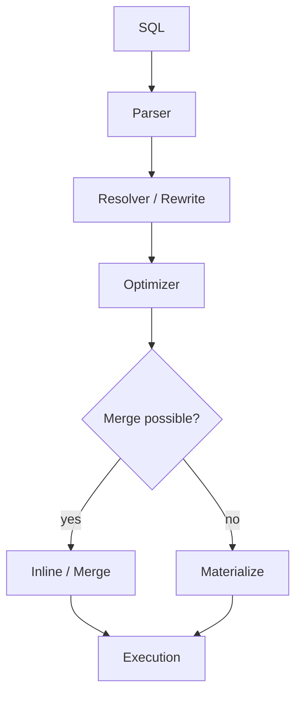
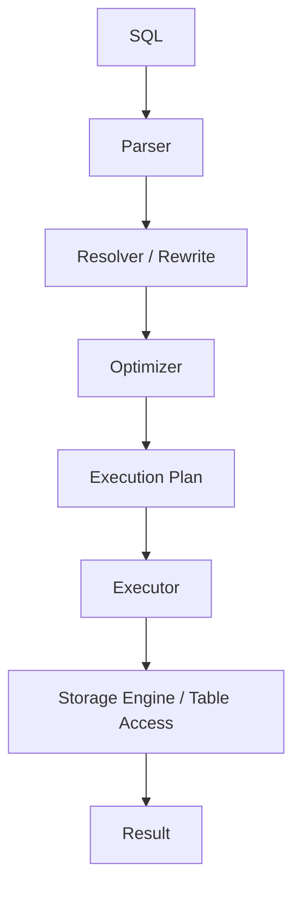

## 概要

View、派生テーブル、CTE、Temporary Tableは、どれも「テーブルのように扱える」構文です。

ただし、SQLだけを保存するのか、Optimizerで展開されるのか、実際に一時テーブルを作るのかは大きく異なります。

## この記事で学べること

- View、派生テーブル、CTE、Temporary Tableの違い
- OptimizerがMergeまたはMaterializeする考え方
- `EXPLAIN` で実体化されたかどうかを見る方法
- どの場面でどの構文を選ぶべきか

## 前提知識

- `SELECT`、`FROM`、`WITH` の基本を知っている
- 実行計画という言葉を聞いたことがある
- MySQLまたはPostgreSQLでSQLを実行したことがある

## 図解



## SQL例

```sql
WITH active_users AS (
  SELECT *
  FROM users
  WHERE deleted_at IS NULL
)
SELECT *
FROM active_users;
```

## EXPLAIN

```sql
EXPLAIN
WITH active_users AS (
  SELECT *
  FROM users
  WHERE deleted_at IS NULL
)
SELECT *
FROM active_users;
```

```text
Seq Scan on users  (cost=0.00..1820.00 rows=1000 width=128)
  Filter: (deleted_at IS NULL)
```

## 実際の性能比較

```text
単純なCTE: Optimizerでインライン化され、元テーブルへのアクセスだけに見える
MaterializeされるCTE: 一時結果を作るため、読み書きコストが増える場合がある
Temporary Table: 明示的に中間結果を保存できるが、作成と管理のコストがある
```

## 内部動作

```text
SQL
↓
Parser
↓
Resolver / Rewrite
↓
Optimizer
↓
Merge または Materialize
↓
Execution
```

## 本編

SQLには「テーブルのように扱えるもの」が複数存在します。

例えば次の4つです。

```sql title="view.sql"
SELECT *
FROM active_users;
```

```sql title="derived_table.sql"
SELECT *
FROM (
  SELECT *
  FROM users
) u;
```

```sql title="cte.sql"
WITH active_users AS (
  SELECT *
  FROM users
)
SELECT *
FROM active_users;
```

```sql title="temporary_table.sql"
SELECT *
FROM temp_users;
```

どれもテーブルのように扱えますが、内部ではまったく同じものではありません。

- データは保存されるのか
- SQLだけ保存されるのか
- 毎回SELECTが実行されるのか
- 本当にテーブルが作られるのか
- Optimizerはそれをどう扱うのか

この記事では、SQLが実行される流れに沿って、View、派生テーブル、CTE、Temporary Tableの違いを整理します。

> [!NOTE]
> ここでは通常のViewを扱います。データを保存するMaterialized Viewは別物です。

## SQLが実行される流れ

まず、SQLは大きく次のような流れで処理されます。



細かい名称はDBによって異なりますが、ざっくり見ると以下の流れです。

| 段階 | 役割 |
| --- | --- |
| Parser | SQL文字列を構文として解析する |
| Resolver / Rewrite | テーブル名、カラム名、Viewなどを解決する |
| Optimizer | どの順序で、どの方法でアクセスするかを決める |
| Execution Plan | 実行計画を作る |
| Executor | 実行計画に沿って処理する |
| Storage Engine / Table Access | 実テーブルや一時領域へアクセスする |

この記事では、それぞれの機能がこの流れのどこで登場するのかを見ていきます。

## まず結論

| 種類 | データ保持 | SQL保持 | 独自Index | 有効期間 |
| --- | --- | --- | --- | --- |
| 派生テーブル | 原則なし | なし | 作れない | クエリ中 |
| CTE | 原則なし | なし | 作れない | クエリ中 |
| View | なし | あり | 作れない | 永続 |
| Temporary Table | あり | なし | 作れる | セッション |

ただし、ここで注意があります。

派生テーブルやCTEは、常に完全に消えるわけではありません。Optimizerがインライン展開できる場合は元SQLへ統合されますが、条件によっては内部的にMaterializeされることがあります。

このとき作られるのは、ユーザーが参照できるTemporary Tableではなく、DB内部の一時的な結果です。

## 派生テーブル

派生テーブルは、`FROM` 句の中に書くサブクエリです。

```sql title="derived_table.sql"
SELECT *
FROM (
  SELECT *
  FROM users
) u;
```

初心者のうちは「一時的なテーブルが作られている」と考えがちです。

しかし、単純なケースではOptimizerが次のように展開します。

```sql title="optimized.sql"
SELECT *
FROM users;
```

つまり、派生テーブルという実体が常に作られるわけではありません。

MySQLでは、派生テーブル、View参照、CTEに対して、主に次の2つの戦略を取ります。

- 外側のクエリへMergeする
- 内部一時テーブルへMaterializeする

単純な派生テーブルであれば、Mergeされて外側のSELECTに統合されることが多いです。

## EXPLAINしてみる

例えば次のSQLを考えます。

```sql title="explain_derived_table.sql"
EXPLAIN
SELECT *
FROM (
  SELECT *
  FROM users
) u;
```

Mergeされる場合、実行計画上は `users` への単純なアクセスとして見えます。

```text
id | select_type | table
---+-------------+-------
1  | SIMPLE      | users
```

この場合、派生テーブルは実行計画上ほぼ消えています。

一方で、次のような要素があるとMergeできず、Materializeされることがあります。

- `GROUP BY`
- `DISTINCT`
- `HAVING`
- `LIMIT`
- 集約関数
- Window Function
- `UNION`

その場合は、内部的な一時結果として扱われます。

> [!IMPORTANT]
> 派生テーブルは「必ず実体がない」ではなく、「OptimizerがMergeできれば実体化しない」と理解すると安全です。

## CTE

CTEは、`WITH` で名前を付けた問い合わせです。

```sql title="cte.sql"
WITH active_users AS (
  SELECT *
  FROM users
)
SELECT *
FROM active_users;
```

CTEも「一時テーブル」と説明されることがありますが、必ず物理的なテーブルが作られるわけではありません。

単純なCTEであれば、Optimizerによって次のように扱われます。

```text
WITH
↓
Optimizer
↓
インライン展開
↓
通常のSELECT
```

つまり、次のSQLに近い実行計画になることがあります。

```sql title="expanded_cte.sql"
SELECT *
FROM users;
```

## PostgreSQLだけ少し違う

PostgreSQLでは、CTEの扱いがバージョンによって大きく変わりました。

PostgreSQL 11以前では、CTEは最適化の境界として扱われ、Materializeされやすいものでした。

一方、PostgreSQL 12以降では、非再帰で副作用のないCTEは、条件を満たすと親クエリへ折りたたまれるようになりました。

例えば次のようなCTEです。

```sql title="postgres_cte.sql"
WITH active_users AS (
  SELECT *
  FROM users
  WHERE deleted_at IS NULL
)
SELECT *
FROM active_users
WHERE id = 1;
```

インライン化される場合、実行計画は次のような問い合わせに近くなります。

```sql title="folded_cte.sql"
SELECT *
FROM users
WHERE deleted_at IS NULL
  AND id = 1;
```

これにより、外側の `WHERE id = 1` を元テーブルのアクセスに押し込める可能性があります。

## EXPLAIN ANALYZEしてみる

PostgreSQLで次のSQLを実行します。

```sql title="explain_analyze_cte.sql"
EXPLAIN ANALYZE
WITH active_users AS (
  SELECT *
  FROM users
)
SELECT *
FROM active_users;
```

インライン化される場合は、`Seq Scan on users` や `Index Scan using ... on users` のように、元テーブルへのアクセスだけが見えます。

一方、Materializeされる場合は、`CTE Scan` や `Materialize` に近いノードが現れます。

ここを見ると、CTEが実行計画上どのように扱われたかを確認できます。

## CTEはいつ便利か

CTEの主な価値は、物理的に速くすることではなく、SQLを読みやすく分割できることです。

```sql title="readable_cte.sql"
WITH latest_orders AS (
  SELECT
    user_id,
    MAX(created_at) AS latest_ordered_at
  FROM orders
  GROUP BY user_id
)
SELECT
  users.id,
  latest_orders.latest_ordered_at
FROM users
LEFT JOIN latest_orders
  ON latest_orders.user_id = users.id;
```

複雑なSQLを段階的に読めるようになるため、レビューや保守で役立ちます。

ただし、同じCTEを複数回参照する場合や、DBのバージョンによってはMaterializeされる可能性があります。

## View

Viewは、名前を付けて保存したSELECTです。

```sql title="create_view.sql"
CREATE VIEW active_users AS
SELECT *
FROM users
WHERE deleted_at IS NULL;
```

初心者のうちは「Viewというテーブルが作られる」と思いがちです。

しかし通常のViewで保存されるのは、データではなくSQL定義です。

```sql title="stored_definition.sql"
SELECT *
FROM users
WHERE deleted_at IS NULL;
```

つまり、ViewはSQLのショートカットに近いものです。

```sql title="select_view.sql"
SELECT *
FROM active_users;
```

このSQLを実行すると、DBはView定義を解決し、元のSQLへ展開して実行計画を作ります。

## Viewだから速いわけではない

次のSQLを考えます。

```sql title="explain_view.sql"
EXPLAIN
SELECT *
FROM active_users;
```

多くの場合、実行計画では `users` へのアクセスが現れます。

これは実質的に次のSQLを実行しているのに近いからです。

```sql title="expanded_view.sql"
SELECT *
FROM users
WHERE deleted_at IS NULL;
```

そのため、通常のViewは「よく使うSQLを共通化する」ための仕組みであり、Viewにしただけで速くなるわけではありません。

> [!TIP]
> Viewの性能は、View定義の中身と元テーブルのIndexに大きく依存します。

## Temporary Table

Temporary Tableだけは、実際にテーブルを作ります。

```sql title="create_temporary_table.sql"
CREATE TEMPORARY TABLE temp_users AS
SELECT *
FROM users;
```

この瞬間、セッション内で参照できる `temp_users` が作成されます。

そのため、次のような操作ができます。

```sql title="temporary_table_operations.sql"
CREATE INDEX idx_temp_users_id ON temp_users(id);

UPDATE temp_users
SET name = 'Alice'
WHERE id = 1;

DELETE FROM temp_users
WHERE deleted_at IS NOT NULL;
```

ここがView、派生テーブル、CTEとの大きな違いです。

## EXPLAINしてみる

```sql title="explain_temporary_table.sql"
EXPLAIN
SELECT *
FROM temp_users;
```

この場合、Optimizerは元の `users` ではなく、作成済みの `temp_users` へアクセスします。

つまり、Temporary Tableは中間結果を明示的に保存し、その後のSQLで再利用するための仕組みです。

MySQLのTemporary Tableは作成したセッション内でのみ見え、セッションが閉じると自動的に削除されます。

## 4つの内部動作を比較する

派生テーブルは、基本的にクエリの一部です。

```text
SELECT
↓
Parser
↓
Optimizer
↓
Merge または Materialize
↓
Execution
```

CTEは、名前付きの問い合わせです。

```text
WITH
↓
Parser
↓
Optimizer
↓
インライン展開 または Materialize
↓
Execution
```

Viewは、保存されたSQL定義です。

```text
SELECT View
↓
View定義を解決
↓
Optimizer
↓
Merge または Materialize
↓
Execution
```

Temporary Tableは、実際に作成済みのテーブルです。

```text
CREATE TEMPORARY TABLE
↓
Storage Engine / Temporary Area
↓
物理的な中間データを保持
↓
SELECT temp_users
↓
Execution
```

## EXPLAINを見比べる

| 種類 | 実行計画の特徴 |
| --- | --- |
| 派生テーブル | Mergeされると元テーブルへのアクセスだけに見える |
| CTE | インライン化されると通常のSELECTに近い。MaterializeされるとCTE Scanなどが現れる |
| View | View定義が展開され、元テーブルへのアクセスとして見えることが多い |
| Temporary Table | Temporary Tableそのものへアクセスする |

> [!TIP]
> `EXPLAIN` や `EXPLAIN ANALYZE` の読み方自体は、[SQLのEXPLAINとEXPLAIN ANALYZEを理解する](../explain-analyze/) で整理しています。

## どれを使えばいい？

最後は用途で考えると分かりやすいです。

| 使いたいこと | おすすめ |
| --- | --- |
| 1回だけ使う中間問い合わせを書きたい | 派生テーブル |
| 複雑なSQLを読みやすく分割したい | CTE |
| 共通SQLをDB側で管理したい | View |
| 中間結果を保存して何度も使いたい | Temporary Table |
| 中間結果へIndexを張りたい | Temporary Table |

## 実務での考え方

実務では、まずCTEで読みやすく書き、遅い場合に実行計画を見ることが多いです。

```text
読みやすさを優先
↓
EXPLAIN / EXPLAIN ANALYZE
↓
Mergeされているか確認
↓
Materializeが重いなら書き換えを検討
↓
何度も再利用するならTemporary Tableも検討
```

特に大量データを扱う場合は、「SQLの見た目」ではなく「実行計画」を見ることが重要です。

## まとめ

「テーブルのように扱える」という点は共通していますが、内部では異なる仕組みで動いています。

- 派生テーブルは、クエリ中だけ存在する問い合わせの構造。OptimizerがMergeできれば実体化しない。
- CTEは、可読性や再利用のための名前付き問い合わせ。DBや参照回数によってインライン化またはMaterializeされる。
- Viewは、SQL定義を永続化したもの。通常はデータを保存せず、実行時に定義が展開される。
- Temporary Tableは、実際に中間データを保持するテーブル。セッション内でIndex作成や更新もできる。

`EXPLAIN` や `EXPLAIN ANALYZE` を見ることで、見た目は似ていても、データベース内部では違う処理が行われていることが分かります。

## 参考文献

- [MySQL 8.4 Reference Manual: Optimizing Derived Tables, View References, and Common Table Expressions](https://dev.mysql.com/doc/refman/8.4/en/derived-table-optimization.html)
- [MySQL 8.0 Reference Manual: CREATE TEMPORARY TABLE Statement](https://dev.mysql.com/doc/refman/8.0/en/create-temporary-table.html)
- [PostgreSQL Documentation: WITH Queries](https://www.postgresql.org/docs/current/queries-with.html)
- [PostgreSQL 12 Release Notes](https://www.postgresql.org/docs/12/release-12.html)
