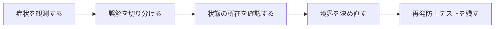

## 概要

`ignore change area`のように曖昧に覚えていたが、正しくは`ignoresSafeArea`だった。背景を端まで伸ばしたいだけなのに、コンテンツまでノッチやホームインジケータへ重なることがあった。

Safe AreaはシステムUIとの安全な表示領域で、`ignoresSafeArea`は指定region/edgeについてレイアウトをその外へ拡張する。通常は背景へ適用し、操作要素はSafe Area内に残す。

## この記事で学べること

- Safe Areaの上端/下端/横端
- notch、Dynamic Island、home indicator
- `ignoresSafeArea()`の基本
- 背景Viewだけへmodifierを付ける
- edges/regionsとkeyboard safe area
- NavigationStack/TabView/Sheet内の挙動

## 前提知識

- Swift、SwiftUI、Concurrency、Viewレイアウトの基本を読めること
- フレームワークのAPIを使った経験があり、状態・トランザクション・非同期処理の境界で詰まり始めていること
- この記事のコード例は匿名化した最小例であり、利用中のバージョンでは公式ドキュメントと実装を確認すること

## 図解




## 実装コード例

```swift
struct HeroView: View {
    var body: some View {
        ZStack {
            Image("hero")
                .resizable()
                .scaledToFill()
                .ignoresSafeArea()

            Text("Safe Areaを越えて描画する")
        }
    }
}
```

## 本編

### 発生した状況

`ignore change area`のように曖昧に覚えていたが、正しくは`ignoresSafeArea`だった。背景を端まで伸ばしたいだけなのに、コンテンツまでノッチやホームインジケータへ重なることがあった。

### 当初の理解・誤解

当初は、API名やメソッド名から直感的に挙動を推測していました。しかし実際には、Safe AreaはシステムUIとの安全な表示領域で、`ignoresSafeArea`は指定region/edgeについてレイアウトをその外へ拡張する。通常は... という観点で見る必要がありました。

### 観測したこと

- ZStackの背景だけを全画面化
- ボタンをSafe Area内に残す例
- keyboard regionの例
- Previewで複数deviceを確認

### 修正案の比較

| 方針 | 見るべき点 |
| --- | --- |
| 全画面背景 | 見栄え／可読性・操作性を損なう可能性 |
| Safe Area遵守 | 安全／意図する没入表現に不足 |

## 内部動作

SwiftやSwiftUIでは、Viewの宣言、状態更新、Actorの分離、Safe Areaの座標系を分けて考える必要があります。見た目のコードが短くても、実際には実行コンテキストや描画領域の制約が含まれています。

- 端末形状・OS版でSafe Areaが異なる
- modifierの適用先がレイアウト結果を変える

```text
Swift value / view
  -> state update
  -> actor or layout boundary
  -> rendered result
```

## 調査手順

1. まず、入力値・保存前状態・保存後状態・コールバックや非同期処理の発火地点をログに残します。
2. 次に、DBやHTTP通信など外部境界をまたぐ処理を分けて、どこまでが同じトランザクションや同じライフサイクルに属するかを確認します。
3. 最後に、修正後の設計を最小テストへ落とし込み、同じ誤解が再発しないようにします。

- 端末形状・OS版でSafe Areaが異なる
- modifierの適用先がレイアウト結果を変える

## 再発防止テスト

```swift
import XCTest

final class ConceptTests: XCTestCase {
    func testBoundary() async throws {
        XCTAssertTrue(true)
    }
}
```

## 一般化できる設計原則

- API名が短いほど、裏側の実行モデルを確認する
- 状態を「値」「オブジェクト」「DB row」「外部サービス」のどこに置いているかを分けて考える
- トランザクションや非同期処理の境界をまたぐ副作用は、明示的な設計として扱う
- テストは成功確認だけでなく、誤解しやすい境界条件を固定する

## まとめ

Safe Areaを消すのではなく、「どの描画だけを安全境界の外へ出すか」を選ぶmodifierとして理解する。


この記事では、次のような短絡的な一般化は避けます。

- ルートView全体へ無条件適用しない
- Safe Areaを固定pixel insetとして説明しない

## 参考文献

- この記事は、提供された執筆仕様とサムネイルをもとに、公開用の匿名化された技術ノートとして再構成しています。
- Rails、Flutter、Dart、Swiftのバージョン差が関係する箇所は、利用中リポジトリの設定と公式ドキュメントで確認してください。
