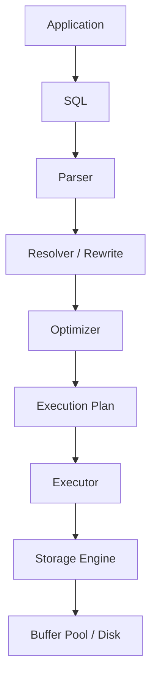

## はじめに

SQLを理解するとき、最初は構文を覚えるだけでも十分です。

しかし実務で遅いSQLを調べたり、View、CTE、派生テーブル、一時テーブルを使い分けたりする段階になると、構文だけでは判断できません。

重要なのは、SQLがDB内部でどのように処理されるかです。



このBookでは、個別記事で得た知識をそのまま並べるのではなく、SQLが実行される流れに沿って再構成します。

目標は、`EXPLAIN` を見たときに「何となく速そう・遅そう」と眺めるのではなく、DBがどの段階で何を判断したのかを説明できる状態になることです。

## このBookで扱う問い

- SQLはいつ解析され、いつ最適化されるのか
- ViewやCTEは本当にテーブルとして存在するのか
- `EXPLAIN` は何を表示しているのか
- `EXPLAIN ANALYZE` はなぜ実測値を出せるのか
- 推定行数と実行時間がずれるとき、何を疑えばよいのか

記事は調査メモとして役立ちますが、Bookでは問いの順番を作り直します。

最初に全体の処理フローを押さえ、その後に「テーブルのように見えるもの」と「実行計画の読み方」をつなげます。

## 1. SQLはそのまま実行されない

SQLを書くと、DBはその文字列をそのまま上から順番に実行しているように見えます。

しかし実際には、まずParserがSQLを解析し、構文として正しいかを確認します。

次にResolverやRewriteの段階で、参照しているテーブル、カラム、Viewなどが解決されます。

例えばViewを使ったSQLは、ここでView定義のSQLへ展開されます。

```sql
SELECT *
FROM active_users;
```

`active_users` が次のViewだとします。

```sql
CREATE VIEW active_users AS
SELECT *
FROM users
WHERE deleted_at IS NULL;
```

この場合、実行時には概念的に次のようなSQLとして扱われます。

```sql
SELECT *
FROM users
WHERE deleted_at IS NULL;
```

Viewはテーブルそのものではなく、保存されたSQLです。

この理解がないと、「Viewにすると速くなる」と誤解しやすくなります。

## 2. Optimizerは実行方法を選ぶ

SQLの形が決まると、Optimizerが実行方法を考えます。

同じ結果を返すSQLでも、実行方法は複数あります。

```sql
SELECT *
FROM users
WHERE email = 'alice@example.com';
```

このSQLに対して、DBは少なくとも次のような選択肢を持ちます。

- usersテーブルを全件読む
- emailのIndexを使って1件だけ探す
- 統計情報を見て、どちらが安いか判断する

Optimizerは正解を知っているわけではありません。

統計情報をもとに、より安いと思われる実行計画を選びます。

そのため、統計情報が古い、条件に合う行数の見積もりが外れている、Indexが適切でない、といった理由で計画が外れることがあります。

## 3. テーブルのように見えるものを整理する

SQLには、テーブルのように扱えるものがいくつもあります。

```sql
SELECT *
FROM (
  SELECT *
  FROM users
) u;
```

これは派生テーブルです。

```sql
WITH active_users AS (
  SELECT *
  FROM users
  WHERE deleted_at IS NULL
)
SELECT *
FROM active_users;
```

これはCTEです。

どちらも見た目はテーブルのようですが、常に物理的なテーブルが作られるわけではありません。

Optimizerがインライン展開できる場合、実行計画上では元テーブルへのアクセスに変換されます。

一方で、一時テーブルは本当に作られます。

```sql
CREATE TEMPORARY TABLE temp_users AS
SELECT *
FROM users;
```

この場合、以降のSQLは元の`users`ではなく、作成済みの`temp_users`へアクセスします。

つまり、重要なのは「テーブルのように書けるか」ではありません。

DB内部で、SQLとして展開されるのか、中間結果として実体化されるのか、Storage Engine上の一時テーブルとして作られるのかです。

## 4. EXPLAINはOptimizerの判断を見る道具

`EXPLAIN` は、Optimizerが選んだ実行計画を確認するための道具です。

```sql
EXPLAIN
SELECT *
FROM users
WHERE email = 'alice@example.com';
```

PostgreSQLでは、Indexが使われる場合に次のような出力になります。

```text
Index Scan using idx_users_email on users  (cost=0.42..8.44 rows=1 width=128)
  Index Cond: (email = 'alice@example.com'::text)
```

ここで見るべきポイントは、まずスキャン方法です。

`Seq Scan` なら全件走査、`Index Scan` ならIndexを使った探索です。

次に `rows` を見ます。

これは実際に読んだ行数ではなく、Optimizerが見積もった行数です。

この見積もりが大きく外れると、Join順序やIndex利用の判断も外れやすくなります。

## 5. EXPLAIN ANALYZEは実行結果まで見る

`EXPLAIN` は実行計画を表示しますが、通常はSQLそのものを実行しません。

一方、`EXPLAIN ANALYZE` は実際にSQLを実行し、実測値を表示します。

```sql
EXPLAIN ANALYZE
SELECT *
FROM users
WHERE email = 'alice@example.com';
```

例えば次のような出力になります。

```text
Index Scan using idx_users_email on users
  (cost=0.42..8.44 rows=1 width=128)
  (actual time=0.020..0.021 rows=1 loops=1)
  Index Cond: (email = 'alice@example.com'::text)
Planning Time: 0.120 ms
Execution Time: 0.045 ms
```

ここでは `actual time`、実際の `rows`、`loops` を確認できます。

推定値と実測値を並べて見られるため、Optimizerの見積もりがどれくらい当たっていたかを判断できます。

ただし、実際にSQLを実行するため、更新系SQLで使うとデータに影響します。

本番環境で使う場合は、対象SQLとDBの仕様を必ず確認する必要があります。

## 6. 読む順番

このBookでは、次の順番で理解すると迷いにくくなります。

1. SQLは文字列のまま実行されない
2. ViewやCTEはOptimizerの前後で形が変わる
3. 一時テーブルだけは実体を持つ
4. EXPLAINでOptimizerの判断を見る
5. EXPLAIN ANALYZEで実測値と見積もりを比較する

個別記事は、それぞれのテーマを調べたメモとして参照できます。

しかし、このBookでは「SQLがDB内部で流れていく順番」を軸に並べ直しています。

## まとめ

SQLを内部動作から理解するには、構文単位ではなく処理段階で考える必要があります。

- ParserはSQLを解析する
- ResolverやRewriteは参照先やView定義を解決する
- Optimizerは実行計画を選ぶ
- Executorは実行計画に沿って処理する
- Storage Engineは実際のデータへアクセスする
- EXPLAINは選ばれた計画を見る
- EXPLAIN ANALYZEは実行後の実測値まで見る

この流れが見えると、View、CTE、派生テーブル、一時テーブル、EXPLAINが別々の知識ではなく、1本の線でつながります。
