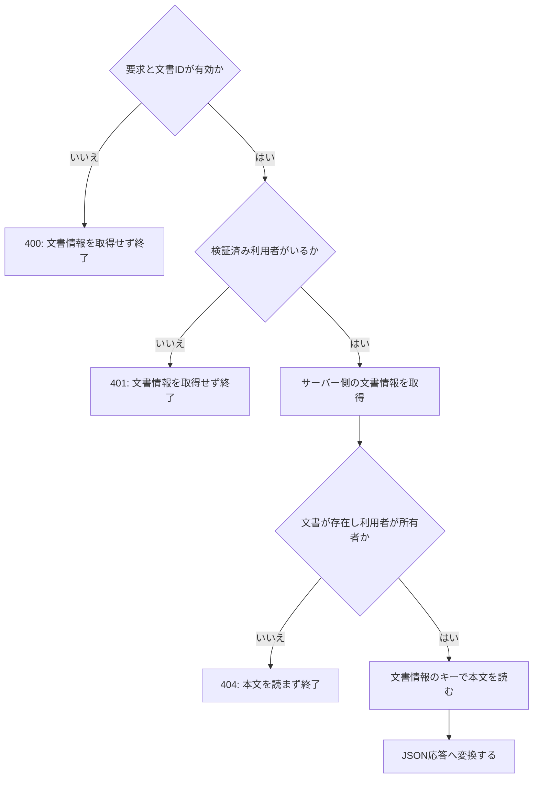

「Lambdaが文書を読める」と「利用者へその文書を返してよい」は、確認する主体が違います。APIを作るときは、要求が届く入口、コードの入力、AWS資源を操作する主体、利用者の対象認可を順に分けます。

このBookでは、所有者だけが文書を読める説明用のAPIを使います。入口はAPI GatewayのHTTP API、イベント形式はpayload format 2.0です。文書IDから所有者とS3キーを取得し、許可した場合だけ本文を読む構成を考えます。

本文のコードは、合成イベントと合成データでアプリ処理を確認するためのものです。認証、AWS SDK、DB、インフラの配置は実装しません。入力を読む場所と対象認可を置く場所を決め、どの確認を別に残すか判断できることを目的にします。

## 1. API入口で要求の形を決める

ブラウザが送るのはHTTPリクエストです。Lambdaに配置したTypeScriptのファイルをブラウザ側でimportして、サーバーの処理を起動する構成ではありません。HTTP APIのLambda proxy integrationでは、API Gatewayが要求をイベントへ変換し、Lambdaの戻り値をHTTP応答へ変換します。[HTTP APIとLambdaの統合](https://docs.aws.amazon.com/apigateway/latest/developerguide/http-api-develop-integrations-lambda.html)

文書APIでは、まず次の契約を決めます。パスの文書IDは、S3のキーそのものにはしません。

| 境界 | 説明用の契約 |
| --- | --- |
| HTTPの要求 | `GET /documents/document-a` |
| ルート | `GET /documents/{documentId}` |
| Lambdaへ渡る形式 | payload format `2.0`。メソッドは`requestContext.http.method`、文書IDは`pathParameters.documentId` |
| 文書ID | 英字・数字・ハイフンの1〜40文字。業務データを探すための識別子 |
| 成功時の応答 | `200`とJSON本文 |

このID制限は説明を小さくするための仕様です。実アプリでは既存の識別子の規則に合わせます。イベント形式1.0、REST API、Function URLなどへ入口を変える場合は、入力と応答の契約を確認し直します。

入口へ認証を置く場合も、何を確認するかを明示します。たとえばHTTP APIのJWT authorizerは、トークンを検証し、設定したルートのscopeも評価します。検証したclaimsはLambdaのイベントへ渡されます。[HTTP APIのJWT authorizer](https://docs.aws.amazon.com/apigateway/latest/developerguide/http-api-jwt-authorizer.html)

ただし、そのclaimsから「このアプリのどの利用者か」を決める対応付けと、文書の所有者を確かめる処理は残ります。トークンを受け付けたという結果だけで、任意の文書IDの内容を返すことにはしません。

## 2. handlerでは入力を読み、応答へ変換する

TypeScriptはJavaScriptへ変換して配置します。Lambdaのhandler設定は、配置したファイル名とexportした関数名に対応します。配置パッケージのルートに`index.js`を置き、`handler`をexportする構成なら`index.handler`です。[AWSのTypeScriptビルド](https://docs.aws.amazon.com/lambda/latest/dg/lambda-typescript.html)、[handlerの命名規則](https://docs.aws.amazon.com/lambda/latest/dg/typescript-handler.html#typescript-handler-naming)

この設定が決めるのは、Lambdaがどの関数を呼ぶかです。利用者が文書を読めるかまでは決めません。ここからは、handlerから呼ぶ処理を`document-api.ts`へ順に書きます。

最初に、処理で読む項目だけを確認します。TypeScriptの型を付けただけでは、実行時の入力がその型に合うことを保証しないため、イベントは`unknown`で受け取ります。型注釈はJavaScriptへの変換時に除かれます。[TypeScriptの型と実行時の動作](https://www.typescriptlang.org/docs/handbook/2/basic-types.html#erased-types)

```typescript file=document-api.ts
function isRecord(value: unknown): value is Record<string, unknown> {
  return typeof value === "object" && value !== null && !Array.isArray(value);
}

export function documentIdFromEvent(event: unknown): string | undefined {
  if (!isRecord(event) || event.version !== "2.0") return undefined;
  if (event.routeKey !== "GET /documents/{documentId}") return undefined;

  const context = event.requestContext;
  if (!isRecord(context) || !isRecord(context.http)) return undefined;
  if (context.http.method !== "GET") return undefined;

  const parameters = event.pathParameters;
  if (!isRecord(parameters)) return undefined;
  const id = parameters.documentId;
  return typeof id === "string" && /^[A-Za-z0-9-]{1,40}$/.test(id)
    ? id
    : undefined;
}

function jsonResponse(statusCode: number, body: Record<string, string>) {
  return {
    statusCode,
    headers: { "content-type": "application/json" },
    body: JSON.stringify(body),
    isBase64Encoded: false,
  };
}
```

この関数はイベント全体のschemaを検証しません。選んだルート・メソッド・文書IDが、後の処理で使える形かを見ます。クエリや本文に別のS3キーが付いていても、ここでは読みません。

`jsonResponse`は、アプリの結果をHTTP APIで扱う応答へ変換する部品です。payload format 2.0には応答を推定する機能もありますが、この例ではstatusと文字列のbodyを明示します。[Lambdaの応答形式](https://docs.aws.amazon.com/apigateway/latest/developerguide/http-api-develop-integrations-lambda.html#http-api-develop-integrations-lambda.response)

入力確認の役割は「文書を特定できる要求か」です。続けて読む文書情報と、利用者の認可結果は別に扱います。

## 3. 実行ロールでは信頼と操作権限を見る

LambdaがAWS資源を操作するときの主体は、関数に付けた実行ロールです。Lambdaはそのロールを引き受け、AWSサービスへのアクセスに使います。[Lambdaの実行ロール](https://docs.aws.amazon.com/lambda/latest/dg/lambda-intro-execution-role.html)

ここでは、API入口からS3までの3つの関係を分けます。

| 関係 | どこで確認するか | 確認結果から言えること |
| --- | --- | --- |
| API Gateway → Lambda | 関数のリソースベースポリシー | 指定された呼出し元に関数の呼出しを許可している |
| Lambdaサービス → 実行ロール | ロールの信頼ポリシー | Lambdaサービスがロールを引き受けられる |
| 実行ロール → S3オブジェクト | 権限ポリシーと資源側を含む評価条件 | 該当するS3操作を許可する条件がそろっているか |

API Gatewayの呼出し許可は、関数のリソースベースポリシーで確認します。API、stage、methodなどの呼出し元の範囲も見る対象です。ロールへS3の操作許可を付けても、この呼出し許可を確認したことにはなりません。[API Gatewayからの呼出し権限](https://docs.aws.amazon.com/lambda/latest/dg/services-apigateway.html#services-apigateway-permissions)

通常のS3バケットで現在のオブジェクトを読む場合は、`s3:GetObject`を対象のオブジェクト範囲へ許可することを考えます。特定バージョンの取得や暗号化などでは追加条件が関係します。[S3 GetObjectの権限](https://docs.aws.amazon.com/AmazonS3/latest/API/API_GetObject.html)

権限ポリシーのAllowだけで、読取り成功を保証できるわけではありません。資源側のポリシーや組織の制限なども評価され、明示的なDenyはAllowに優先します。[IAMのポリシー評価](https://docs.aws.amazon.com/IAM/latest/UserGuide/reference_policies_evaluation-logic.html)

**判断してみる:** 実行ロールが`documents/`配下を読めるなら、ログインした利用者はその配下のすべての文書を読めますか。IAMで確認した主体は実行ロールです。利用者と文書の関係は、次の章で別に確認します。

## 4. 本文を読む前に利用者と文書を照合する

利用者の認可では、要求ごとに、その主体が対象へアクセスできるかを確認します。利用者IDをリクエストのクエリから受け取り、認証済みの主体として扱うことはしません。[OWASPの要求ごとの認可](https://cheatsheetseries.owasp.org/cheatsheets/Authorization_Cheat_Sheet.html#validate-the-permissions-on-every-request)

説明用の閲覧ルールは、文書の所有者だけが読めるものとします。文書IDからサーバー側の文書情報を取得し、所有者を照合した後に、その情報のS3キーで本文を読みます。



前章のファイルへ、次のコードを続けます。`Principal`は認証処理が確認した利用者を表します。`loadDocument`と`readObject`も外から渡す処理で、次章では合成データに置き換えます。

```typescript file=document-api.ts
type Principal = { userId: string };
type DocumentRecord = { ownerId: string; objectKey: string };
type Dependencies = {
  loadDocument: (id: string) => Promise<DocumentRecord | undefined>;
  readObject: (key: string) => Promise<string>;
};

export async function handleDocumentRequest(
  event: unknown,
  principal: Principal | undefined,
  dependencies: Dependencies,
) {
  const documentId = documentIdFromEvent(event);
  if (!documentId) return jsonResponse(400, { error: "invalid request" });
  if (!principal) return jsonResponse(401, { error: "authentication required" });

  const document = await dependencies.loadDocument(documentId);
  if (!document || document.ownerId !== principal.userId) {
    return jsonResponse(404, { error: "not found" });
  }

  const content = await dependencies.readObject(document.objectKey);
  return jsonResponse(200, { content });
}
```

`handleDocumentRequest`はLambdaに登録するhandlerそのものではありません。実際のhandlerは、選んだ認証方式の検証結果をアプリの利用者へ対応付け、この関数へ渡すアダプタになります。Lambdaのasync handlerの第2引数は実行contextなので、ここでの`principal`をその位置から得る設計にはしません。[AWSのasync handlerの引数](https://docs.aws.amazon.com/lambda/latest/dg/typescript-handler.html#typescript-handler-async)

存在しない文書と他人の文書は、どちらも404にしています。この例で両者を応答から区別させないための方針です。入力の誤りを400、利用者を得られない状態を401とするのも、このアプリ処理の契約であり、API Gatewayが先に拒否した場合の応答を定めるものではありません。

S3キーは`document.objectKey`から決めます。利用者が文書IDを知っていることだけでは、その本文を取得する権限になりません。[OWASPの対象IDと認可](https://cheatsheetseries.owasp.org/cheatsheets/Authorization_Cheat_Sheet.html#ensure-lookup-ids-are-not-accessible-even-when-guessed-or-cannot-be-tampered-with)

また、本文読取りの失敗は例外として残ります。実handlerでは、業務上の拒否と基盤障害を分けて応答・記録する必要があります。共同閲覧や利用停止を扱うAPIでは、その条件も認可へ含めます。

## 5. 拒否した要求で読取りが走らないことを確かめる

成功時に本文が返るだけでは、認可を置いた順序まで確認できません。拒否する要求で、文書情報の取得や本文の読取りがどこまで進むかを見ます。

前述の2つのTypeScriptブロックを順に`document-api.ts`へ保存します。TypeScriptが使える専用の作業用ディレクトリで、CommonJSへ変換します。`package.json`の`type`を`module`にしていない構成です。

```bash
tsc document-api.ts --strict --target ES2022 --module commonjs --outDir dist --skipLibCheck
```

次を`check.cjs`として同じ場所へ保存します。イベントは処理で読む項目だけを持つ合成データで、実際のAPI Gatewayイベント全体を再現したものではありません。利用者・文書・本文も合成データです。

```javascript file=check.cjs
const assert = require("node:assert/strict");
const { handleDocumentRequest } = require("./dist/document-api.js");

const event = {
  version: "2.0",
  routeKey: "GET /documents/{documentId}",
  requestContext: { http: { method: "GET" } },
  pathParameters: { documentId: "document-a" },
};

async function check(input, principal, status, expectedLoads, expectedReads) {
  const loaded = [];
  const read = [];
  const dependencies = {
    loadDocument: async (id) => {
      loaded.push(id);
      return id === "document-a"
        ? { ownerId: "user-a", objectKey: "documents/a.txt" }
        : undefined;
    },
    readObject: async (key) => {
      read.push(key);
      return "sample document";
    },
  };

  const result = await handleDocumentRequest(input, principal, dependencies);
  assert.equal(result.statusCode, status);
  assert.deepEqual(loaded, expectedLoads);
  assert.deepEqual(read, expectedReads);
  if (status === 200) {
    assert.deepEqual(JSON.parse(result.body), { content: "sample document" });
  }
}

async function main() {
  await check({}, { userId: "user-a" }, 400, [], []);
  await check(event, undefined, 401, [], []);
  await check(event, { userId: "user-b" }, 404, ["document-a"], []);
  await check({ ...event, pathParameters: { documentId: "missing" } },
    { userId: "user-a" }, 404, ["missing"], []);
  await check(event, { userId: "user-a" }, 200,
    ["document-a"], ["documents/a.txt"]);
}

main().catch((error) => {
  console.error(error);
  process.exitCode = 1;
});
```

`node check.cjs`で次の5条件を確認します。

| 入力・利用者の状態 | 応答status | 文書情報の取得 | 本文の読取り |
| --- | --- | --- | --- |
| 処理に合わないイベント | 400 | 0回 | 0回 |
| 利用者が渡されていない | 401 | 0回 | 0回 |
| 他人の文書 | 404 | 1回 | 0回 |
| 存在しない文書 | 404 | 1回 | 0回 |
| 所有者の文書 | 200 | 1回 | サーバー側のキーで1回 |

掲載コードはNode.js 22.13.0・TypeScript 5.9.3でビルド・実行し、この5条件と成功時の本文を確認しました。この確認は、認証結果を正しく取得できることや、実行ロールでS3を読めることの試験にはなりません。

**判断してみる:** 認可の前に`readObject`を呼び、最後の応答だけ404へ変えた場合、この表を満たせますか。他人の文書でも本文を読んでしまうため、「本文の読取り0回」という条件を満たせません。

## 6. AWSの設定とアプリの確認を対応付ける

ローカルの確認をAWS側の成功へ広げず、境界ごとに確かめたことを対応付けます。設定を見る順番が、1件の要求を追う順番とつながっていると、失敗した場所を絞れます。

| 確認したいこと | 必要な確認 | 本文のローカル例で確認できるか |
| --- | --- | --- |
| HTTP要求が意図した関数へ届く | ルート、統合先、payload形式、Lambda呼出し許可 | できない |
| 配置した関数を呼べる | ビルド成果物、パッケージ構成、handler設定、runtime | できない。アプリ処理のビルドだけを確認 |
| 利用者を信頼できる | 選んだ認証方式の検証、claimsとアプリ利用者の対応 | できない。確認済みとして渡す合成データのみ |
| 実行主体が対象のAWS資源を読める | 実行ロール、信頼、操作範囲、資源側を含む実効権限 | できない |
| 所有者だけに本文を返す | 対象認可、拒否時の読取り回数、成功時のキーと本文 | 合成データで確認できる |

たとえば、IAMの制限で本文読取りが失敗した場合は、所有者照合を外して解決しようとしません。逆に、他人の文書が返った場合は、実行ロールのAllowだけを調べても利用者の認可漏れは分かりません。失敗した関係と、修正する場所を対応させます。

入口を変えるときは第1章へ、配置した関数が呼ばれないときは第2章へ、AWS資源へのアクセスは第3章へ、利用者と対象の判断は第4・5章へ戻ります。短い確認カードとして残したい場合は[Lambdaの権限ノート](/tech-note/notes/aws/lambda-permission-checklist/)、個別記事の順に読みたい場合は[Lambda APIのシリーズ](/tech-note/series/lambda-api-boundaries/)を使えます。
